

# Tài liệu Hướng dẫn Sử dụng (User Manual)
# Hệ thống Quản lý Doanh nghiệp Elite ERP (ELT-ERP)

---

| Document Info | Details |
|---|---|
| **Document Code** | ELT_UM_ERP_CORE |
| **Version** | V1.0 |
| **Last Updated** | 24/05/2026 |
| **Author** | Hoàng Thúy / BA |
| **Target Audience** | Board of Directors, Managers, Operational Staff |

---

# MỤC LỤC
1. [1. Overview (Giới thiệu tổng quan)](#overview)
1. [2. Prerequisites (Các điều kiện cần có)](#prerequisites)
1. [3. Getting Started (Làm quen hệ thống)](#getting-started)
  - [3.1 Login & Main Dashboard](#login-dashboard)
  - [3.2 Basic Operations](#basic-operations)
  - [3.3 Status Definitions (Ý nghĩa các trạng thái)](#status-definitions)
  - [3.4 Core Business Workflows (Quy trình vận hành liên kết)](#e2e-workflows)
1. [4. Step-by-Step Guide (Hướng dẫn các bước thực hiện)](#step-by-step-guide)
  - [4.1 🌟 PHÂN HỆ BÁN HÀNG (Sales)](#sales)
    - [4.1.1 Cấu hình (Configuration)](#sales-config)
      - [4.1.1.1 Đội ngũ bán hàng (Sales Teams)](#sales-teams)
      - [4.1.1.2 Mẫu báo giá (Quotation Templates)](#quotation-templates)
    - [4.1.2 Sản phẩm (Products)](#sales-products)
      - [4.1.2.1 Sản phẩm (Products)](#sales-products-main)
      - [4.1.2.2 Biến thể sản phẩm (Product Variants)](#sales-product-variants)
      - [4.1.2.3 Bảng giá (Pricelists)](#pricelists)
      - [4.1.2.4 Khuyến mãi & Khách hàng thân thiết (Discount & Loyalty)](#discount-loyalty)
      - [4.1.2.5 Thẻ quà tặng & Ví điện tử (Gift cards & eWallet)](#gift-cards-ewallet)
    - [4.1.3 Đơn hàng (Orders)](#sales-orders)
      - [4.1.3.1 Báo giá (Quotations)](#quotations)
      - [4.1.3.2 Đơn bán hàng (Sales Orders)](#sales-orders-main)
      - [4.1.3.3 Khách hàng (Customers)](#sales-customers)
  - [4.2 👑 PHÂN HỆ MUA HÀNG (Purchase)](#purchase)
    - [4.2.1 Cấu hình (Configuration)](#purchase-config)
      - [4.2.1.1 Bảng giá của nhà cung cấp (Vendor Pricelists)](#vendor-pricelists)
      - [4.2.1.2 Thuộc tính sản phẩm (Attributes)](#attributes)
      - [4.2.1.3 Nhóm sản phẩm (Categories)](#product-categories)
      - [4.2.1.4 Đơn vị tính & Quy cách đóng gói (Units & Packagings)](#units-packagings)
    - [4.2.2 Sản phẩm (Products)](#purchase-products)
      - [4.2.2.1 Sản phẩm (Products)](#purchase-products-main)
      - [4.2.2.2 Biến thể sản phẩm (Product Variants)](#purchase-product-variants)
    - [4.2.3 Đơn hàng (Orders)](#purchase-orders)
      - [4.2.3.1 Yêu cầu báo giá (Requests for Quotation)](#rfq)
      - [4.2.3.2 Đơn mua hàng (Purchase Orders)](#po)
      - [4.2.3.3 Nhà cung cấp (Vendors)](#vendors)
  - [4.3 🛡️ PHÂN HỆ HÓA ĐƠN (Invoicing)](#invoicing)
    - [4.3.1 Cấu hình (Configuration)](#invoicing-config)
      - [4.3.1.1 Cấu hình thuế (Configuration > Taxes)](#taxes)
      - [4.3.1.2 Sổ nhật ký (Journals)](#journals)
      - [4.3.1.3 Điều khoản thanh toán (Payment Terms)](#payment-terms)
    - [4.3.2 Nhà cung cấp (Vendor)](#invoicing-vendor)
      - [4.3.2.1 Hóa đơn nhà cung cấp (Bills)](#bills)
      - [4.3.2.2 Hóa đơn trả lại / Hoàn tiền (Refunds)](#refunds)
      - [4.3.2.3 Thanh toán cho nhà cung cấp (Vendor Payments)](#vendor-payments)
      - [4.3.2.4 Sản phẩm (Products)](#invoicing-vendor-products)
      - [4.3.2.5 Nhà cung cấp (Vendors)](#invoicing-vendor-main)
    - [4.3.3 Khách hàng (Customers)](#invoicing-customers)
      - [4.3.3.1 Hóa đơn khách hàng (Invoices)](#invoices)
      - [4.3.3.2 Ghi chú tín dụng / Giảm trừ nợ (Credit Notes)](#credit-notes)
      - [4.3.3.3 Ghi nhận thanh toán của khách hàng (Customer Payments)](#customer-payments)
      - [4.3.3.4 Sản phẩm (Products)](#invoicing-customer-products)
      - [4.3.3.5 Khách hàng (Customers)](#invoicing-customers-main)
  - [4.4 📦 PHÂN HỆ KHO (Inventory)](#inventory)
    - [4.4.1 Cấu hình (Configuration)](#inventory-config)
      - [4.4.1.1 Kho hàng (Warehouses)](#warehouses)
      - [4.4.1.2 Loại hoạt động (Operations Types)](#operations-types)
    - [4.4.2 Hoạt động kho (Operations)](#inventory-operations)
      - [4.4.2.1 Nhận hàng (Receipts)](#receipts)
      - [4.4.2.2 Giao hàng (Deliveries)](#deliveries)
      - [4.4.2.3 Chuyển kho nội bộ (Internal Transfers)](#internal-transfers)
      - [4.4.2.4 Kiểm kho định kỳ (Physical Inventory)](#physical-inventory)
      - [4.4.2.5 Phiếu loại bỏ / Hủy hàng (Scrap Orders)](#scrap-orders)
      - [4.4.2.6 Product Returns (Quy trình Trả hàng)](#product-returns)
      - [4.4.2.7 Tổng quan kho (Inventory Overview)](#inventory-overview)
      - [4.4.2.8 Make to Order (MTO) Procurement Workflow](#inventory-mto)
1. [5. Exceptions & Troubleshooting (Luồng ngoại lệ & Xử lý sự cố)](#faq)
1. [6. Glossary (Giải nghĩa thuật ngữ)](#glossary)
---

# **1. Overview (Giới thiệu tổng quan)**
This User Manual provides standard operating procedures on the Elite ERP system. It helps users master core business processes, from initial setup (Configuration) to executing daily transactions, covering 4 main modules: **Sales**, **Purchase**, **Invoicing**, and **Inventory**.

---

# **2. Prerequisites (Các điều kiện cần có)**
To use the functions described in this manual, users must ensure the following conditions:
- [ ] The user account has access rights to the: **Sales, Purchase, Invoicing, and Inventory modules.**
- [ ] Foundational data is ready: **The system has been configured with initial foundational data (Company info, Chart of Accounts).**

---

# **3. Getting Started (Làm quen hệ thống)**
Before diving into detailed operations, users should master basic interactions on the Odoo (Elite ERP) interface:

## **3.1 Login & Main Dashboard**
- **Login:** Access the system URL [https://elite.erp.watatek.com](https://elite.erp.watatek.com), enter the Email and Password provided by the administrator.
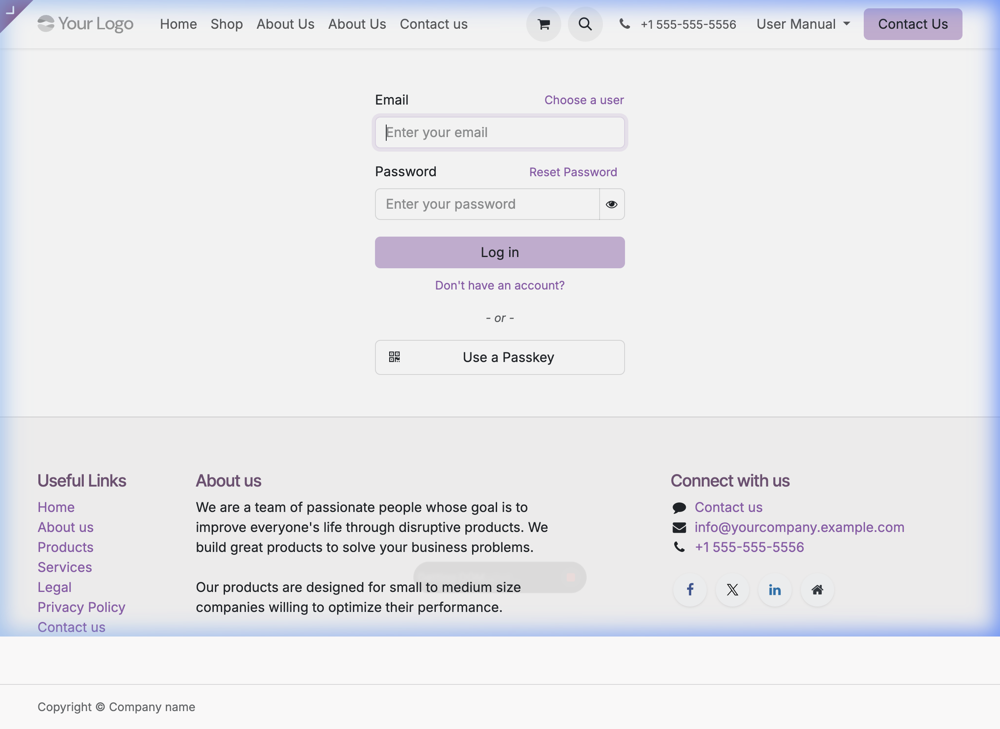
- **Main Dashboard:** Displays the Apps the user has access to. Click the grid icon in the top left to open the app menu at any time.

## **3.2 Basic Operations**
- **Standard Views:**
  - **Kanban:** Card-based view (often used for stages like Quotation -> Sent -> Won).
  - **List:** View multiple records in a table format.
  - **Form:** View details of a single record.
- **Filters & Search:** Use the search bar at the top to filter data or group data (Group By).

## **3.3 Status Definitions (Ý nghĩa các trạng thái)**
Below is the status workflow for core documents in the system:
- **Sales:** Quotation (Draft) -> Quotation Sent -> Sales Order (Confirmed) -> Cancelled.
- **Purchase:** RFQ (Draft) -> RFQ Sent -> Purchase Order (Confirmed) -> Cancelled.
- **Inventory:** Draft -> Waiting -> Ready -> Done.
- **Invoicing:** Draft -> Posted (Accounting recognized) -> Cancelled.

## **3.4 Core Business Workflows (Quy trình vận hành liên kết)**
To operate the system efficiently, departments must collaborate and follow these sequential workflows. Click on any step to view the detailed guide.

### **3.4.1 Procure-to-Pay Workflow (Quy trình Mua hàng & Nhập kho)**
Applicable when the business needs to procure goods from a Vendor:

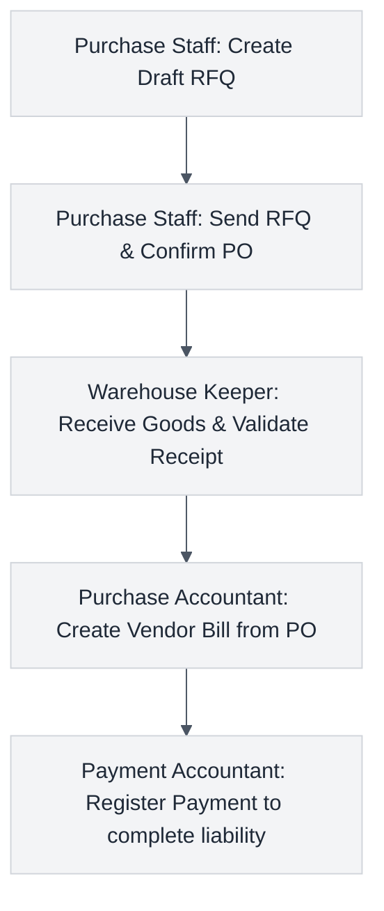
```mermaid
%%{init: {'theme': 'base', 'themeVariables': { 'primaryColor': '#f3f4f6', 'primaryTextColor': '#1f2937', 'primaryBorderColor': '#d1d5db', 'lineColor': '#4b5563', 'background': '#ffffff'}}}%%
graph TD
    A[Purchase Staff: Create Draft RFQ] --> B[Purchase Staff: Send RFQ & Confirm PO]
    B --> C[Warehouse Keeper: Receive Goods & Validate Receipt]
    C --> D[Purchase Accountant: Create Vendor Bill from PO]
    D --> E[Payment Accountant: Register Payment to complete liability]
```

1. **Request for Quotation (RFQ):** The *Purchase Department* creates a draft [Request for Quotation (RFQ)](#rfq) in the system and sends it to the Vendor.
2. **Confirm Purchase Order (PO):** Once the price is agreed upon, the *Purchase Department* confirms the RFQ into an official [Purchase Order (PO)](#po). The system automatically creates a draft [Receipt](#receipts) in the Inventory module.
3. **Receive Goods into Stock:** Upon delivery, the *Warehouse Keeper* inspects the items, verifies the quantities, and [Validates the Receipt](#receipts) to increase system stock.
4. **Create Vendor Bill:** The *Purchase Accountant* creates a [Vendor Bill](#bills) from the PO and clicks **Confirm** (or **Post**) to recognize the liability.
5. **Register Payment:** The *Payment Accountant* executes the payment and clicks [Register Payment](#vendor-payments) on the Vendor Bill to complete the transaction.

### **3.4.2 Order-to-Cash Workflow (Quy trình Bán hàng & Xuất kho)**
Applicable when selling goods to a Customer:

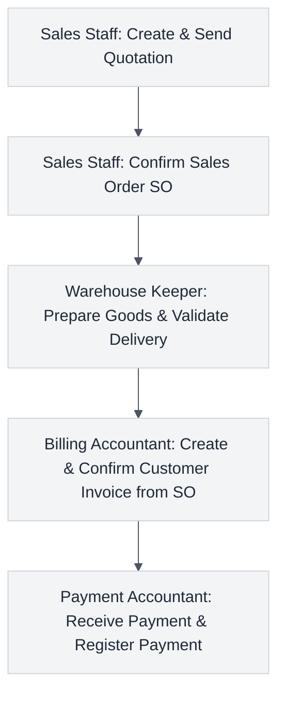
```mermaid
%%{init: {'theme': 'base', 'themeVariables': { 'primaryColor': '#f3f4f6', 'primaryTextColor': '#1f2937', 'primaryBorderColor': '#d1d5db', 'lineColor': '#4b5563', 'background': '#ffffff'}}}%%
graph TD
    A[Sales Staff: Create & Send Quotation] --> B[Sales Staff: Confirm Sales Order SO]
    B --> C[Warehouse Keeper: Prepare Goods & Validate Delivery]
    C --> D[Billing Accountant: Create & Confirm Customer Invoice from SO]
    D --> E[Payment Accountant: Receive Payment & Register Payment]
```

1. **Create Quotation:** The *Sales Department* creates a draft [Quotation](#quotations) and sends it to the Customer.
2. **Confirm Sales Order (SO):** Once confirmed by the customer, the *Sales Department* confirms the Quotation into an official [Sales Order (SO)](#sales-orders-main). The system automatically creates a draft [Delivery Order](#deliveries) in the Inventory module.
3. **Deliver Goods:** The *Warehouse Keeper* prepares the items, inspects the quantities, and [Validates the Delivery Order](#deliveries) to reduce system stock and ship to the customer.
4. **Create Customer Invoice:** The *Billing Accountant / Sales Department* creates a [Customer Invoice](#invoices) from the SO and clicks **Confirm** (or **Post**) to recognize revenue and receivables.
5. **Register Payment:** Upon receiving payment, the *Payment Accountant* clicks [Register Payment](#customer-payments) on the Invoice to complete the transaction.

---

# **4. Step-by-Step Guide (Hướng dẫn các bước thực hiện)**
Below is the detailed operations for each business module:

## **4.1 🌟 PHÂN HỆ BÁN HÀNG (Sales)**

### **4.1.1 Cấu hình (Configuration)**

#### **4.1.1.1 Đội ngũ bán hàng (Sales Teams)**
##### **Mục đích & Ý nghĩa nghiệp vụ**
Giúp tổ chức và phân chia nhân sự phòng kinh doanh thành các đội nhóm kinh doanh độc lập (Bán lẻ, Bán dự án, Kênh đại lý). Giúp gán mục tiêu doanh số riêng biệt cho từng nhóm và theo dõi sát sao hiệu suất.

##### **Giải thích các trường thông tin**
| Trường thông tin 

 | Ý nghĩa & Quy tắc nhập |
| :--- | :--- |
| **Sales Team (*)** | Tên đội ngũ bán hàng. |
| **Team Leader** | Trưởng nhóm quản lý trực tiếp đội ngũ. |
| **Invoicing Target** | Chỉ tiêu doanh thu bán hàng tối thiểu nhóm cần đạt được. |
| **Members** | Danh sách nhân viên trực thuộc đội ngũ. |

##### **Các bước thực hiện**
- **Step 1:** Chọn phân hệ **"Sales"** -> click **"Configuration"** -> chọn **"Sales Teams"**.
- **Step 2:** Trên màn hình Kanban hiển thị, nhấp nút **"New"** (hoặc click vào thẻ nhóm để chỉnh sửa):
   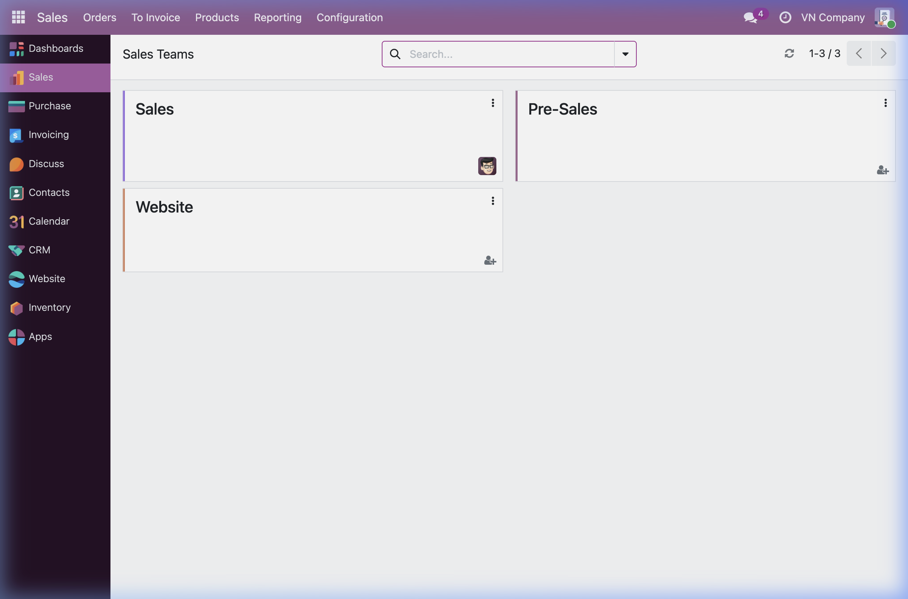
- **Step 3:** Nhập **Tên nhóm**, chỉ định **Team Leader** và gán chỉ tiêu **Invoicing Target**:
   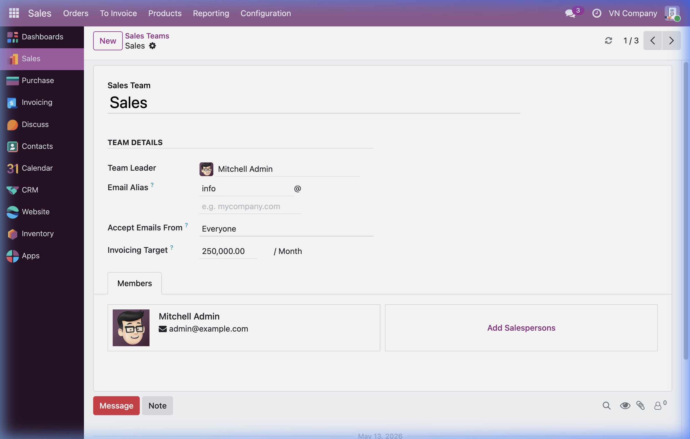
- **Step 4:** Tại mục **Members**, nhấn **Add** để thêm nhân viên vào đội. Nhấn **Save** (Đám mây) để lưu lại.

---

#### **4.1.1.2 Mẫu báo giá (Quotation Templates)**
##### **Mục đích & Ý nghĩa nghiệp vụ**
Tạo ra các biểu mẫu báo giá chuẩn được soạn thảo sẵn cho các nhóm sản phẩm đi kèm nhau. Giúp nhân viên kinh doanh tạo báo giá gửi khách hàng nhanh chóng, giảm thiểu sai sót nhập liệu.

##### **Giải thích các trường thông tin**
| Trường thông tin 

 | Ý nghĩa & Quy tắc nhập |
| :--- | :--- |
| **Quotation Template (*)** | Tên mẫu báo giá gợi nhớ (Ví dụ: Combo nội thất văn phòng). |
| **Quotation Validity** | Số ngày báo giá có hiệu lực kể từ khi tạo (Ví dụ: 30 ngày). |
| **Lines (Tab)** | Danh sách sản phẩm và số lượng được cấu hình sẵn cho mẫu. |

##### **Các bước thực hiện**
- **Step 1:** Chọn phân hệ **"Sales"** -> click **"Configuration"** -> chọn **"Quotation Templates"**.
- **Step 2:** Nhấn nút **"New"** để tạo mẫu báo giá mới (hoặc chọn một mẫu có sẵn):
   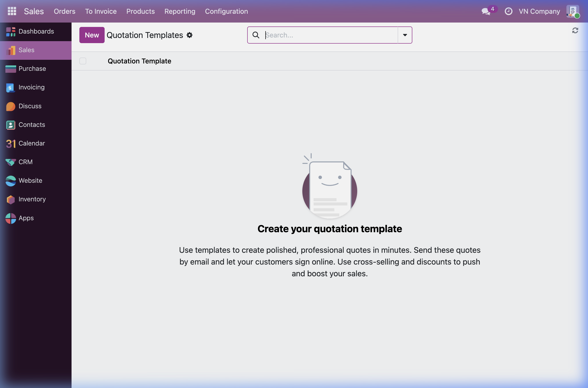
- **Step 3:** Nhập **Tên mẫu**, số ngày hết hạn tại **Quotation Validity**, và cấu hình các sản phẩm đi kèm:
   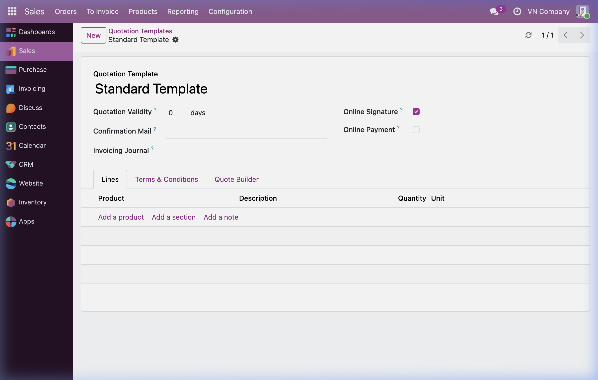
- **Step 4:** Nhấn **Save** để lưu. Khi tạo Báo giá mới, nhân viên chỉ cần chọn Mẫu này để hệ thống tự động điền toàn bộ dòng sản phẩm.

---

### **4.1.2 Sản phẩm (Products)**

#### **4.1.2.1 Sản phẩm (Products)**
##### **Mục đích & Ý nghĩa nghiệp vụ**
Khai báo thông tin danh mục hàng hóa, dịch vụ kinh doanh của doanh nghiệp.

##### **Giải thích các trường thông tin**
| Trường thông tin 

 | Ý nghĩa & Quy tắc nhập |
| :--- | :--- |
| **Product Name (*)** | Tên sản phẩm hiển thị trên các giao dịch mua/bán (Ví dụ: Cabinet with Doors). |
| **Product Type (*)** | Phân loại sản phẩm: **Storable** (Quản lý tồn kho vật lý), **Consumable** (Tiêu dùng nhanh), hoặc **Service** (Dịch vụ). |
| **Sales Price** | Giá bán lẻ mặc định chưa thuế. |
| **Sales Taxes** | Thuế suất GTGT bán ra áp dụng mặc định. |

##### **Các bước thực hiện**
- **Step 1:** Chọn phân hệ **"Sales"** -> chọn menu **"Products"** -> click **"Products"**.
- **Step 2:** Nhấn nút **"New"** để mở form sản phẩm (hoặc click chọn sản phẩm có sẵn để xem chi tiết):
   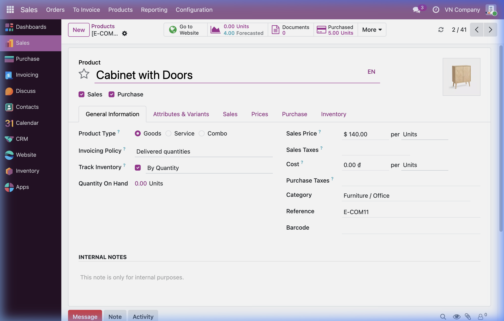
- **Step 3:** Enter product name, select Product Type, set **"Sales Price"** and **"Customer Taxes"** in the **"General Information"** tab.
- **Step 4:** (Optional) Switch to the **"Attributes & Variants"** tab to set characteristics (Color, Size) if the product has multiple versions.
   
- **Step 5:** (Optional) Switch to the **"Sales"** tab to configure invoicing policies and advanced sales settings.
   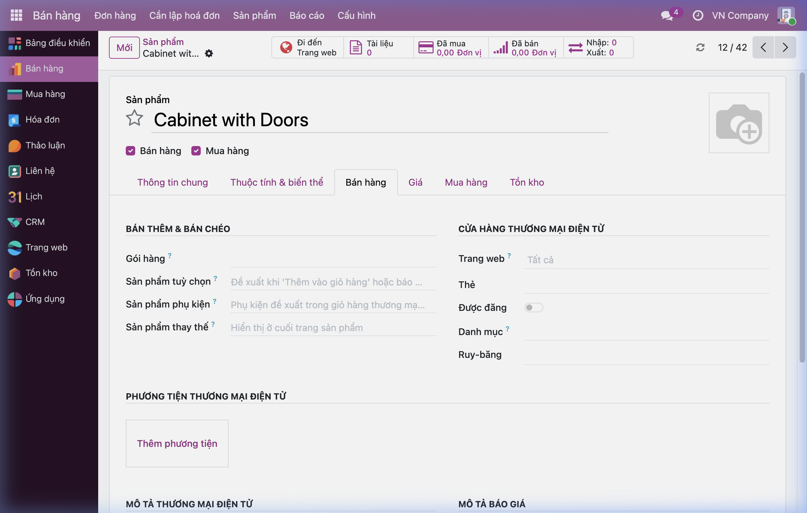
- **Step 6:** (Optional) Switch to the **"Price"** tab to manage pricing rules or promotions.
   
- **Step 7:** (Optional) Switch to the **"Purchase"** tab to set preferred vendors, vendor taxes, and control policies.
   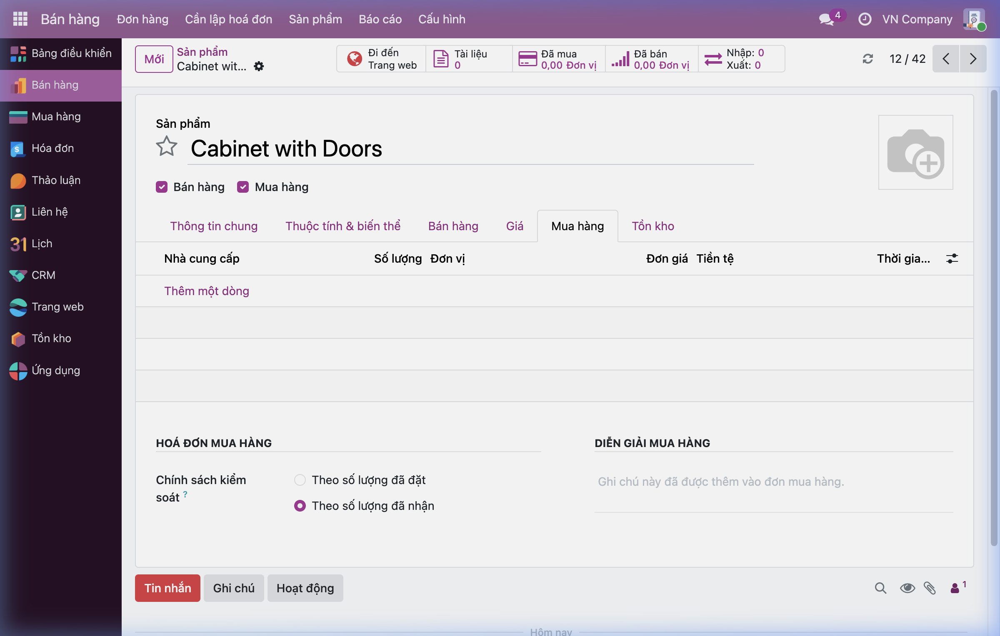
- **Step 8:** (Optional) Switch to the **"Inventory"** tab to enable stock tracking (for storable goods) and input weight.
   
- **Step 9:** Click the **"Save"** button to complete registration.

---

#### **4.1.2.2 Biến thể sản phẩm (Product Variants)**
##### **Mục đích & Ý nghĩa nghiệp vụ**
Quản lý các thuộc tính khác nhau của cùng một mã sản phẩm (Ví dụ: Tủ Cabinet có các biến thể về Màu sắc: Trắng, Đen, Vân gỗ; hoặc Kích thước).

##### **Giải thích các trường thông tin**
| Trường thông tin 

 | Ý nghĩa & Quy tắc nhập |
| :--- | :--- |
| **Attribute (*)** | Thuộc tính phân loại sản phẩm (Ví dụ: Color, Size). |
| **Values** | Giá trị của thuộc tính (Ví dụ: Black, White, Grey). |

##### **Các bước thực hiện**
- **Step 1:** Mở biểu mẫu chi tiết của Sản phẩm đã tạo tại Mục 1.2.1.
- **Step 2:** Di chuyển đến tab **"Attributes & Variants"** và nhấn **"Add a line"**.
- **Step 3:** Chọn thuộc tính tại cột **Attribute** và nhập/chọn các giá trị biến thể tại cột **Values**.
- **Step 4:** Hệ thống sẽ tự động sinh ra danh sách các mã biến thể sản phẩm tương ứng. Nhấn **Save** để áp dụng.

---

#### **4.1.2.3 Bảng giá (Pricelists)**
##### **Mục đích & Ý nghĩa nghiệp vụ**
Thiết lập các chính sách giá đặc thù cho từng nhóm đối tượng khách hàng (VIP, đại lý, bán sỉ) hoặc áp dụng các chiến dịch giảm giá theo khoảng thời gian cụ thể.

##### **Giải thích các trường thông tin**
| Trường thông tin 

 | Ý nghĩa & Quy tắc nhập |
| :--- | :--- |
| **Pricelist Name (*)** | Tên bảng giá (Ví dụ: Bảng giá đại lý Cấp 1). |
| **Currency (*)** | Loại tiền tệ áp dụng (VND, USD). |
| **Rules (Tab)** | Các quy tắc tính giá: Áp dụng cho toàn bộ sản phẩm, danh mục sản phẩm, hoặc sản phẩm cụ thể. |

##### **Các bước thực hiện**
- **Step 1:** Chọn phân hệ **"Sales"** -> chọn menu **"Products"** -> click **"Pricelists"**.
- **Step 2:** Nhấn nút **"New"** để mở form thiết lập bảng giá:
   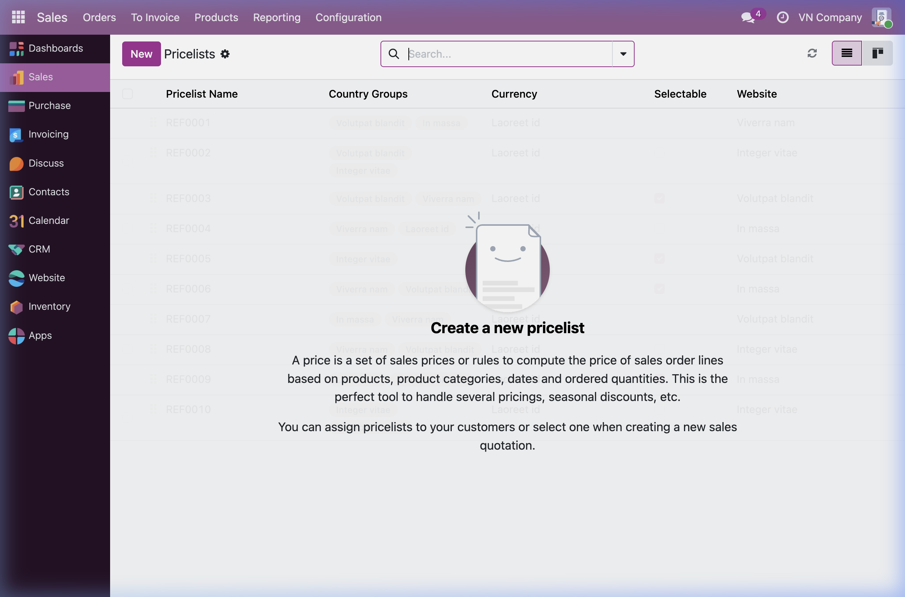
- **Step 3:** Cấu hình chi tiết các quy tắc tính giá tại phần **Price Rules**:
   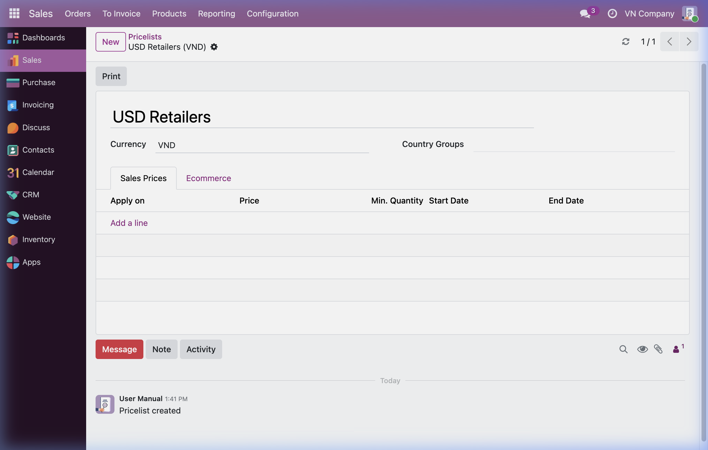
- **Step 4:** Nhấn **Save** để lưu. Bảng giá này có thể được gán mặc định trong hồ sơ Khách hàng.

---

#### **4.1.2.4 Khuyến mãi & Khách hàng thân thiết (Discount & Loyalty)**
##### **Mục đích & Ý nghĩa nghiệp vụ**
Xây dựng các chiến dịch marketing thúc đẩy doanh số thông qua chương trình khuyến mãi (mua 1 tặng 1, chiết khấu hóa đơn) hoặc tích điểm đổi quà cho khách hàng thân thiết.

##### **Giải thích các trường thông tin**
| Trường thông tin 

 | Ý nghĩa & Quy tắc nhập |
| :--- | :--- |
| **Program Name (*)** | Tên chương trình (Ví dụ: Khuyến mãi Hè 2026). |
| **Program Type (*)** | Phân loại: **Promotions** (Khuyến mãi), **Loyalty Cards** (Tích điểm), **Coupons** (Mã giảm giá). |
| **Conditional rules** | Các điều kiện áp dụng (Ví dụ: Giá trị đơn hàng tối thiểu từ 1,000,000 đ). |
| **Rewards** | Phần thưởng nhận được (Ví dụ: Giảm 50,000 đ, miễn phí vận chuyển). |

##### **Các bước thực hiện**
- **Step 1:** Chọn phân hệ **"Sales"** -> chọn menu **"Products"** -> click **"Discount & Loyalty"**.
- **Step 2:** Nhấn nút **"New"** để cấu hình chiến dịch mới:
   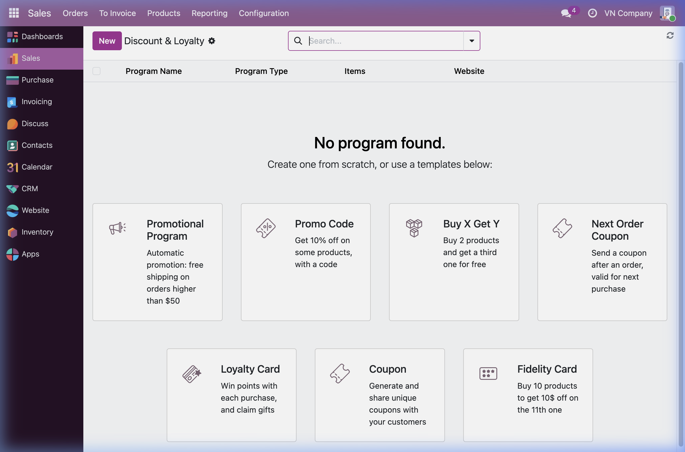
- **Step 3:** Thiết lập chi tiết điều kiện mua hàng tối thiểu (Rules) và phần thưởng nhận được (Rewards):
   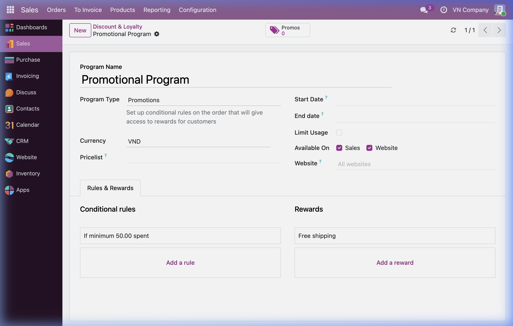
- **Step 4:** Nhấn **Save** để kích hoạt chương trình trên hệ thống.

---

#### **4.1.2.5 Thẻ quà tặng & Ví điện tử (Gift cards & eWallet)**
##### **Mục đích & Ý nghĩa nghiệp vụ**
Phát hành và quản lý số dư thẻ quà tặng (Gift cards) hoặc ví điện tử (eWallet) của khách hàng để phục vụ thanh toán trừ dần trực tiếp trên đơn hàng.

##### **Các bước thực hiện**
- **Step 1:** Chọn phân hệ **"Sales"** -> chọn menu **"Products"** -> click **"Gift cards & eWallet"**.
- **Step 2:** Nhấn nút **"New"** để thiết lập chương trình phát hành thẻ hoặc ví:
   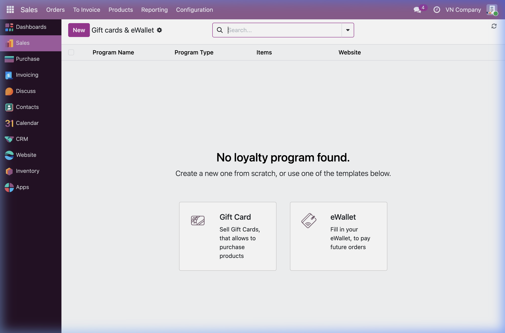
- **Step 3:** Cấu hình chi tiết mệnh giá mặc định, mã số serial hoặc liên kết ví điện tử:
   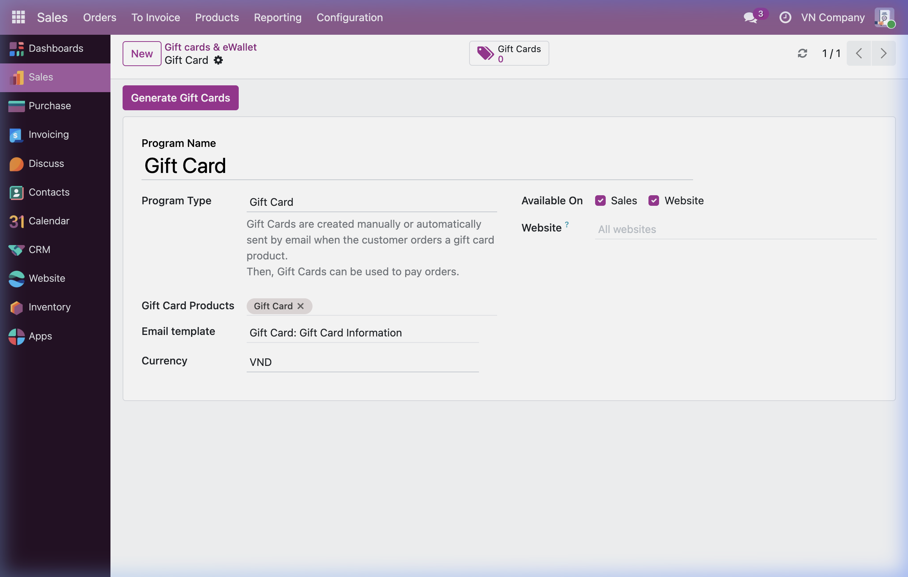
- **Step 4:** Nhấn **Save** để hoàn tất.

---

### **4.1.3 Đơn hàng (Orders)**

#### **4.1.3.1 Báo giá (Quotations)**
##### **Mục đích & Ý nghĩa nghiệp vụ**
Khởi tạo và gửi báo giá chi tiết cho khách hàng. Đây là bước giao dịch đầu tiên với khách hàng trước khi ký kết đơn hàng.

##### **Giải thích các trường thông tin**
| Trường thông tin 

 | Ý nghĩa & Quy tắc nhập |
| :--- | :--- |
| **Customer (*)** | Khách hàng nhận báo giá. |
| **Expiration** | Ngày hết hạn hiệu lực của báo giá. |
| **Payment Terms** | Điều khoản thanh toán thỏa thuận (Thanh toán ngay, 15 ngày...). |
| **Product (*)** | Sản phẩm, số lượng và đơn giá thỏa thuận bán lẻ. |

##### **Các bước thực hiện**
- **Step 1:** Chọn phân hệ **"Sales"** -> chọn menu **"Orders"** -> click **"Quotations"**.
- **Step 2:** Nhấn nút **"New"** để mở form báo giá mới:
   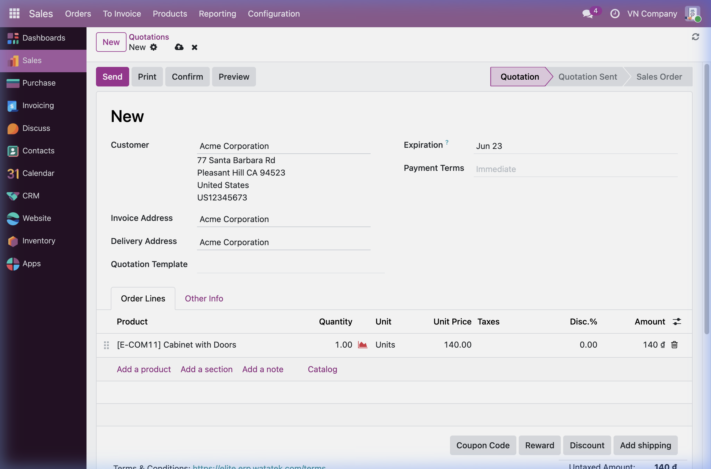
- **Step 3:** Select the **Customer**, expiration date **Expiration**, and payment terms **Payment Terms** in the **Order Lines** tab.
- **Step 4:** In the **Order Lines** tab, click **Add a product** to select the product, enter quantity, and sales price.
- **Step 5:** (Optional) Switch to the **"Other Info"** tab to assign Sales Team, select Payment Terms, or delivery policy.
   
- **Step 6:** Click the **"Save"** button to save the quotation in draft status (**Quotation**). Click **"Send by Email"** to email it, or click **"Confirm"** to convert the quotation into a Sales Order (SO).

---

#### **4.1.3.2 Đơn bán hàng (Sales Orders)**
##### **Mục đích & Ý nghĩa nghiệp vụ**
Chuyển đổi Báo giá nháp thành Đơn bán hàng chính thức (Sales Order - SO) sau khi khách hàng đồng ý ký kết, ghi nhận doanh thu dự kiến và kích hoạt luồng xuất kho hàng hóa.

##### **Các bước thực hiện**
- **Step 1:** Mở Báo giá (Quotation) cần xác nhận đang ở trạng thái nháp.
- **Step 2:** Kiểm tra lại toàn bộ thông tin sản phẩm, số lượng, điều khoản thanh toán.
- **Step 3:** Nhấp chọn nút **[Confirm]** ở góc trên bên trái màn hình.
- **Step 4:** Hệ thống chuyển trạng thái báo giá sang **Sales Order** (Đơn bán hàng chính thức):
   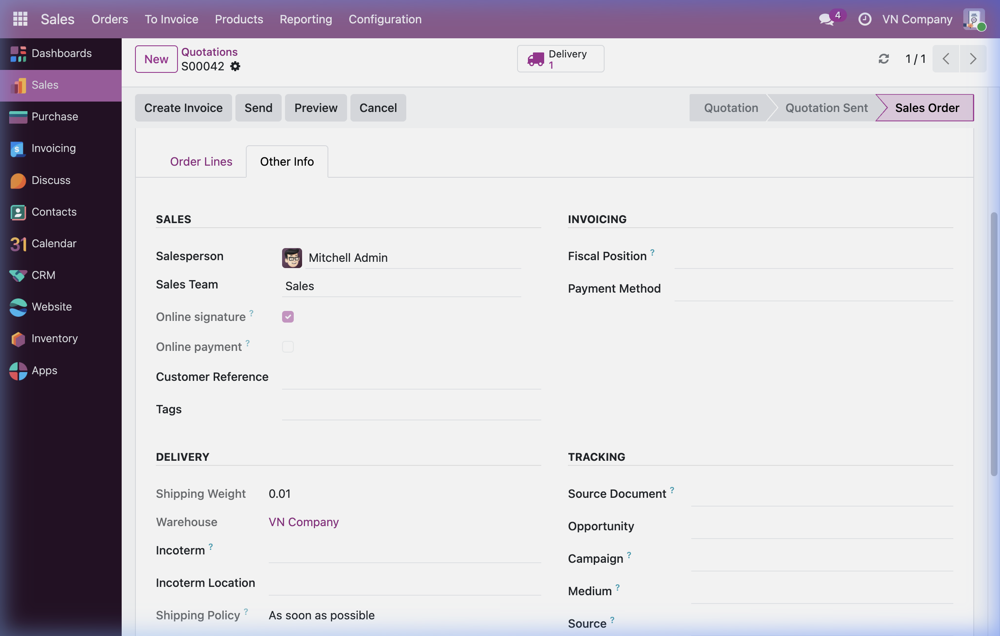
- **Step 5:** Một phiếu xuất kho nháp (Delivery Order) sẽ được tự động tạo lập bên phân hệ Kho hàng để thủ kho chuẩn bị hàng hóa.

---

#### **4.1.3.3 Khách hàng (Customers)**
##### **Mục đích & Ý nghĩa nghiệp vụ**
Quản lý danh sách và thông tin liên hệ của khách hàng mua sản phẩm trực tiếp từ phân hệ Sales, giúp nhân viên kinh doanh nhanh chóng tra cứu lịch sử mua hàng, công nợ và thông tin liên lạc.

##### **Các bước thực hiện**
- **Step 1:** Chọn phân hệ **"Sales"** -> chọn menu **"Orders"** -> click **"Customers"**.
- **Step 2:** Giao diện hiển thị danh mục các khách hàng hiện tại dưới dạng thẻ hình ảnh.
- **Step 3:** Nhấp nút **"New"** để khai báo khách hàng mới hoặc click trực tiếp vào một thẻ khách hàng để xem chi tiết hồ sơ liên hệ, công nợ và lịch sử đơn hàng.

---

## **4.2 👑 PHÂN HỆ MUA HÀNG (Purchase)**

### **4.2.1 Cấu hình (Configuration)**

#### **4.2.1.1 Bảng giá của nhà cung cấp (Vendor Pricelists)**
##### **Mục đích & Ý nghĩa nghiệp vụ**
Bảng giá của nhà cung cấp (Vendor Pricelist) được sử dụng để quản lý thông tin giá mua của từng sản phẩm từ các nhà cung cấp khác nhau. Hệ thống tự động áp đơn giá mua chính xác vào RFQ khi chọn nhà cung cấp và số lượng tối thiểu tương ứng đã thỏa thuận trước đó.

##### **Giải thích các trường thông tin**
| Trường thông tin 

 | Ý nghĩa & Quy tắc nhập |
| :--- | :--- |
| **Vendor (*)** | Nhà cung cấp áp dụng bảng giá. |
| **Vendor Product Name / Code** | Tên hoặc mã sản phẩm của nhà cung cấp (tự động in trên PO thay cho tên nội bộ). |
| **Minimal Quantity** | Số lượng mua tối thiểu để được hưởng đơn giá này. |
| **Price (*)** | Đơn giá mua thỏa thuận chưa thuế. |
| **Delivery Lead Time** | Số ngày từ lúc xác nhận đơn hàng đến lúc NCC giao hàng về kho. |

##### **Các bước thực hiện**
- **Step 1:** Chọn phân hệ **"Purchase"** -> chọn **"Configuration"** -> click **"Vendor Pricelists"**.
- **Step 2:** Nhấp nút **"New"** để tạo quy tắc giá mua mới:
   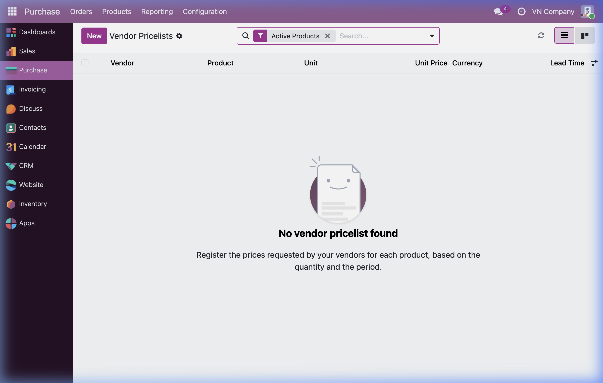
- **Step 3:** Điền thông tin **Vendor**, **Product**, số lượng tối thiểu và đơn giá mua tương ứng:
   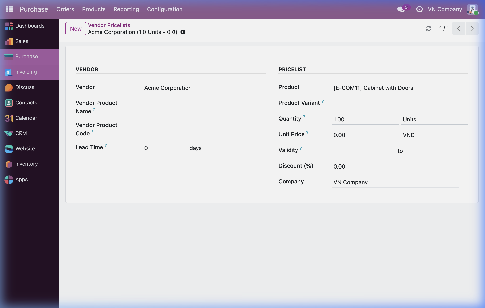
- **Step 4:** Nhập **Delivery Lead Time** và nhấn **Save** để lưu.

---

#### **4.2.1.2 Thuộc tính sản phẩm (Attributes)**
##### **Mục đích & Ý nghĩa nghiệp vụ**
Quản lý danh mục các thuộc tính vật lý hoặc tính chất của sản phẩm mua sắm (Màu sắc, kích thước, chất liệu) giúp đồng bộ dữ liệu thuộc tính dùng chung trên toàn hệ thống.

##### **Các bước thực hiện**
- **Step 1:** Chọn phân hệ **"Purchase"** -> chọn **"Configuration"** -> click **"Attributes"**.
- **Step 2:** Nhấn nút **"New"** để định nghĩa một thuộc tính mới:
   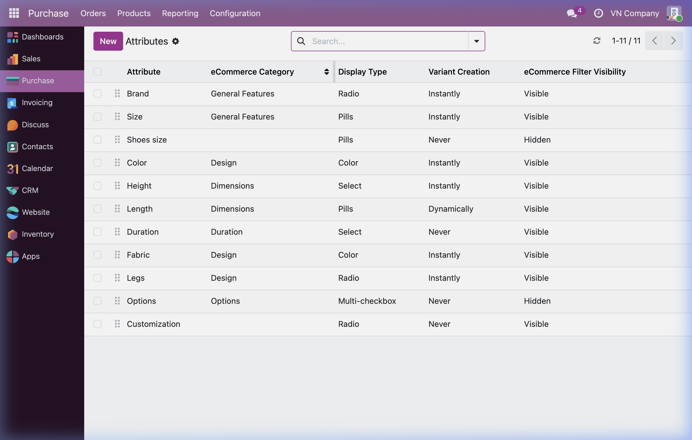
- **Step 3:** Định nghĩa tên thuộc tính và nhập các giá trị tùy chọn tại phần **Values**:
   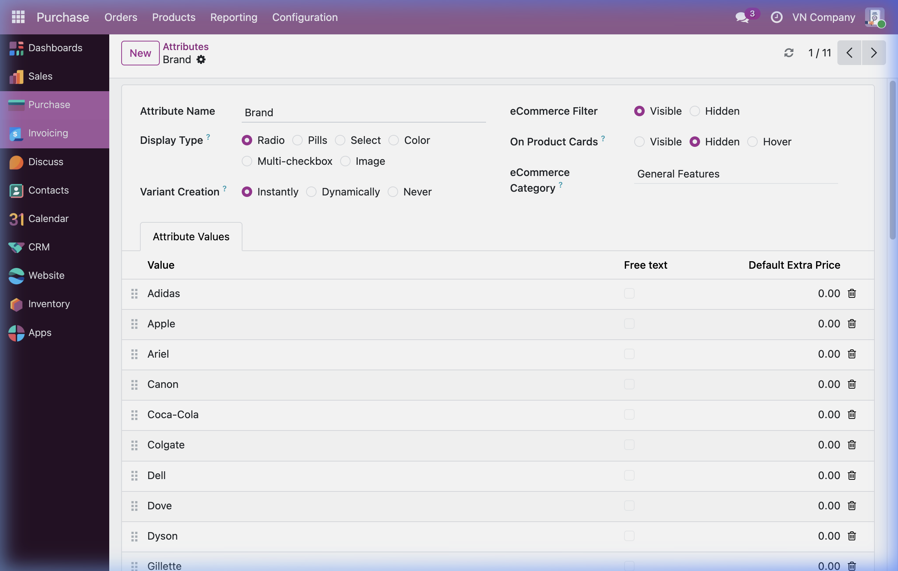
- **Step 4:** Nhấn **Save** để lưu trữ.

---

#### **4.2.1.3 Nhóm sản phẩm (Categories)**
##### **Mục đích & Ý nghĩa nghiệp vụ**
Phân nhóm danh mục sản phẩm (Product Categories) phục vụ định khoản kế toán tự động (tài khoản kho, tài khoản giá vốn) và thiết lập phương pháp tính giá trị hàng tồn kho.

##### **Giải thích các trường thông tin**
| Trường thông tin 

 | Ý nghĩa & Quy tắc nhập |
| :--- | :--- |
| **Category Name (*)** | Tên nhóm sản phẩm (Ví dụ: Office Furniture). |
| **Costing Method** | Phương pháp tính giá vốn hàng tồn kho: **Standard Price** (Giá tiêu chuẩn), **FIFO** (Nhập trước xuất trước), hoặc **AVCO** (Giá bình quân gia quyền). |
| **Inventory Valuation** | Định giá kho: **Manual** (Báo cáo kho thủ công) hoặc **Automated** (Kế toán ghi sổ kho tự động sau mỗi lần nhập/xuất). |

##### **Các bước thực hiện**
- **Step 1:** Chọn phân hệ **"Purchase"** -> chọn **"Configuration"** -> click **"Product Categories"**.
- **Step 2:** Nhấn nút **"New"** để tạo nhóm sản phẩm mới:
   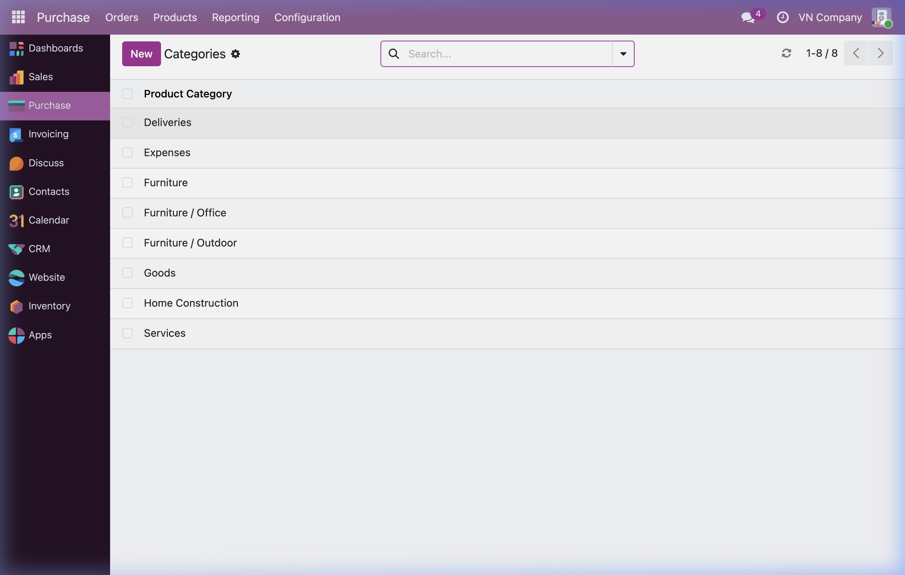
- **Step 3:** Nhập **Category Name**, cấu hình phương pháp tính giá vốn **Costing Method** và định giá kho tự động **Inventory Valuation**:
   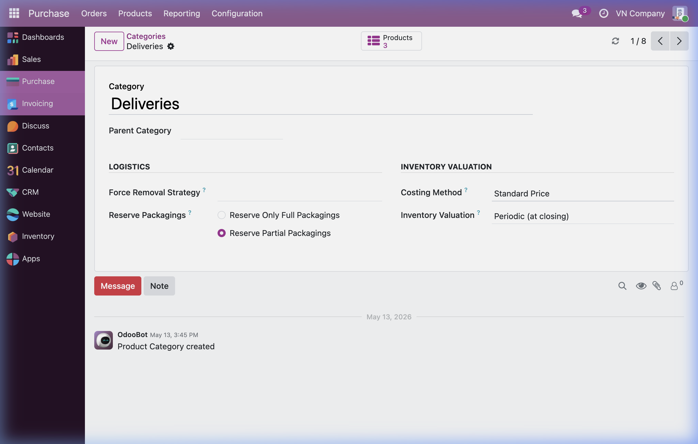
- **Step 4:** Nhấn **Save** để hoàn tất.

---

#### **4.2.1.4 Đơn vị tính & Quy cách đóng gói (Units & Packagings)**
##### **Mục đích & Ý nghĩa nghiệp vụ**
Quản lý các loại Đơn vị tính (UoM) phục vụ quy đổi đơn vị mua sắm khác với đơn vị bán (Ví dụ: mua theo Thùng nhưng bán lẻ theo Cái) và quy định số lượng sản phẩm trên mỗi gói hàng (Packagings) khi giao nhận.

##### **Các bước thực hiện**
- **Step 1:** Chọn phân hệ **"Purchase"** -> chọn **"Configuration"** -> click **"Units of Measure"** để định cấu hình nhóm quy đổi đơn vị tính:
   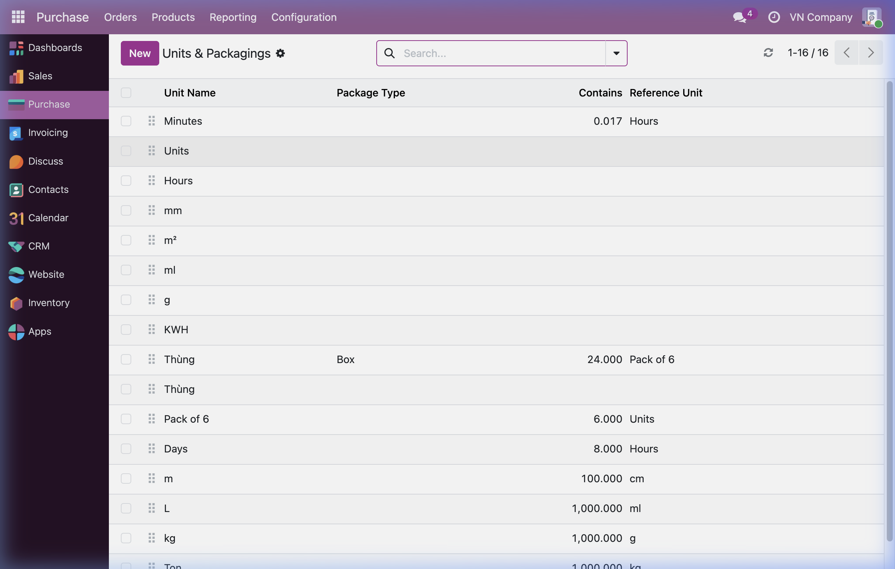
- **Step 2:** Cấu hình chi tiết tỷ lệ quy đổi trong nhóm đơn vị tính:
   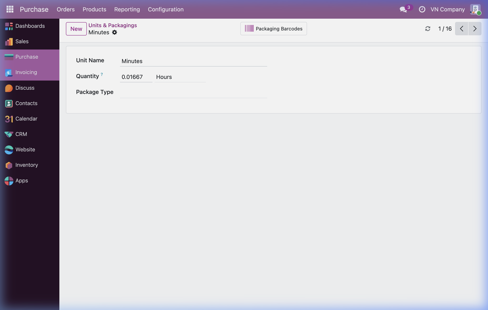
- **Step 3:** Để thiết lập quy cách đóng gói cho sản phẩm cụ thể: Mở hồ sơ sản phẩm đó -> di chuyển đến tab **Purchase** -> điền thông tin đóng gói tại mục **Packaging** (Ví dụ: `Box of 10` chứa 10 sản phẩm). Nhấn **Save** để lưu.

---

### **4.2.2 Sản phẩm (Products)**

#### **4.2.2.1 Sản phẩm (Products)**
##### **Mục đích & Ý nghĩa nghiệp vụ**
Khai báo và quản lý thông tin các mặt hàng, vật tư, nguyên liệu cần mua sắm phục vụ cho nhu cầu hoạt động sản xuất kinh doanh của công ty.

##### **Giải thích các trường thông tin**
| Trường thông tin 

 | Ý nghĩa & Quy tắc nhập |
| :--- | :--- |
| **Cost** | Giá vốn hoặc giá mua tham chiếu của sản phẩm. |
| **Purchase Taxes** | Thuế suất GTGT đầu vào áp dụng mặc định khi mua hàng. |
| **Control Policy** | Chính sách kiểm tra hóa đơn: **On ordered quantities** (Theo số lượng đặt mua) hoặc **On received quantities** (Theo số lượng thực tế nhận vào kho). |

##### **Các bước thực hiện**
- **Step 1:** Chọn phân hệ **"Purchase"** -> chọn **"Products"** -> click **"Products"**.
- **Step 2:** Nhấn nút **"New"** để khai báo sản phẩm cần mua:
   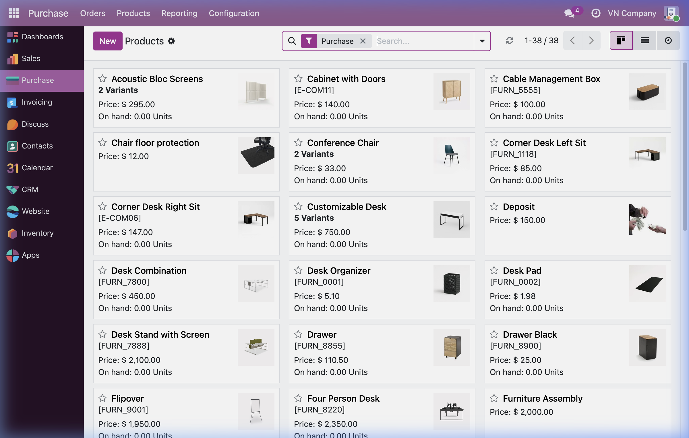
- **Step 3:** Điền thông tin giá vốn tại ô **Cost**, chọn **Purchase Taxes** và thiết lập **Control Policy** kiểm soát hóa đơn. Nhấn **Save** để lưu.

---

#### **4.2.2.2 Biến thể sản phẩm (Product Variants)**
##### **Mục đích & Ý nghĩa nghiệp vụ**
Tra cứu nhanh danh sách các biến thể hàng hóa đã tạo để cập nhật riêng giá vốn (Cost) hoặc giá mua thỏa thuận cho từng biến thể cụ thể (Ví dụ: Tủ Cabinet màu trắng có giá mua cao hơn màu đen).

##### **Các bước thực hiện**
- **Step 1:** Chọn phân hệ **"Purchase"** -> chọn **"Products"** -> click **"Product Variants"**.
- **Step 2:** Hệ thống hiển thị danh sách tất cả các biến thể đang có trên hệ thống. Nhấp chọn biến thể cần cấu hình để cập nhật thông tin đặc thù.

---

### **4.2.3 Đơn hàng (Orders)**

#### **4.2.3.1 Yêu cầu báo giá (Requests for Quotation)**
##### **Mục đích & Ý nghĩa nghiệp vụ**
Khởi tạo chứng từ Yêu cầu báo giá gửi đến nhà cung cấp để đối chiếu và lưu thông tin báo giá nháp trên hệ thống.

##### **Các bước thực hiện**
- **Step 1:** Tại thanh menu bên trái, nhấp chọn phân hệ **"Purchase"** (Mua hàng) để truy cập danh sách các Yêu cầu báo giá.
- **Step 2:** Nhấn nút **"New"** ở góc trên bên trái màn hình.
- **Step 3:** Click the **"Vendor"** field, type `Acme Corporation` and select the vendor.
- **Step 4:** Go down to the **Products** tab, click **"Add a product"**, select product `Cabinet with Doors` (Code `[E-COM11]`), and set the purchase quantity to `5.00`.
- **Step 5:** (Optional) Switch to the **"Other Information"** tab to check financial position, buyer, or payment terms.
   
- **Step 6:** Click the cloud save icon (**Save manually**) or click **"Confirm Order"** to convert it to a Purchase Order (PO).
   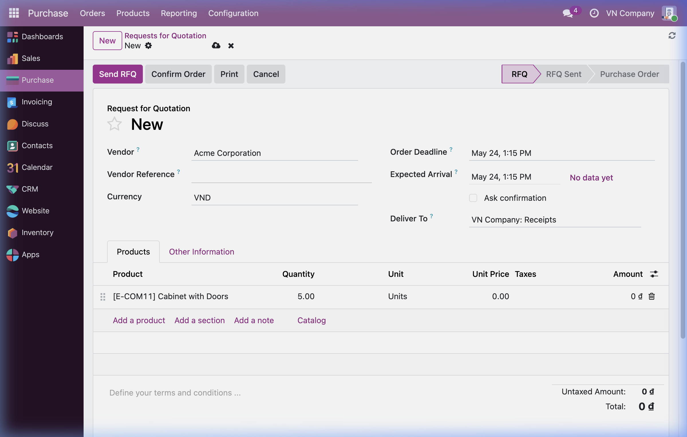

---

#### **4.2.3.2 Đơn mua hàng (Purchase Orders)**
##### **Mục đích & Ý nghĩa nghiệp vụ**
Xác nhận RFQ thành Đơn mua hàng chính thức (PO) gửi sang nhà cung cấp để thực hiện giao hàng, ghi nhận công nợ và tự động sinh phiếu nhập kho tương ứng.

##### **Các bước thực hiện**
- **Step 1:** Mở Yêu cầu báo giá (RFQ) đã tạo ở Mục 2.3.1.
- **Step 2:** Nhấp nút **[Confirm Order]** ở góc trái trên của màn hình:
   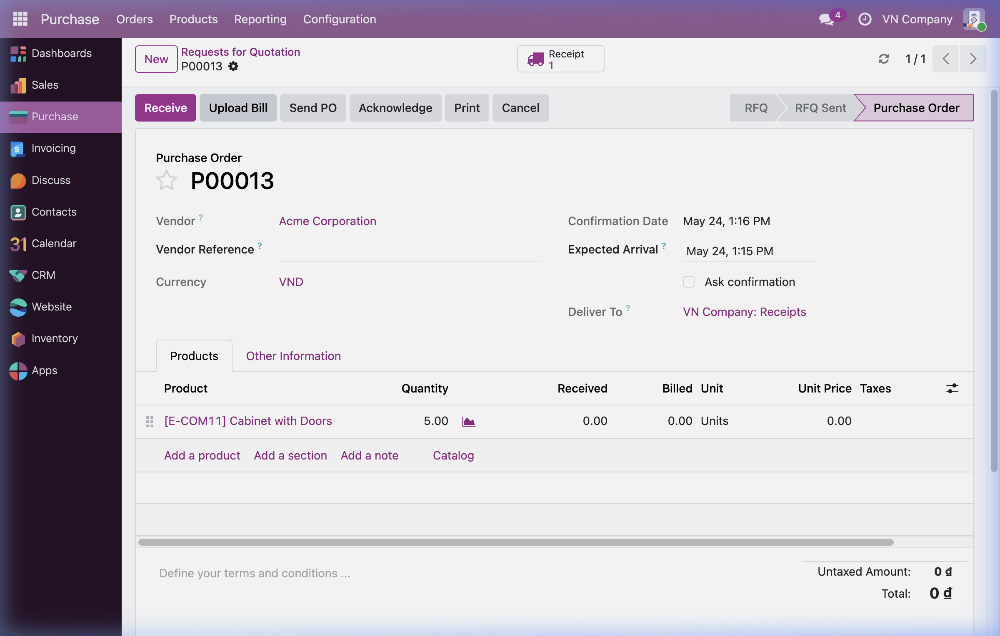
- **Step 3:** Hệ thống cập nhật trạng thái đơn hàng sang **Purchase Order** và tự động sinh phiếu nhập kho nháp liên kết.

---

#### **4.2.3.3 Nhà cung cấp (Vendors)**
##### **Mục đích & Ý nghĩa nghiệp vụ**
Quản lý hồ sơ, lịch sử giao dịch và tài khoản thanh toán của các nhà cung cấp sản phẩm và dịch vụ đầu vào cho công ty.

##### **Các bước thực hiện**
- **Step 1:** Select the **"Purchase"** app -> select the **"Orders"** menu -> click **"Vendors"**.
- **Step 2:** The system displays the list of vendors:
   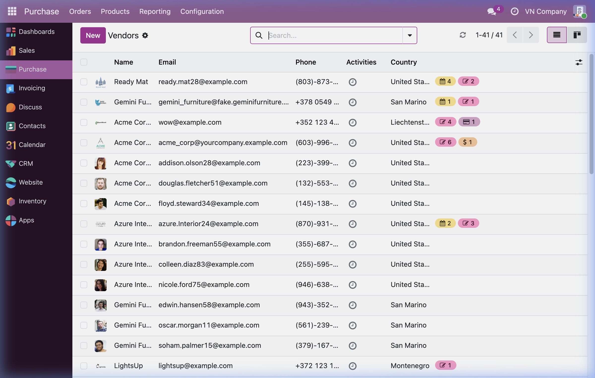
- **Step 3:** Click **New** to create a new vendor profile or select an existing vendor to view their transaction history.

---

## **4.3 🛡️ PHÂN HỆ HÓA ĐƠN (Invoicing)**

### **4.3.1 Cấu hình (Configuration)**

#### **4.3.1.1 Cấu hình thuế (Configuration > Taxes)**
##### **Mục đích & Ý nghĩa nghiệp vụ**
Cấu hình các loại thuế suất giá trị gia tăng (VAT) đầu vào và đầu ra áp dụng cho sản phẩm. Thiết lập này giúp hệ thống định khoản tự động tài khoản thuế phải nộp hoặc thuế được khấu trừ tương ứng khi ghi sổ hóa đơn.

##### **Explanation of Fields & Tab Configurations**
* **General Information:**
  * **Tax Name (*):** The display name of the tax (e.g., `VAT 10% Sales`).
  * **Tax Type (*):** Scope of application: **Sales** (for outgoing customer invoices) or **Purchase** (for incoming vendor bills).
  * **Tax Computation (*):** Calculation method, typically select **Percentage of Price**.
  * **Amount:** The tax rate value (e.g., `10.00` representing 10%).

* **Definition Tab:**
  Specifies how the base amount (Base) and calculated tax amount (Tax) are mapped to journal accounts on Invoices and Refunds:
  * **Base:** Price before tax. Leave the Account field **empty** (the system will automatically use the income/expense account of the product).
  * **Tax:** Calculated tax amount. Enter `%` as `100.00`, set `Based on` to `Tax` and choose the corresponding **Account** (e.g., `333100` for sales tax, `131000`/`1331` for purchase tax).
  * **Tax Grid:** Assign to the corresponding box on the VAT declaration form if automatic tax return generation is required (leave blank otherwise).

* **Advanced Options Tab:**
  * **Label on Invoices:** A short label displayed to customers on printed invoices (e.g., `VAT 10%`).
  * **Tax Group:** Category grouping for taxes (e.g., group `VAT 10% Group`).
  * **Country:** Select `Vietnam` to align with the correct currency and regulatory formats.
  * **Included in Price:** Check this if the product price entered on orders is tax-inclusive (retail B2C); uncheck it if it is tax-exclusive (wholesale B2B).
  * **Affect Base of Subsequent Taxes:** Check this if subsequent taxes should be computed on top of this tax (tax-on-tax, e.g., Special Consumption Tax calculated first, then VAT calculated on both product price + Special Consumption Tax).

##### **Steps to Execute**
- **Step 1:** Select the **"Invoicing"** app -> click **"Configuration"** -> select **"Taxes"**.
- **Step 2:** Click the **"New"** button to create a new tax:
   
- **Step 3:** Enter the **Tax Name**, select the **Tax Type**, input the **Amount**, and configure account mappings and advanced options in the **Definition** and **Advanced Options** tabs as described above:
   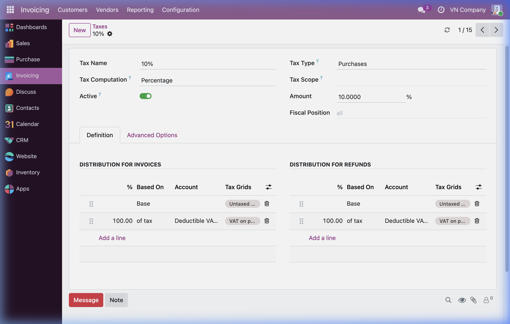
   * *Detailed configuration for Advanced Options tab:*
   
- **Step 4:** Click **Save** to save the tax.

---

#### **4.3.1.2 Sổ nhật ký (Journals)**
##### **Mục đích & Ý nghĩa nghiệp vụ**
Thiết lập các sổ nhật ký kế toán để phân nhóm các nghiệp vụ tài chính phát sinh (Ví dụ: Sổ nhật ký Hóa đơn bán hàng, Sổ nhật ký Mua hàng, Nhật ký tài khoản Ngân hàng, Nhật ký Tiền mặt). Mỗi sổ nhật ký sẽ quản lý một chuỗi số chứng từ riêng biệt và tài khoản định khoản mặc định.

##### **Các bước thực hiện**
- **Step 1:** Select the **"Invoicing"** app -> select **"Configuration"** -> click **"Journals"**.
- **Step 2:** Click the **"New"** button:
   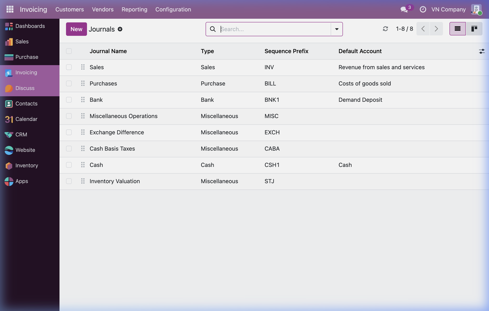
- **Step 3:** Enter the **Journal Name**, select the **Type** and enter the **Short Code**:
   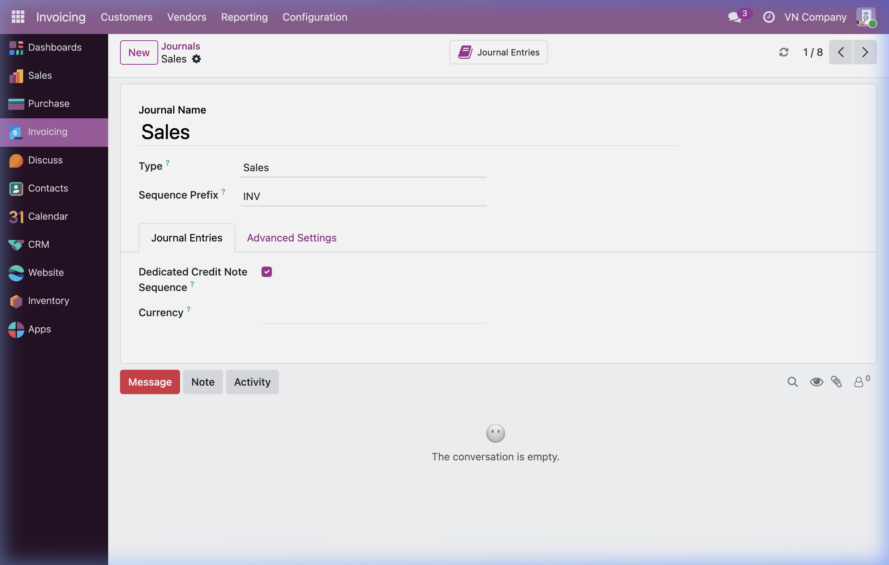
- **Step 4:** Set the default cash/bank accounts for payment journals under the **Journal Entries** tab.
- **Step 5:** Under the **Advanced Settings** tab, configure corresponding account controls, product controls, or payment methods:
   
- **Step 6:** Click **Save** to save the journal.

---

#### **4.3.1.3 Điều khoản thanh toán (Payment Terms)**
##### **Mục đích & Ý nghĩa nghiệp vụ**
Định nghĩa các chính sách tín dụng và thời hạn thanh toán áp dụng cho khách hàng hoặc nhà cung cấp (Ví dụ: Thanh toán ngay, Thanh toán 30% đặt cọc, 70% sau 30 ngày giao hàng).

##### **Các bước thực hiện**
- **Step 1:** Chọn phân hệ **"Invoicing"** -> chọn **"Configuration"** -> click **"Payment Terms"**.
- **Step 2:** Nhấn nút **"New"**:
   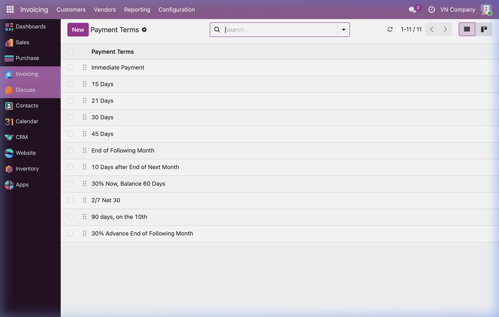
- **Step 3:** Nhập tên điều khoản thanh toán và cấu hình các dòng quy tắc thanh toán chi tiết:
   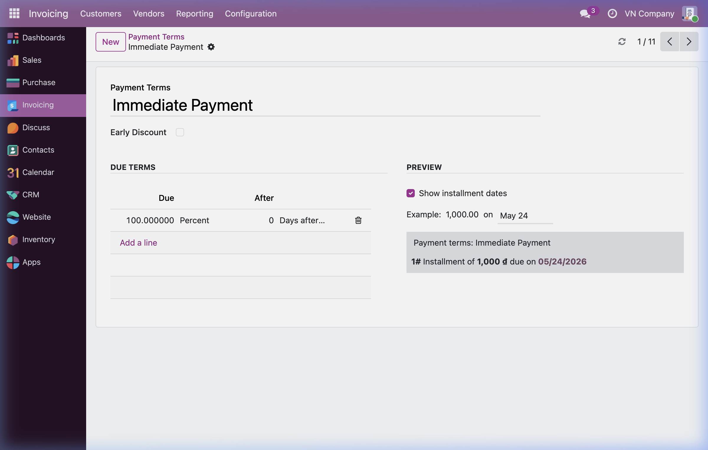
- **Step 4:** Nhấn **Save** để lưu.

---

### **4.3.2 Nhà cung cấp (Vendor)**

#### **4.3.2.1 Hóa đơn nhà cung cấp (Bills)**
##### **Mục đích & Ý nghĩa nghiệp vụ**
Ghi nhận hóa đơn mua hàng do nhà cung cấp phát hành gửi đến doanh nghiệp để hạch toán chi phí đầu vào và ghi nhận công nợ phải trả (Accounts Payable).

##### **Các bước thực hiện**
- **Step 1:** Chọn phân hệ **"Invoicing"** -> di chuyển đến menu **"Vendors"** -> click **"Bills"**.
- **Step 2:** Nhấn nút **"New"** để tạo hóa đơn NCC mới:
   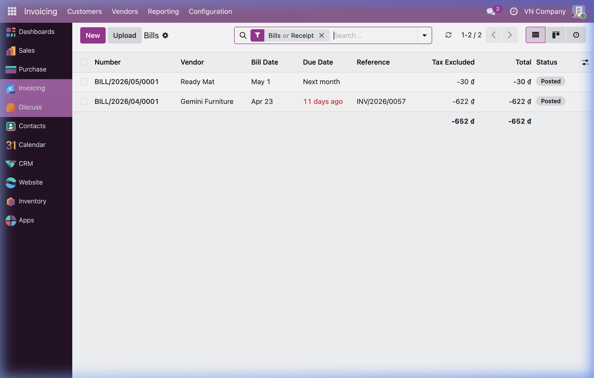
- **Step 3:** Enter vendor name in **Vendor**, invoice date in **Bill Date**, and product lines in the **Invoice Lines** tab.
- **Step 4:** (Optional) Switch to the **"Other Info"** tab to enter payment details such as payment terms, due date, and bank account.
   
- **Step 5:** Click the **"Save"** button to save it as draft, and click **"Confirm"** to officially post the payable liability.

---

#### **4.3.2.2 Hóa đơn trả lại / Hoàn tiền (Refunds)**
##### **Mục đích & Ý nghĩa nghiệp vụ**
Tạo chứng từ giảm trừ công nợ hoặc hoàn tiền từ nhà cung cấp (Vendor Credit Note) trong trường hợp doanh nghiệp trả lại hàng lỗi, hỏng hoặc được giảm giá mua hàng.

##### **Các bước thực hiện**
- **Step 1:** Chọn phân hệ **"Invoicing"** -> di chuyển đến menu **"Vendors"** -> click **"Refunds"** (hoở mở trực tiếp hóa đơn Bill gốc và chọn **Add Credit Note**):
   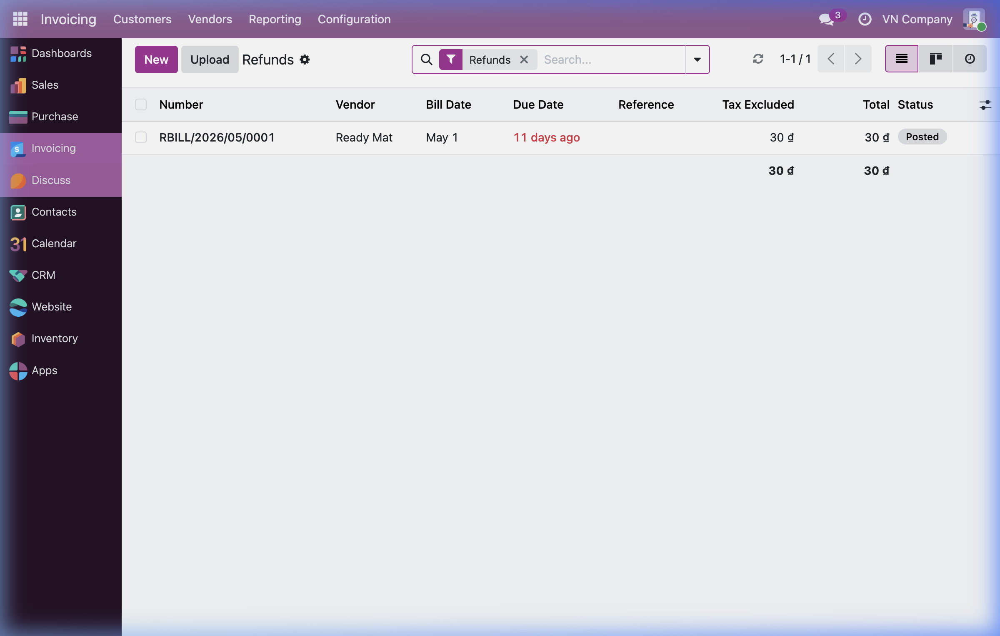
- **Step 2:** Điền số tiền được hoàn trả hoặc cấn trừ, lý do hoàn tiền. Nhấn **Save** và **Confirm** để giảm trừ công nợ phải trả nhà cung cấp.

---

#### **4.3.2.3 Thanh toán cho nhà cung cấp (Vendor Payments)**
##### **Mục đích & Ý nghĩa nghiệp vụ**
Ghi nhận bút toán chuyển khoản ngân hàng hoặc chi tiền mặt thực tế để thanh toán công nợ cho nhà cung cấp.

##### **Các bước thực hiện**
- **Step 1:** Chọn phân hệ **"Invoicing"** -> di chuyển đến menu **"Vendors"** -> click **"Payments"**.
- **Step 2:** Nhấn nút **"New"** (hoặc mở hóa đơn Bill gốc đang nợ và nhấn **Register Payment**):
   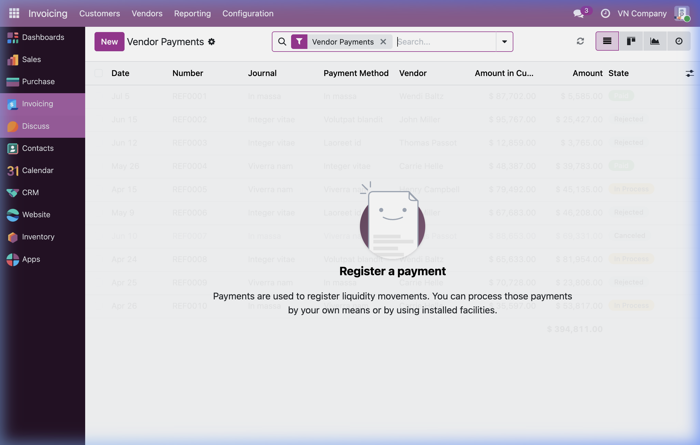
- **Step 3:** Chọn sổ nhật ký thanh toán (Tiền mặt/Ngân hàng), điền số tiền trả và chọn nhà cung cấp đối ứng. Nhấn **Confirm** để khấu trừ nợ phải trả.

---

#### **4.3.2.4 Sản phẩm (Products)**
##### **Mục đích & Ý nghĩa nghiệp vụ**
Tra cứu nhanh danh sách các mặt hàng mua vào để phục vụ làm Bills hoặc cấu hình tài khoản kế toán chi phí đầu vào tương ứng cho sản phẩm.

##### **Các bước thực hiện**
- **Step 1:** Chọn phân hệ **"Invoicing"** -> di chuyển đến menu **"Vendors"** -> click **"Products"**.
- **Step 2:** Click chọn sản phẩm cần cấu hình để điều chỉnh các tài khoản kế toán chi phí tại tab **Income/Expense Accounts**.

---

#### **4.3.2.5 Nhà cung cấp (Vendors)**
##### **Mục đích & Ý nghĩa nghiệp vụ**
Xem và cấu hình thông tin danh bạ đối tác là nhà cung cấp, cấu hình tài khoản công nợ phải trả mặc định (Account Payable) phục vụ hạch toán mua hàng.

##### **Các bước thực hiện**
- **Step 1:** Chọn phân hệ **"Invoicing"** -> di chuyển đến menu **"Vendors"** -> click **"Vendors"**.
- **Step 2:** Chọn nhà cung cấp cần thiết lập, tại tab **Accounting**, gán tài khoản kế toán công nợ và nhấn **Save**.

---

### **4.3.3 Khách hàng (Customers)**

#### **4.3.3.1 Hóa đơn khách hàng (Invoices)**
##### **Mục đích & Ý nghĩa nghiệp vụ**
Ghi nhận doanh thu bán hàng và công nợ phải thu từ khách hàng (Accounts Receivable). Hóa đơn sau khi được ghi sổ sẽ cấp số hiệu chính thức và ghi nhận công nợ.

##### **Các bước thực hiện**
- **Step 1:** Chọn phân hệ **"Invoicing"** (Hóa đơn) bên menu trái để xem danh sách hóa đơn hiện có:
   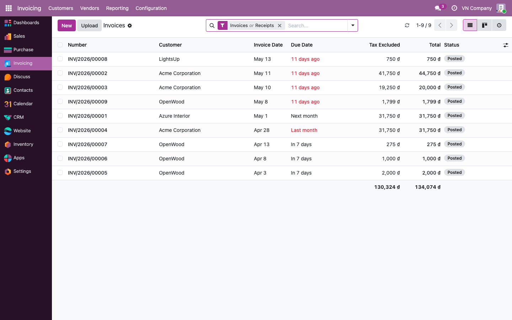
- **Step 2:** Nhấp nút **"New"** ở góc trên cùng bên trái.
- **Step 3:** Select the customer in the **Customer** field (e.g., `Acme Corporation`) and enter product lines in the **Invoice Lines** tab.
- **Step 4:** Set the quantity to `1.00`, the system automatically fetches the default price `140.00`.
- **Step 5:** (Optional) Switch to the **"Other Info"** tab to set bank accounts, payment terms, or salespersons.
   
- **Step 6:** Save the invoice in draft status:
   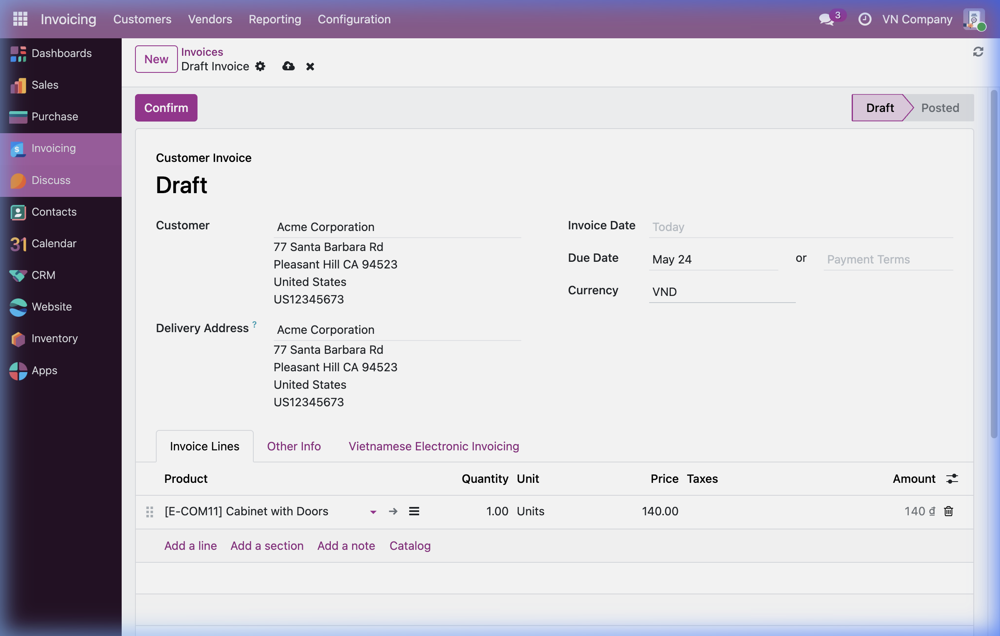
- **Step 7:** Click **"Confirm"** at the top left to officially post the invoice.
- **Step 8:** Trạng thái chuyển sang **Posted**, hệ thống sinh số hóa đơn dạng `INV/2026/00010` và hiển thị khoản nợ cần thu ở trường **Amount Due**:
   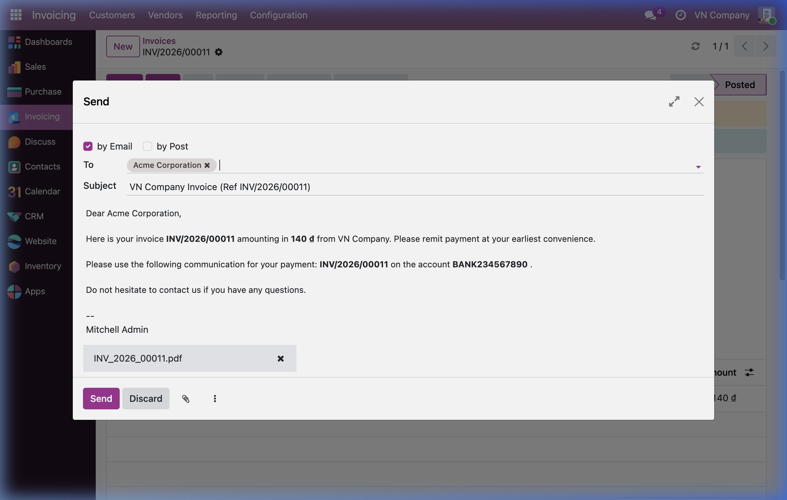

---

#### **4.3.3.2 Ghi chú tín dụng / Giảm trừ nợ (Credit Notes)**
##### **Mục đích & Ý nghĩa nghiệp vụ**
Tạo hóa đơn giảm trừ công nợ (Credit Note) cho khách hàng trong trường hợp trả lại hàng hóa đã mua hoặc được chiết khấu, giảm giá sau khi hóa đơn chính thức đã xuất.

##### **Các bước thực hiện**
- **Step 1:** Mở Hóa đơn khách hàng (Invoice) cần giảm trừ đã ghi sổ.
- **Step 2:** Nhấp nút **[Credit Note]** ở thanh công cụ phía trên.
- **Step 3:** Nhập lý do giảm trừ nợ, chọn phương thức hoàn tiền và nhấn **Confirm** để tạo và ghi sổ hóa đơn giảm trừ công nợ:
   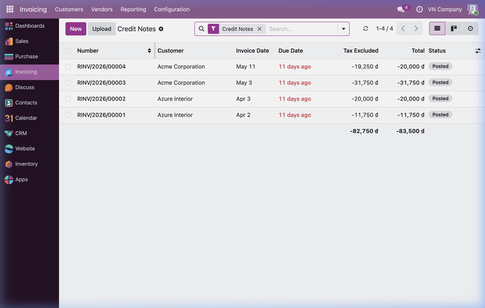

---

#### **4.3.3.3 Ghi nhận thanh toán của khách hàng (Customer Payments)**
##### **Mục đích & Ý nghĩa nghiệp vụ**
Ghi nhận số tiền thu về từ khách hàng (chuyển khoản ngân hàng hoặc tiền mặt) để cấn trừ các hóa đơn còn nợ của họ trên hệ thống.

##### **Các bước thực hiện**
- **Step 1:** Mở hóa đơn bán hàng cần ghi nhận thanh toán đang có trạng thái **Posted**.
- **Step 2:** Nhấn nút **[Pay]** (hoặc **Register Payment**) ở góc trên bên trái:
   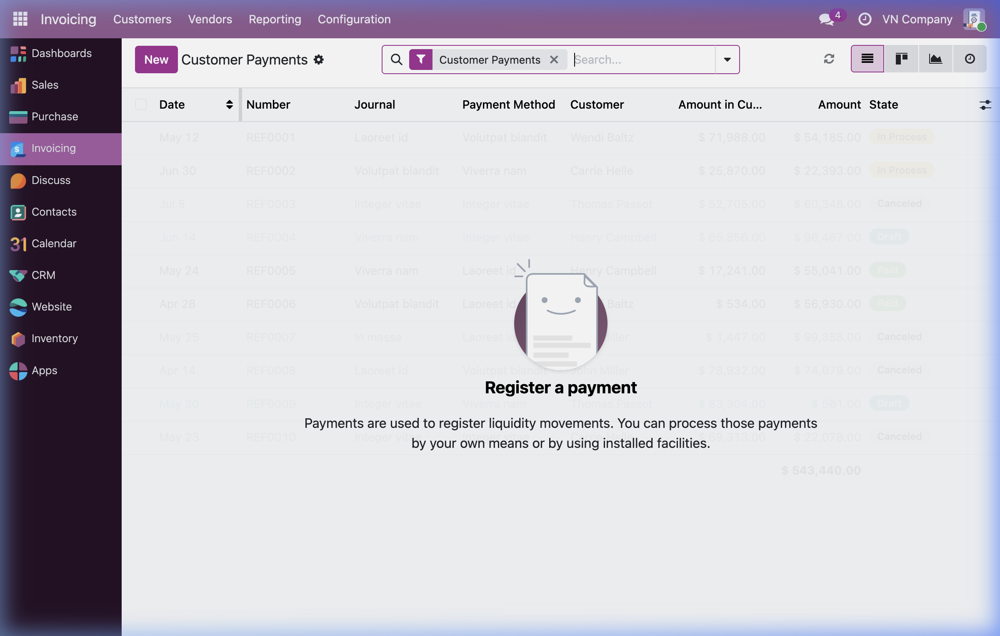
- **Step 3:** Chọn Sổ nhật ký nhận tiền (Cash/Bank), số tiền nhận thực tế và nhấn **Create Payment**.
- **Step 4:** Hoặc đối với khách hàng có sẵn tiền đặt cọc trước đó: Cuộn xuống chân trang tại phần **Outstanding credits** và nhấn nút **[Add]** bên cạnh khoản tiền cọc để cấn trừ trực tiếp công nợ.

---

#### **4.3.3.4 Sản phẩm (Products)**
##### **Mục đích & Ý nghĩa nghiệp vụ**
Tra cứu nhanh danh sách các mặt hàng bán ra để kiểm tra thông tin tài khoản doanh thu (Income Account) phục vụ xuất hóa đơn khách hàng.

##### **Các bước thực hiện**
- **Step 1:** Chọn phân hệ **"Invoicing"** -> di chuyển đến menu **"Customers"** -> click **"Products"**.
- **Step 2:** Cấu hình tài khoản kế toán ghi nhận doanh thu mặc định cho sản phẩm tại tab **Accounting**.

---

#### **4.3.3.5 Khách hàng (Customers)**
##### **Mục đích & Ý nghĩa nghiệp vụ**
Quản lý danh sách khách hàng và thiết lập các thông tin tài khoản ngân hàng, tài khoản công nợ phải thu (Account Receivable) của khách hàng phục vụ cho phân hệ Kế toán.

##### **Các bước thực hiện**
- **Step 1:** Chọn phân hệ **"Invoicing"** -> di chuyển đến menu **"Customers"** -> click **"Customers"**.
- **Step 2:** Chọn khách hàng cần thiết lập, tại tab **Accounting**, gán tài khoản kế toán công nợ phải thu và nhấn **Save** để cập nhật.

---

## **4.4 📦 PHÂN HỆ KHO (Inventory)**

### **4.4.1 Cấu hình (Configuration)**

#### **4.4.1.1 Kho hàng (Warehouses)**
##### **Mục đích & Ý nghĩa nghiệp vụ**
Quản lý các địa điểm vật lý hoặc kho hàng của doanh nghiệp (Ví dụ: Kho chính, Kho trung chuyển, Kho chi nhánh). Việc thiết lập kho hàng giúp hệ thống theo dõi chính xác lượng tồn kho và cấu hình các tuyến đường vận chuyển tự động.

##### **Các bước thực hiện**
- **Step 1:** Chọn phân hệ **"Inventory"** -> chọn **"Configuration"** -> click **"Warehouses"**.
- **Step 2:** Hệ thống hiển thị danh sách các kho hàng:
   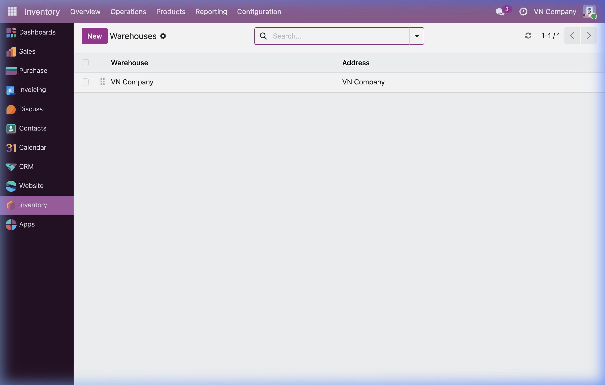
- **Step 3:** Nhấp chọn một kho hàng (hoặc nhấn **"New"** để tạo mới) để xem thông tin chi tiết:
   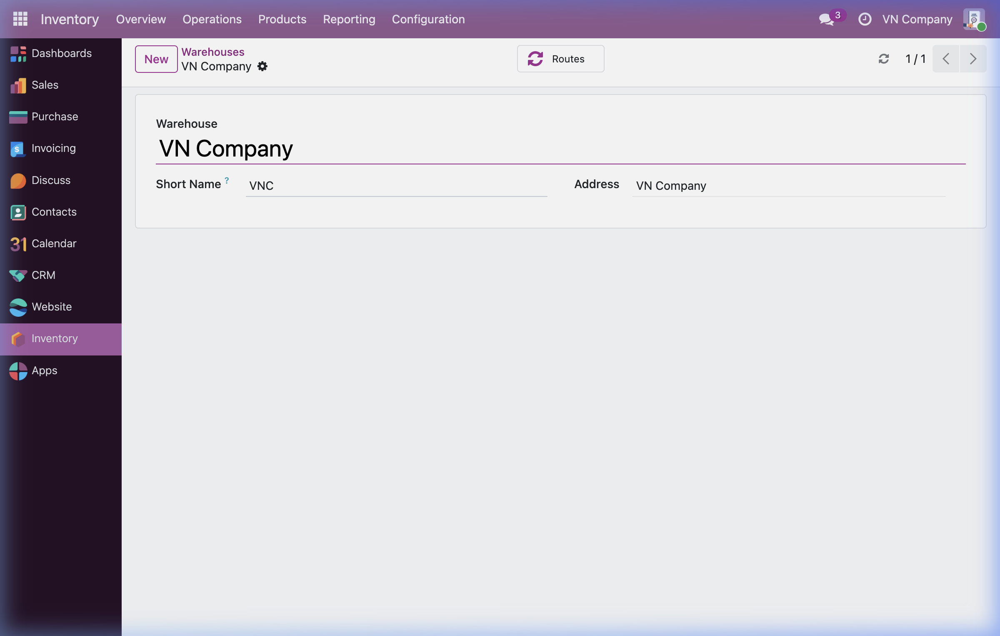
- **Step 4:** Nhập tên kho hàng (**Warehouse**), mã viết tắt (**Short Name**), và địa chỉ kho. Nhấn **Save** để lưu.

---

#### **4.4.1.2 Loại hoạt động (Operations Types)**
##### **Mục đích & Ý nghĩa nghiệp vụ**
Định nghĩa các loại giao dịch kho khác nhau (Ví dụ: Nhận hàng - Receipts, Giao hàng - Delivery Orders, Chuyển kho nội bộ - Internal Transfers). Mỗi loại hoạt động sẽ có quy trình xử lý, địa điểm kho nguồn/đích mặc định và chuỗi số phiếu riêng biệt.

##### **Các bước thực hiện**
- **Step 1:** Chọn phân hệ **"Inventory"** -> chọn **"Configuration"** -> click **"Operations Types"**.
- **Step 2:** Hệ thống hiển thị danh sách các loại hoạt động:
   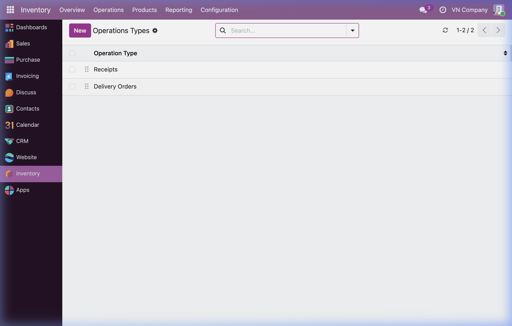
- **Step 3:** Nhấp chọn một loại hoạt động để xem chi tiết cấu hình:
   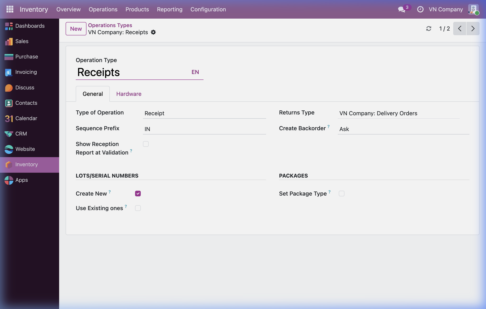
- **Step 4:** Định nghĩa tên loại hoạt động, chọn kho hàng áp dụng, địa điểm nguồn/đích mặc định và nhấn **Save**.

---

### **4.4.2 Hoạt động kho (Operations)**

#### **4.4.2.1 Nhận hàng (Receipts)**
##### **Mục đích & Ý nghĩa nghiệp vụ**
Thực hiện nhận hàng hóa từ nhà cung cấp vào kho dựa trên Đơn mua hàng (PO). Phiếu nhận hàng ghi nhận số lượng thực nhập, in phiếu nhập kho và cập nhật số lượng tồn kho tức thời.

##### **Các bước thực hiện**
- **Step 1:** Chọn phân hệ **"Inventory"** -> chọn menu **"Operations"** -> click **"Receipts"** (hoặc nhấn vào nút **"Receipts"** trên bảng điều khiển Inventory Overview).
- **Step 2:** Chọn phiếu nhận hàng có trạng thái **"Ready"** liên kết với PO tương ứng.
- **Step 3:** Check the actual quantity received in the **"Done"** column of the **Operations** tab.
- **Step 4:** (Optional) Switch to the **"Additional Info"** tab to enter shipping partner info or verify source documents.
   
- **Step 5:** (Optional) Switch to the **"Note"** tab to add internal shipping notes or special instructions.
   
- **Step 6:** Click **"Validate"** to complete the stock receipt:
   

---

#### **4.4.2.2 Giao hàng (Deliveries)**
##### **Mục đích & Ý nghĩa nghiệp vụ**
Xuất kho hàng hóa để giao cho khách hàng dựa trên Đơn bán hàng (SO). Phiếu giao hàng giúp kiểm tra tình trạng hàng trong kho, chuẩn bị hàng và xác nhận xuất kho chính thức.

##### **Các bước thực hiện**
- **Step 1:** Chọn phân hệ **"Inventory"** -> chọn menu **"Operations"** -> click **"Deliveries"** (hoặc nhấn vào nút **"Delivery Orders"** trên bảng điều khiển Inventory Overview).
- **Step 2:** Chọn phiếu giao hàng tương ứng của Đơn bán hàng cần xuất.
- **Step 3:** Confirm the actual shipped quantity in the **"Done"** column of the **Operations** tab.
- **Step 4:** (Optional) Switch to the **"Additional Info"** tab to set shipping partner details or tracking numbers.
   
- **Step 5:** (Optional) Switch to the **"Note"** tab to add shipping notes.
   
- **Step 6:** Click **"Validate"** to officially complete the stock delivery:
   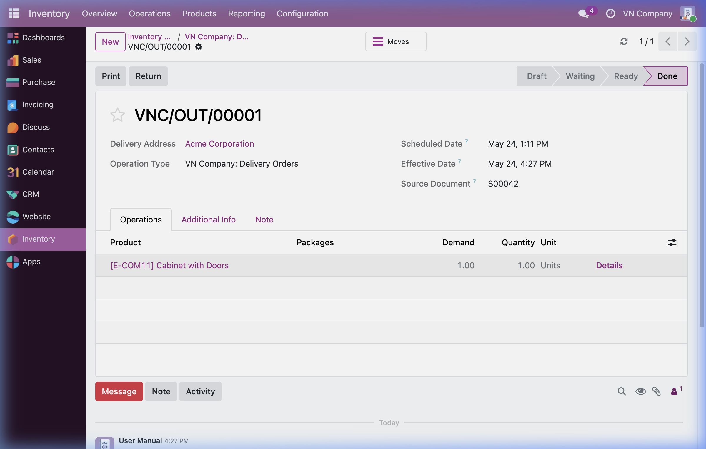

#### **4.4.2.3 Chuyển kho nội bộ (Internal Transfers)**
##### **Mục đích & Ý nghĩa nghiệp vụ**
Transfer goods between physical warehouses or different locations within the same warehouse (e.g., transferring goods from the Main Warehouse to the Retail Store Warehouse, or moving defective items to a scrap/QC location). This process helps optimize stock availability and logistics workflows.

> [!IMPORTANT]
> If you cannot see the **Source Location** and **Destination Location** fields, it is because **Storage Locations** has not been enabled in system settings. Contact your administrator to navigate to **Inventory** -> **Configuration** -> **Settings**, tick **Storage Locations**, and save.

##### **Steps to Execute**
- **Step 1:** Select the **"Inventory"** app -> select the **"Operations"** menu -> click **"Transfers"** (or click **"New"** under the **Internal Transfers** card on the Inventory Overview dashboard).
   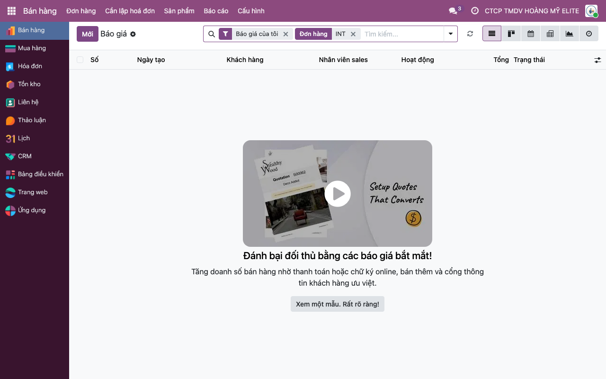
- **Step 2:** Click the **"New"** button.
- **Step 3:** Select the **Source Location** and **Destination Location**. In the **Operations** tab, click **"Add a line"**, choose the product, and enter the **Demand** quantity:
   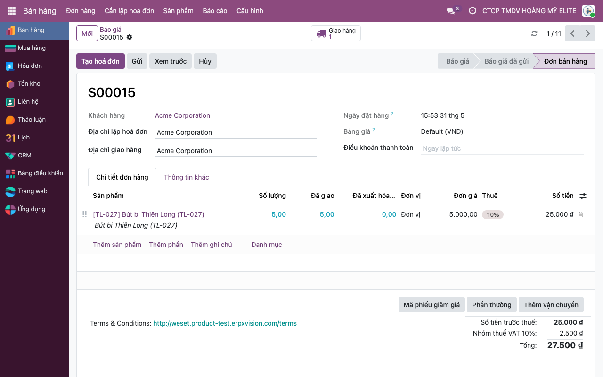
- **Step 4:** Click **Save**, then click **Mark as Todo** and **Check Availability** to reserve the stock.
- **Step 5:** Once the physical transfer is completed, enter the moved quantity in the **Done** column and click **Validate** to complete the transfer.

> [!IMPORTANT]
> **Important Stock Transfer Rules:**
> - **Source Stock Availability:** The source location must have sufficient stock on hand to **Validate** the transfer. If stock is unavailable, the transfer remains in a *Waiting* state and cannot be completed.
> - **Stock Reservation:** Clicking **Check Availability** locks the required quantity in the source location under the **Reserved** column, preventing it from being allocated to other sales or transfer orders.
> - **Lot/Serial Tracking:** For products tracked by Lots or Serial Numbers, you must specify the exact Lot/Serial number being transferred under the operations detail. You cannot simply input a generic quantity.
> - **Unit of Measure (UoM):** Ensure that the correct UoM is used to prevent incorrect quantity conversions and inventory discrepancies.

---

#### **4.4.2.4 Kiểm kho định kỳ (Physical Inventory)**
##### **Mục đích & Ý nghĩa nghiệp vụ**
Kiểm kê số lượng tồn kho thực tế tại kho và điều chỉnh số lượng tồn kho trên hệ thống nếu có chênh lệch, đảm bảo tính chính xác của số liệu kế toán kho.

##### **Các bước thực hiện**
- **Step 1:** Chọn phân hệ **"Inventory"** -> chọn menu **"Operations"** -> click **"Physical Inventory"**.
- **Step 2:** Nhấn nút **"New"** để bắt đầu đợt kiểm kê, hoặc chọn các dòng sản phẩm hiển thị để điều chỉnh trực tiếp số lượng thực tế tại cột **"Counted Quantity"**:
   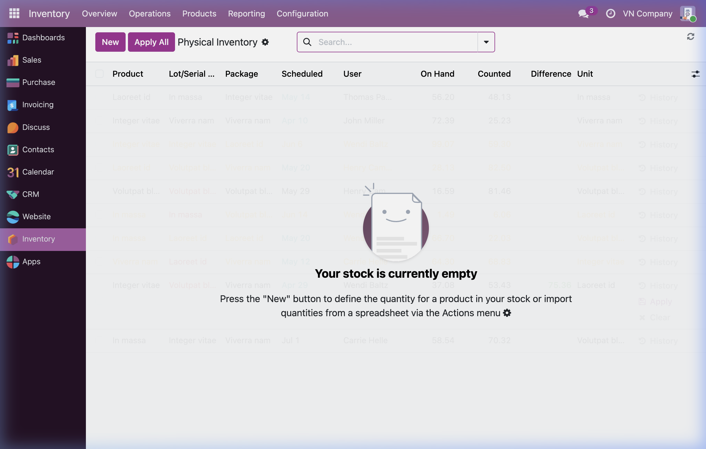
- **Step 3:** Sau khi nhập số lượng thực tế kiểm đếm, nhấn **"Apply"** để hệ thống tự động sinh bút toán điều chỉnh kho.

---

#### **4.4.2.5 Phiếu loại bỏ / Hủy hàng (Scrap Orders)**
##### **Mục đích & Ý nghĩa nghiệp vụ**
Loại bỏ hàng hóa bị hư hỏng, lỗi, hết hạn sử dụng ra khỏi kho và ghi nhận chi phí hao hụt kho tương ứng.

##### **Các bước thực hiện**
- **Step 1:** Chọn phân hệ **"Inventory"** -> chọn menu **"Operations"** -> click **"Scrap Orders"**.
- **Step 2:** Nhấn nút **"New"** để tạo phiếu hủy hàng:
   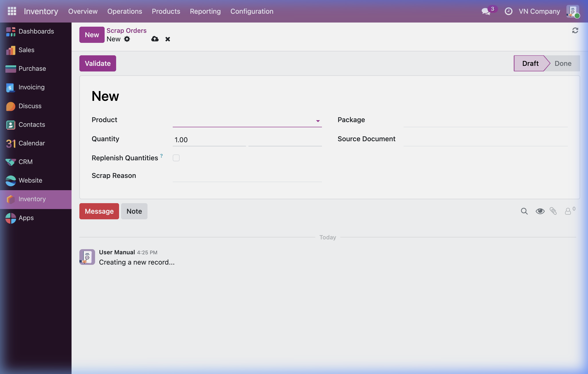
- **Step 3:** Chọn sản phẩm cần hủy, nhập số lượng hủy tại cột **"Quantity"**, và chọn kho chứa hàng lỗi. Nhấn **Save** và **Validate** để hoàn tất hủy hàng.

---

#### **4.4.2.6 Product Returns (Quy trình Trả hàng)**
##### **Mục đích & Ý nghĩa nghiệp vụ**
Process returned products from customers (Customer Returns) or return defect/incorrect items to vendors (Vendor Returns). This workflow updates the stock levels accurately and serves as a basis for the accounting department to issue credit notes or refund bills.

##### **1. Customer Returns (Khách hàng trả lại hàng)**
- **Step 1:** Go to the **Inventory** app -> select **Operations** -> click **Deliveries** (or **Transfers**). Find and open the completed Delivery Order (with code **OUT**) corresponding to the original order being returned.
- **Step 2:** On the completed delivery form, click the **[Return] (Trả hàng)** button in the statusbar at the top:
   
- **Step 3:** In the pop-up Return wizard, verify the product list and enter the returned quantities in the **Quantity** column:
   
- **Step 4:** Click the green <strong>[Return]</strong> button. The system automatically generates a new incoming receipt in a **Ready** state with the origin set to *"Return of [original OUT code]"*:
   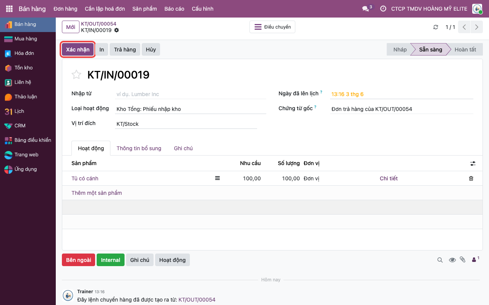
- **Step 5:** Check the returned goods physically, input the actual quantities in the **Done** column, and click **[Validate]** to return the items to stock:
   

##### **2. Vendor Returns (Trả hàng cho Nhà cung cấp)**
- **Step 1:** Go to the **Inventory** app -> select **Operations** -> click **Receipts** (or **Transfers**). Find and open the completed Receipt (with code **IN**) corresponding to the original purchase order being returned.
- **Step 2:** Click the **[Return] (Trả hàng)** button in the statusbar at the top:
   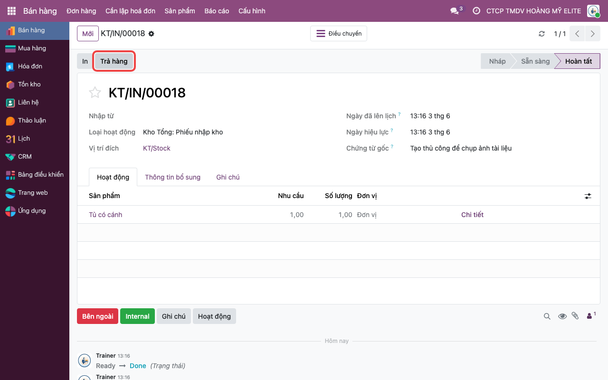
- **Step 3:** In the pop-up Return wizard, enter the product quantities to be sent back to the vendor:
   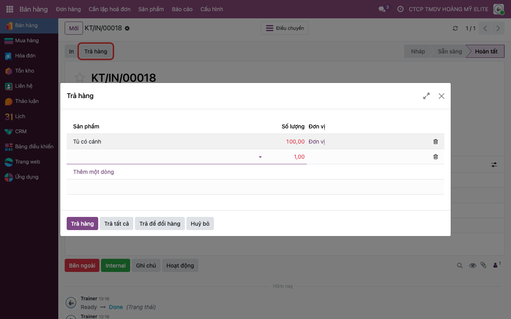
- **Step 4:** Click the **[Return]** button. The system automatically generates a new outgoing delivery in a <strong>Ready</strong> state with the origin set to *"Return of [original IN code]"*:
   
- **Step 5:** Click **[Validate]** to complete the return shipment:
   

---

#### **4.4.2.7 Tổng quan kho (Inventory Overview)**
##### **Mục đích & Ý nghĩa nghiệp vụ**
Bảng điều khiển trung tâm hiển thị trạng thái hoạt động của tất cả các loại hoạt động kho (Nhập kho, Xuất kho, Chuyển kho nội bộ) giúp thủ kho nắm bắt nhanh số lượng phiếu đang chờ xử lý (To Process), phiếu trễ hạn (Late), hoặc phiếu sẵn sàng thực hiện (Ready).

##### **Các bước thực hiện**
- **Step 1:** Chọn phân hệ **"Inventory"** -> chọn menu **"Operations"** -> click **"Inventory Overview"** (hoặc click trực tiếp vào tab Inventory khi vào phân hệ).
- **Step 2:** Màn hình Kanban hiển thị các thẻ đại diện cho từng loại hoạt động kho:
   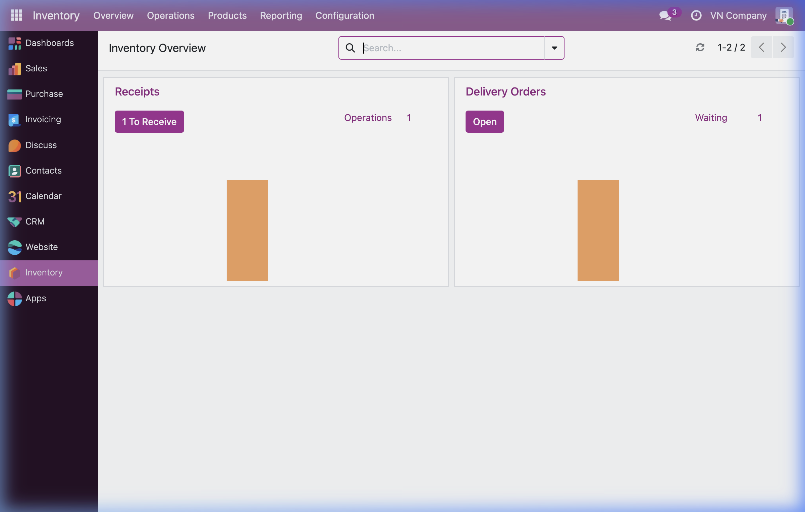
- **Step 3:** Nhấp vào các phím chức năng trên thẻ để đi đến danh sách các phiếu kho tương ứng theo trạng thái cần xử lý.

---

#### **4.4.2.8 Make to Order (MTO) Procurement Workflow**
##### **Mục đích & Ý nghĩa nghiệp vụ**
The MTO workflow is used for "Buy to Order" (Back-to-Back) business models. When a customer orders a product that is not stocked, the system automatically generates a draft Purchase Order (RFQ) for the designated vendor as soon as the Sales Order (SO) is confirmed. This keeps inventory costs low and automates cross-document references.

##### **Các bước thực hiện cấu hình và vận hành**

###### **1. Product Configuration**
- **Step 1:** Go to the **Products** app -> open the target product. Ensure both **Sales** and **Purchase** checkboxes are ticked at the top:
   
- **Step 2:** Select the **Purchase** tab -> click **[Add a line]** to assign a default Vendor and the purchase price:
   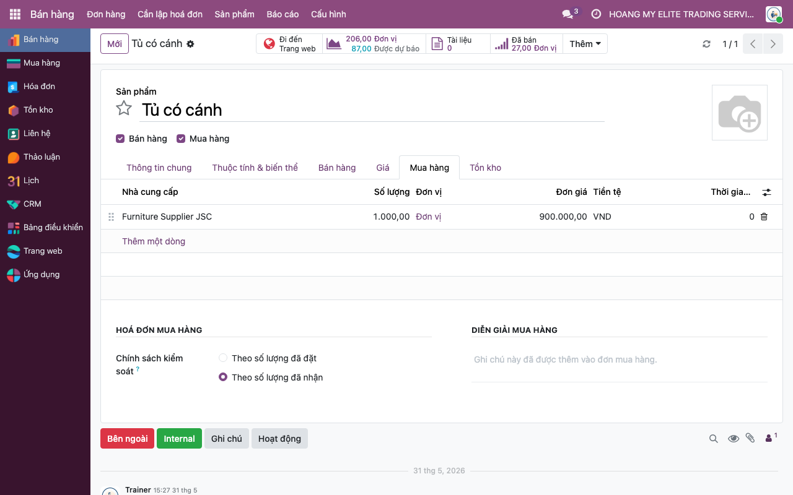

###### **2. Operating the Flow**
- **Step 3:** Create a new Sales Order (SO), select the product configured for MTO, enter the quantity, and click **[Confirm]**.
- **Step 4:** Once confirmed, a **Purchase Orders** smart button will appear at the top-right of the SO form, showing the number of generated POs:
   
- **Step 5:** Go to the **Purchase** app -> open the draft Request for Quotation (RFQ) generated. In the **Source Document** field, you will see the referencing SO code:
   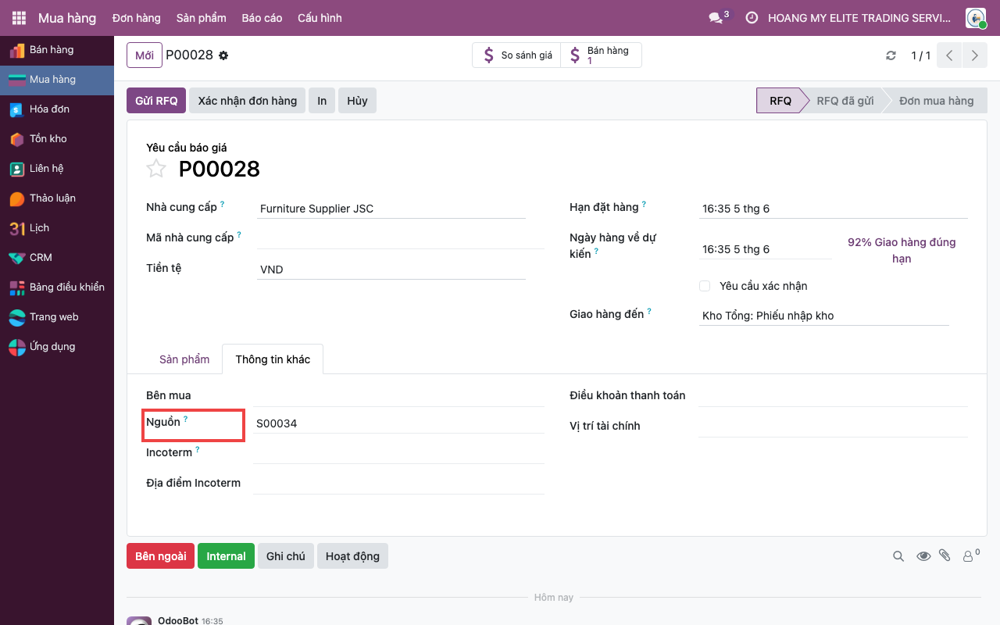

###### **3. Warehouse Operations**
- **Step 6:** On the confirmed Sales Order (SO), click the **Delivery** smart button. The generated Delivery Order (OUT) will be in **Waiting Another Operation** status since the goods have not arrived:
   
- **Step 7:** Once the purchasing team confirms the PO, a vendor Receipt (IN) is generated. Go to the Inventory app -> open this receipt (it will be in **Ready** status):
   
- **Step 8:** The storekeeper receives the goods and clicks **[Validate]** on the receipt (IN). Odoo immediately auto-reserves this stock for the SO, and the Delivery Order (OUT) status changes to **Ready**:
   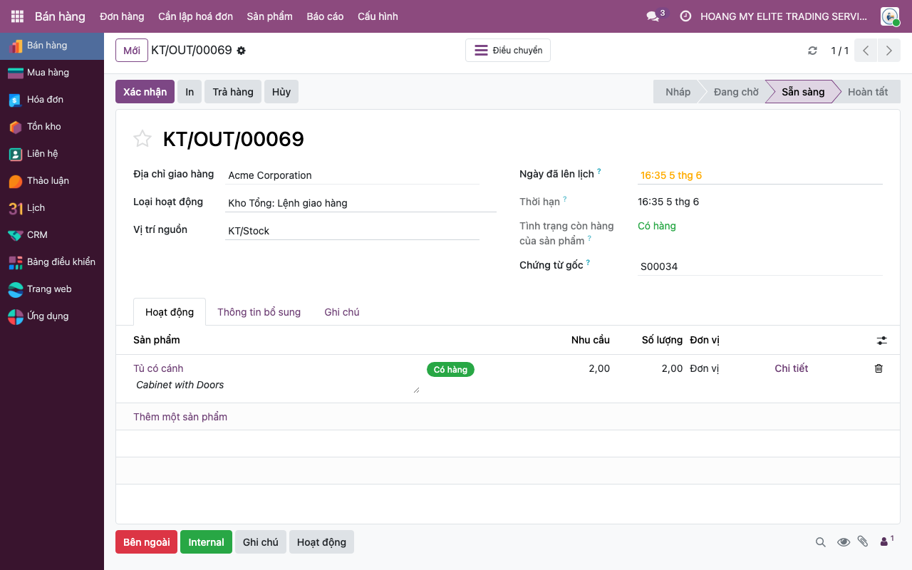
- **Step 9:** Open the Delivery Order (OUT) again and click **[Validate]** to finally ship the goods to the customer.

##### **Important Notes (Exceptions & Accounting)**
> [!IMPORTANT]
> **1. Order Cancellation:** If the SO is cancelled after the PO has been generated, the automatic link is broken. The generated PO will NOT be automatically cancelled; the purchasing team must cancel it manually.
>
> **2. Accounting & Invoicing Notes:**
> * **Vendor Bills:** It is recommended to use the **On Received Quantities** policy to pay vendors only for what is actually received.
> * **Customer Invoices:** It is recommended to use the **On Delivered Quantities** invoicing policy to prevent invoicing before the actual delivery.
> * **Margin Control:** Accounts should cross-reference the purchase price in the automatically generated PO with the sales price on the SO to check margins before confirming the PO.

---

# **5. Exceptions & Troubleshooting (Luồng ngoại lệ & Xử lý sự cố)**

During ERP operations, you may encounter exception workflows or need to cancel documents. Here is the handling guide:

## **5.1 Cancellation & Exception Workflows**

##### **1. How to cancel a Sales/Purchase Order?**
- **Case 1 (No deliveries, no invoices):** Open the order and click **[Cancel]**.
- **Case 2 (Deliveries or Invoices exist):** You cannot cancel directly. You must:
  - Return the delivery orders.
  - Create a Credit Note for the invoice.
  - Then cancel the original order.

##### **2. Return/Cancel a "Done" receipt, delivery, or internal transfer order?**
- A completed transfer **cannot be deleted or cancelled** directly.
- **Solution:** Open the transfer, click **[Return]**. The system automatically generates a reverse transfer to return the stock to the original location (for internal transfers, goods will be moved back to the source location).

##### **3. Fix a "Posted" accounting invoice?**
- Under accounting standards, posted invoices cannot be deleted.
- **Solution:** Click **[Add Credit Note]** to completely reverse the old invoice value, and then create a new invoice with correct details.

## **5.2 General FAQ**

##### **1. Cannot "Validate" a delivery or internal transfer order?**
- **Cause:** Not enough products in the source location (The "Reserved" column is red).
- **Solution:** Check the actual on-hand quantity in the source location, or check if another transfer has reserved this product.

##### **2. Created an internal transfer but cannot see "Source Location" and "Destination Location" fields?**
- **Cause:** The **Storage Locations** feature is not enabled in the settings.
- **Solution:** Contact the System Administrator to go to **Inventory** -> **Configuration** -> **Settings** -> check **Storage Locations** and save.

##### **3. Cannot see a specific menu?**
- **Cause:** Your account lacks the required access permissions.
- **Solution:** Contact the System Administrator to request the necessary permissions.

---

# **6. Glossary (Giải nghĩa thuật ngữ)**

The table below summarizes common terms and acronyms used in Elite ERP to help new users:

| Term / Acronym 

 | Detailed Explanation |
| :--- | :--- |
| **ERP** (Enterprise Resource Planning) | The core platform of Elite ERP used to manage business operations. |
| **SO** (Sales Order) | A confirmed document indicating that a customer has agreed to purchase goods/services. |
| **PO** (Purchase Order) | An official document sent to a vendor to order goods. |
| **RFQ** (Request for Quotation) | A draft purchase order used to ask a vendor for pricing before confirming the purchase. |
| **Credit Note** | A document used to reverse the value of a posted invoice (e.g., when a customer returns goods or an invoice is incorrect). |
| **Validate** | The action of confirming a transaction in the system (e.g., Validating a delivery). Once validated, records usually cannot be deleted. |
| **Posted** | The status of an invoice when it has been officially recorded in the accounting journal. |
| **Kanban** | A **Card-based** view that allows dragging and dropping records across stages (Draft -> Sent -> Confirmed). |
| **Scrap** | Removing damaged or unusable products from inventory so they do not affect the available stock. |
| **Variant** | Different versions of the same product (e.g., A T-shirt has variants like Color: Red, Size: L). |
