

# Tài liệu Hướng dẫn Sử dụng (User Manual)
# Hệ thống Quản lý Doanh nghiệp Elite ERP (ELT-ERP)

---

| Thông tin tài liệu | Chi tiết |
|---|---|
| **Mã tài liệu** | ELT_UM_ERP_CORE |
| **Phiên bản** | V2.0 |
| **Ngày cập nhật** | 28/07/2026 |
| **Người biên soạn** | Hoàng Thúy / BA |
| **Đối tượng áp dụng** | Ban Giám đốc, Quản lý, Nhân viên Vận hành |

---

# MỤC LỤC
1. [1. Giới thiệu tổng quan (Overview)](#overview)
1. [2. Các điều kiện cần có (Prerequisites)](#prerequisites)
1. [3. Làm quen hệ thống (Getting Started)](#getting-started)
  - [3.1 Đăng nhập & Giao diện chính](#login-dashboard)
  - [3.2 Các thao tác cơ bản](#basic-operations)
  - [3.3 Ý nghĩa các Trạng thái chứng từ (Status Definitions)](#status-definitions)
  - [3.4 Trình tự thiết lập hệ thống (Initial Setup Workflow)](#initial-setup-workflow)
  - [3.5 Luồng quy trình vận hành liên kết (End-to-End Workflows)](#e2e-workflows)
1. [4. Hướng dẫn các bước thực hiện (Step-by-Step Guide)](#step-by-step-guide)
  - [4.1 🌟 PHÂN HỆ BÁN HÀNG (Sales)](#sales)
    - [4.1.1 Cấu hình (Configuration)](#sales-config)
      - [4.1.1.1 Đội ngũ bán hàng (Sales Teams)](#sales-teams)
      - [4.1.1.2 Mẫu báo giá (Quotation Templates)](#quotation-templates)
    - [4.1.2 Sản phẩm (Products)](#sales-products)
      - [4.1.2.1 Sản phẩm (Products)](#sales-products-main)
      - [4.1.2.2 Biến thể sản phẩm (Product Variants)](#sales-product-variants)
      - [4.1.2.3 Bảng giá (Pricelists)](#pricelists)
      - [4.1.2.4 Khuyến mãi & Khách hàng thân thiết (Discount & Loyalty)](#discount-loyalty)
      - [4.1.2.5 Thẻ quà tặng & Ví điện tử (Gift cards & eWallet)](#gift-cards-ewallet)
    - [4.1.3 Đơn hàng (Orders)](#sales-orders)
      - [4.1.3.1 Báo giá (Quotations)](#quotations)
      - [4.1.3.2 Đơn bán hàng (Sales Orders)](#sales-orders-main)
      - [4.1.3.3 Khách hàng (Customers)](#sales-customers)
      - [4.1.3.4 Nhập Đơn bán hàng từ Excel/CSV (Import Sales Orders)](#import-sales-orders)
  - [4.2 👑 PHÂN HỆ MUA HÀNG (Purchase)](#purchase)
    - [4.2.1 Cấu hình (Configuration)](#purchase-config)
      - [4.2.1.1 Bảng giá của nhà cung cấp (Vendor Pricelists)](#vendor-pricelists)
      - [4.2.1.2 Thuộc tính sản phẩm (Attributes)](#attributes)
      - [4.2.1.3 Nhóm sản phẩm (Categories)](#product-categories)
      - [4.2.1.4 Đơn vị tính & Quy cách đóng gói (Units & Packagings)](#units-packagings)
    - [4.2.2 Sản phẩm (Products)](#purchase-products)
      - [4.2.2.1 Sản phẩm (Products)](#purchase-products-main)
      - [4.2.2.2 Biến thể sản phẩm (Product Variants)](#purchase-product-variants)
    - [4.2.3 Đơn hàng (Orders)](#purchase-orders)
      - [4.2.3.1 Yêu cầu báo giá (Requests for Quotation)](#rfq)
      - [4.2.3.2 Đơn mua hàng (Purchase Orders)](#po)
      - [4.2.3.3 Nhà cung cấp (Vendors)](#vendors)
      - [4.2.3.4 Nhập Đơn mua hàng từ Excel/CSV (Import Purchase Orders)](#import-purchase-orders)
  - [4.3 🛡️ PHÂN HỆ HÓA ĐƠN (Invoicing)](#invoicing)
    - [4.3.1 Cấu hình (Configuration)](#invoicing-config)
      - [4.3.1.1 Cấu hình thuế (Configuration > Taxes)](#taxes)
      - [4.3.1.2 Sổ nhật ký (Journals)](#journals)
      - [4.3.1.3 Điều khoản thanh toán (Payment Terms)](#payment-terms)
      - [4.3.1.4 Quản lý Hệ thống Tài khoản Kế toán (Chart of Accounts)](#chart-of-accounts)
    - [4.3.2 Nhà cung cấp (Vendor)](#invoicing-vendor)
      - [4.3.2.1 Hóa đơn nhà cung cấp (Bills)](#bills)
      - [4.3.2.2 Hóa đơn trả lại / Hoàn tiền (Refunds)](#refunds)
      - [4.3.2.3 Thanh toán cho nhà cung cấp (Vendor Payments)](#vendor-payments)
      - [4.3.2.4 Sản phẩm (Products)](#invoicing-vendor-products)
      - [4.3.2.5 Nhà cung cấp (Vendors)](#invoicing-vendor-main)
      - [4.3.2.6 Ghi nhận hóa đơn Chi phí & Chi phí khác (Other Expenses - TK 642, 811)](#other-expenses)
    - [4.3.3 Khách hàng (Customers)](#invoicing-customers)
      - [4.3.3.1 Hóa đơn khách hàng (Invoices)](#invoices)
      - [4.3.3.2 Ghi chú tín dụng / Giảm trừ nợ (Credit Notes)](#credit-notes)
      - [4.3.3.3 Ghi nhận thanh toán của khách hàng (Customer Payments)](#customer-payments)
      - [4.3.3.4 Sản phẩm (Products)](#invoicing-customer-products)
      - [4.3.3.5 Khách hàng (Customers)](#invoicing-customers-main)
    - [4.3.4 Kế toán tổng hợp & Bút toán (Accounting Operations & Journal Entries)](#accounting-operations)
      - [4.3.4.1 Quản lý Bút toán Nhật ký (Manage Journal Entries)](#journal-entries-cru)
    - [4.3.5 Báo cáo & Phân tích (Reporting & Analysis)](#invoicing-reporting)
  - [4.4 📦 PHÂN HỆ KHO (Inventory)](#inventory)
    - [4.4.1 Cấu hình (Configuration)](#inventory-config)
      - [4.4.1.1 Kho hàng (Warehouses)](#warehouses)
      - [4.4.1.2 Loại hoạt động (Operations Types)](#operations-types)
    - [4.4.2 Hoạt động kho (Operations)](#inventory-operations)
      - [4.4.2.1 Nhận hàng (Receipts)](#receipts)
      - [4.4.2.2 Giao hàng (Deliveries)](#deliveries)
      - [4.4.2.3 Chuyển kho nội bộ (Internal Transfers)](#internal-transfers)
      - [4.4.2.4 Kiểm kho định kỳ (Physical Inventory)](#physical-inventory)
      - [4.4.2.5 Phiếu loại bỏ / Hủy hàng (Scrap Orders)](#scrap-orders)
      - [4.4.2.6 Quy trình Trả hàng (Product Returns)](#product-returns)
      - [4.4.2.7 Tổng quan kho (Inventory Overview)](#inventory-overview)
      - [4.4.2.8 Quy trình Cung ứng theo đơn hàng (Make to Order - MTO)](#inventory-mto)
1. [5. Xử lý sự cố & Luồng ngoại lệ (FAQ & Exceptions)](#exceptions-troubleshooting)
  - [5.1 Luồng Hủy & Xử lý ngoại lệ (Cancellation Workflows)](#cancellation-workflows)
  - [5.2 Câu hỏi thường gặp khác (General FAQ)](#general-faq)
  - [5.3 Câu hỏi nghiệp vụ Kế toán (Accounting FAQ)](#accounting-faq)
1. [6. Giải nghĩa thuật ngữ (Glossary)](#glossary)
1. [7. Lịch sử thay đổi (Changelog)](#changelog)
---

# **1. Giới thiệu tổng quan (Overview)**
Tài liệu Hướng dẫn sử dụng (User Manual) này cung cấp các bước thao tác tiêu chuẩn trên hệ thống Elite ERP. Tài liệu giúp người dùng nắm vững các quy trình nghiệp vụ cốt lõi, từ việc thiết lập ban đầu (Configuration) cho đến thực thi các giao dịch hằng ngày trong doanh nghiệp, bao gồm 4 phân hệ chính: **Bán hàng (Sales)**, **Mua hàng (Purchase)**, **Hóa đơn (Invoicing)** và **Kho hàng (Inventory)**.

---

# **2. Các điều kiện cần có (Prerequisites)**
Để sử dụng các chức năng trong tài liệu này, người dùng cần đảm bảo các điều kiện sau:
- [ ] Tài khoản đăng nhập có quyền: **Truy cập vào các phân hệ Bán hàng, Mua hàng, Hoá đơn và Kho hàng.**
- [ ] Dữ liệu chuẩn bị trước: **Hệ thống đã được thiết lập các dữ liệu nền tảng ban đầu (Thông tin công ty, Tài khoản kế toán).**

---

# **3. Làm quen hệ thống (Getting Started)**
Trước khi đi vào các nghiệp vụ chi tiết, người dùng cần nắm vững các thao tác cơ bản trên giao diện Odoo (Elite ERP):

## **3.1 Đăng nhập & Giao diện chính**
- **Đăng nhập:** Truy cập đường dẫn hệ thống [https://elite.erp.watatek.com](https://elite.erp.watatek.com), nhập Email và Mật khẩu do quản trị viên cung cấp.

- **Giao diện chính (Dashboard):** Hiển thị các ứng dụng (Apps) mà người dùng được phân quyền. Bấm vào icon góc trên bên trái để mở menu ứng dụng bất kỳ lúc nào.

## **3.2 Các thao tác cơ bản**
- **Các chế độ xem (Views):**
  - **Kanban:** Hiển thị dạng thẻ (thường dùng cho các giai đoạn như Báo giá -> Đã gửi -> Đã chốt).
  - **List (Danh sách):** Xem nhiều bản ghi dạng bảng.
  - **Form (Biểu mẫu):** Xem chi tiết một bản ghi.
- **Bộ lọc & Tìm kiếm:** Sử dụng thanh tìm kiếm ở trên cùng để lọc dữ liệu (Filters) hoặc nhóm dữ liệu (Group By).

## **3.3 Ý nghĩa các Trạng thái chứng từ (Status Definitions)**
Dưới đây là vòng đời trạng thái của các chứng từ cốt lõi trong hệ thống:
- **Bán hàng:** Báo giá (Nháp) -> Đã gửi báo giá -> Đơn bán hàng (Chốt) -> Đã hủy.
- **Mua hàng:** Yêu cầu báo giá (Nháp) -> Đã gửi yêu cầu -> Đơn mua hàng (Chốt) -> Đã hủy.
- **Kho hàng:** Nháp -> Chờ (chờ nhập/xuất) -> Sẵn sàng -> Hoàn thành.
- **Hóa đơn:** Nháp -> Đã vào sổ (Ghi nhận kế toán) -> Đã hủy.

## **3.4 Trình tự thiết lập hệ thống (Initial Setup Workflow)**
Dành riêng cho Quản trị viên (Admin) hoặc Quản lý cấp cao. Để hệ thống có thể vận hành trơn tru và các phân hệ liên kết được với nhau, bạn cần thực hiện cấu hình hệ thống theo trình tự bắt buộc sau trước khi tạo bất kỳ giao dịch nào:

1. **Thiết lập Kế toán & Tài chính:** [Cấu hình Thuế](#taxes), [Sổ nhật ký](#journals), và [Điều khoản thanh toán](#payment-terms).
2. **Thiết lập Kho hàng:** [Kho hàng](#warehouses) và [Loại hoạt động](#operations-types).
3. **Thiết lập Chính sách Sản phẩm:** [Nhóm sản phẩm](#product-categories), [Thuộc tính](#attributes), và [Đơn vị tính](#units-packagings).
4. **Thiết lập Chính sách Bán/Mua hàng:** [Đội ngũ bán hàng](#sales-teams), [Bảng giá bán](#pricelists), [Bảng giá mua](#vendor-pricelists).
5. **Khai báo Dữ liệu Cốt lõi (Master Data):** Tạo [Sản phẩm](#sales-products-main), [Khách hàng](#sales-customers), và [Nhà cung cấp](#vendors).

*(Nhân viên vận hành hằng ngày có thể bỏ qua bước này và đi thẳng vào Phần 4).*

## **3.5 Luồng quy trình vận hành liên kết (End-to-End Workflows)**
Để vận hành hệ thống một cách hiệu quả, các phòng ban cần phối hợp thực hiện theo các luồng quy trình tuần tự dưới đây. Click vào tên các bước để xem hướng dẫn thao tác chi tiết.

### **3.5.1 Quy trình Mua hàng & Nhập kho (Procure-to-Pay)**
Áp dụng khi doanh nghiệp cần nhập thêm hàng hóa từ Nhà cung cấp:

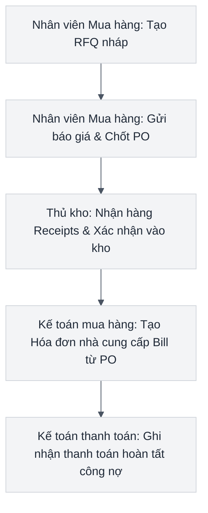
```mermaid
%%{init: {'theme': 'base', 'themeVariables': { 'primaryColor': '#f3f4f6', 'primaryTextColor': '#1f2937', 'primaryBorderColor': '#d1d5db', 'lineColor': '#4b5563', 'background': '#ffffff'}}}%%
graph TD
    A[Nhân viên Mua hàng: Tạo RFQ nháp] --> B[Nhân viên Mua hàng: Gửi báo giá & Chốt PO]
    B --> C[Thủ kho: Nhận hàng Receipts & Xác nhận vào kho]
    C --> D[Kế toán mua hàng: Tạo Hóa đơn nhà cung cấp Bill từ PO]
    D --> E[Kế toán thanh toán: Ghi nhận thanh toán hoàn tất công nợ]
```

1. **Yêu cầu báo giá (RFQ):** *Bộ phận Mua hàng* tạo [Yêu cầu báo giá (RFQ) nháp](#rfq) trên hệ thống và gửi cho Nhà cung cấp.
2. **Xác nhận Đơn mua (PO):** Khi thống nhất giá, *Bộ phận Mua hàng* xác nhận RFQ thành [Đơn mua hàng (PO) chính thức](#po). Hệ thống tự động sinh một phiếu [Nhận hàng (Receipt) nháp](#receipts) bên phân hệ Kho.
3. **Nhận hàng vào kho:** Khi hàng về, *Thủ kho* kiểm tra thực tế, đối chiếu số lượng và tiến hành [Xác nhận phiếu Nhận hàng (Validate)](#receipts) để tăng tồn kho hệ thống.
4. **Tạo Hóa đơn nhà cung cấp:** *Kế toán mua hàng* tạo [Hóa đơn nhà cung cấp (Vendor Bill)](#bills) từ PO và nhấn **Confirm** (hoặc **Post**) để ghi nhận công nợ phải trả.
5. **Thanh toán:** *Kế toán thanh toán* thực hiện chuyển tiền và nhấn [Ghi nhận thanh toán (Register Payment)](#vendor-payments) trên hóa đơn để hoàn tất giao dịch.

### **3.5.2 Quy trình Bán hàng & Xuất kho (Order-to-Cash)**
Áp dụng khi doanh nghiệp bán hàng cho Khách hàng:

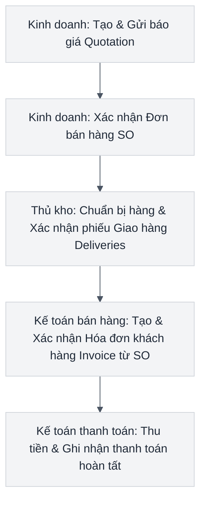
```mermaid
%%{init: {'theme': 'base', 'themeVariables': { 'primaryColor': '#f3f4f6', 'primaryTextColor': '#1f2937', 'primaryBorderColor': '#d1d5db', 'lineColor': '#4b5563', 'background': '#ffffff'}}}%%
graph TD
    A[Kinh doanh: Tạo & Gửi báo giá Quotation] --> B[Kinh doanh: Xác nhận Đơn bán hàng SO]
    B --> C[Thủ kho: Chuẩn bị hàng & Xác nhận phiếu Giao hàng Deliveries]
    C --> D[Kế toán bán hàng: Tạo & Xác nhận Hóa đơn khách hàng Invoice từ SO]
    D --> E[Kế toán thanh toán: Thu tiền & Ghi nhận thanh toán hoàn tất]
```

1. **Tạo Báo giá:** *Bộ phận Kinh doanh* tạo [Báo giá (Quotation) nháp](#quotations) gửi cho Khách hàng.
2. **Xác nhận Đơn bán (SO):** Khi khách chốt mua, *Bộ phận Kinh doanh* xác nhận báo giá thành [Đơn bán hàng (SO) chính thức](#sales-orders-main). Hệ thống tự động sinh một phiếu [Giao hàng (Delivery Order) nháp](#deliveries) bên phân hệ Kho.
3. **Giao hàng xuất kho:** *Thủ kho* chuẩn bị hàng, kiểm tra thực tế và nhấn [Xác nhận phiếu Giao hàng (Validate)](#deliveries) để giảm tồn kho hệ thống và xuất hàng cho khách.
4. **Tạo Hóa đơn khách hàng:** *Kế toán bán hàng / Kinh doanh* tạo [Hóa đơn khách hàng (Customer Invoice)](#invoices) từ SO và nhấn **Confirm** (hoặc **Post**) để ghi nhận doanh thu và công nợ phải thu.
5. **Thu tiền:** Khi khách thanh toán, *Kế toán thanh toán* nhấn [Ghi nhận thanh toán (Register Payment)](#customer-payments) trên hóa đơn để hoàn tất giao dịch.

---

# **4. Hướng dẫn các bước thực hiện (Step-by-Step Guide)**
Dưới đây là hướng dẫn chi tiết cho từng nghiệp vụ:

## **4.1 🌟 PHÂN HỆ BÁN HÀNG (Sales)**

### **4.1.1 Cấu hình (Configuration)**

#### **4.1.1.1 Đội ngũ bán hàng (Sales Teams)**
##### **Mục đích & Ý nghĩa nghiệp vụ**
Giúp tổ chức và phân chia nhân sự phòng kinh doanh thành các đội nhóm kinh doanh độc lập (Bán lẻ, Bán dự án, Kênh đại lý). Giúp gán mục tiêu doanh số riêng biệt cho từng nhóm và theo dõi sát sao hiệu suất.

##### **Giải thích các trường thông tin**
| Trường thông tin 

 | Ý nghĩa & Quy tắc nhập |
| :--- | :--- |
| **Bộ phận sales (*)** | Tên đội ngũ bán hàng. |
| **Trưởng nhóm** | Trưởng nhóm quản lý trực tiếp đội ngũ. |
| **Mục tiêu lập hóa đơn** | Chỉ tiêu doanh thu bán hàng tối thiểu nhóm cần đạt được. |
| **Thành viên** | Danh sách nhân viên trực thuộc đội ngũ. |

##### **Các bước thực hiện**
- **Bước 1:** Chọn phân hệ **"Bán hàng"** -> click **"Cấu hình"** -> chọn **"Đội ngũ bán hàng"**.
- **Bước 2:** Trên màn hình Kanban hiển thị, nhấp nút **"Mới"** (hoặc click vào thẻ nhóm để chỉnh sửa):
   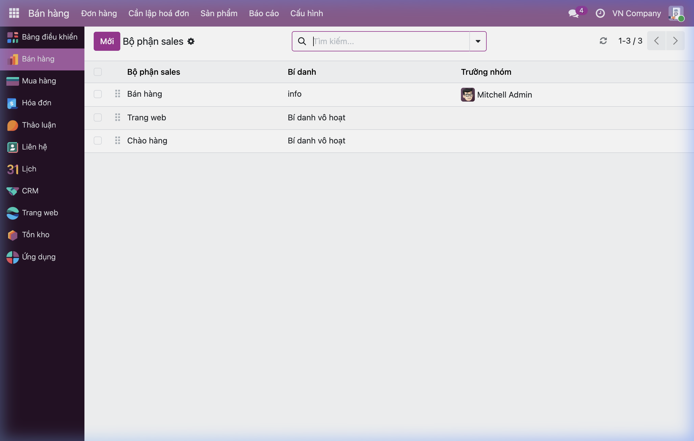
- **Bước 3:** Nhập **Tên nhóm**, chỉ định **Trưởng nhóm** và gán chỉ tiêu **Mục tiêu lập hóa đơn**:
   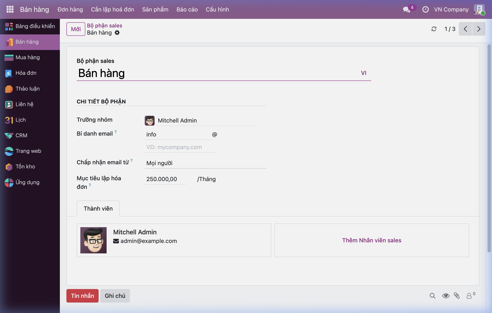
- **Bước 4:** Di chuyển đến tab **Thành viên** (Members), nhấn **Add** để thêm nhân viên vào đội. Nhấn **Save** (Đám mây) để lưu lại.

---

#### **4.1.1.2 Mẫu báo giá (Quotation Templates)**
##### **Mục đích & Ý nghĩa nghiệp vụ**
Tạo ra các biểu mẫu báo giá chuẩn được soạn thảo sẵn cho các nhóm sản phẩm đi kèm nhau. Giúp nhân viên kinh doanh tạo báo giá gửi khách hàng nhanh chóng, giảm thiểu sai sót nhập liệu.

##### **Giải thích các trường thông tin**
| Trường thông tin 

 | Ý nghĩa & Quy tắc nhập |
| :--- | :--- |
| **Mẫu báo giá (*)** | Tên mẫu báo giá gợi nhớ (Ví dụ: Combo nội thất văn phòng). |
| **Thời hạn hiệu lực báo giá** | Số ngày báo giá có hiệu lực kể từ khi tạo (Ví dụ: 30 ngày). |
| **Chi tiết (Tab)** | Danh sách sản phẩm và số lượng được cấu hình sẵn cho mẫu. |

##### **Các bước thực hiện**
- **Bước 1:** Chọn phân hệ **"Bán hàng"** -> click **"Cấu hình"** -> chọn **"Mẫu báo giá"**.
- **Bước 2:** Nhấn nút **"Mới"** để tạo mẫu báo giá mới (hoặc chọn một mẫu có sẵn):
   
- **Bước 3:** Nhập **Tên mẫu**, số ngày hết hạn tại **Thời hạn hiệu lực báo giá**, và cấu hình các sản phẩm đi kèm tại tab **Chi tiết** (Lines):
   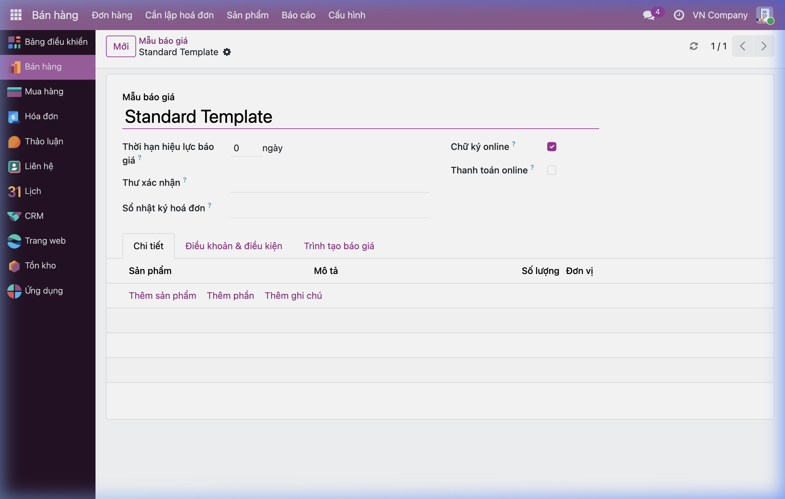
- **Bước 4:** Nhấn **Save** để lưu. Khi tạo Báo giá mới, nhân viên chỉ cần chọn Mẫu này để hệ thống tự động điền toàn bộ dòng sản phẩm.

---

### **4.1.2 Sản phẩm (Products)**

#### **4.1.2.1 Sản phẩm (Products)**
##### **Mục đích & Ý nghĩa nghiệp vụ**
Khai báo thông tin danh mục hàng hóa, dịch vụ kinh doanh của doanh nghiệp.

##### **Giải thích các trường thông tin**
| Trường thông tin 

 | Ý nghĩa & Quy tắc nhập |
| :--- | :--- |
| **Tên sản phẩm (*)** | Tên sản phẩm hiển thị trên các giao dịch mua/bán (Ví dụ: Cabinet with Doors). |
| **Loại sản phẩm (*)** | Phân loại sản phẩm: **Hàng hóa** (Các sản phẩm vật lý), **Dịch vụ** (Sản phẩm phi vật lý), hoặc **Combo** (Gói sản phẩm kết hợp nhiều mặt hàng). Lưu ý: Để quản lý số lượng tồn kho cho Hàng hóa, bạn cần bật tính năng theo dõi trong tab Kho vận. |
| **Giá bán** | Giá bán lẻ mặc định chưa thuế. |
| **Thuế bán hàng** | Thuế suất GTGT bán ra áp dụng mặc định. |

##### **Các bước thực hiện**
- **Bước 1:** Chọn phân hệ **"Bán hàng"** -> chọn menu **"Sản phẩm"** -> click **"Sản phẩm"**.
- **Bước 2:** Nhấn nút **"Mới"** để mở form sản phẩm (hoặc click chọn sản phẩm có sẵn để xem chi tiết):
   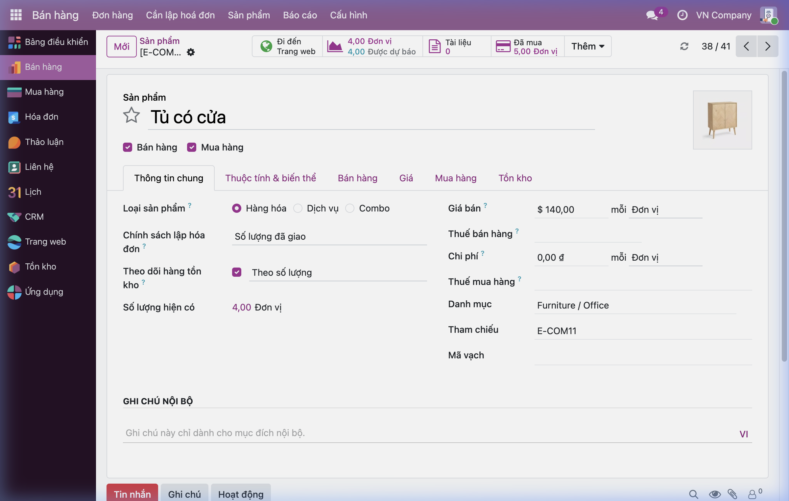
- **Bước 3:** Nhập tên sản phẩm, chọn Loại sản phẩm, đặt **"Giá bán"** và **"Thuế bán hàng"** tại tab **"Thông tin chung"**.
- **Bước 4:** (Tùy chọn) Chuyển sang tab **"Thuộc tính & biến thể"** để thêm các đặc tính nếu sản phẩm có nhiều phiên bản (Ví dụ: Màu sắc, Kích thước).
   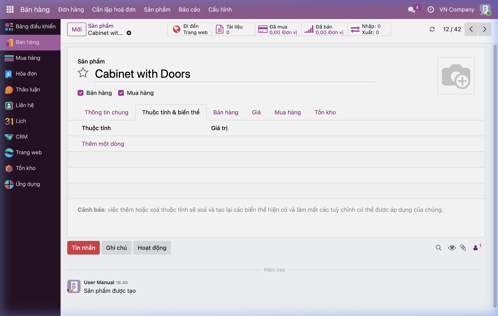
- **Bước 5:** (Tùy chọn) Chuyển sang tab **"Bán hàng"** để cấu hình chính sách lập hóa đơn cho sản phẩm và các tùy chọn bán hàng nâng cao.
   
- **Bước 6:** (Tùy chọn) Chuyển sang tab **"Giá"** để cấu hình các chương trình khuyến mãi hoặc bảng giá bán lẻ.
   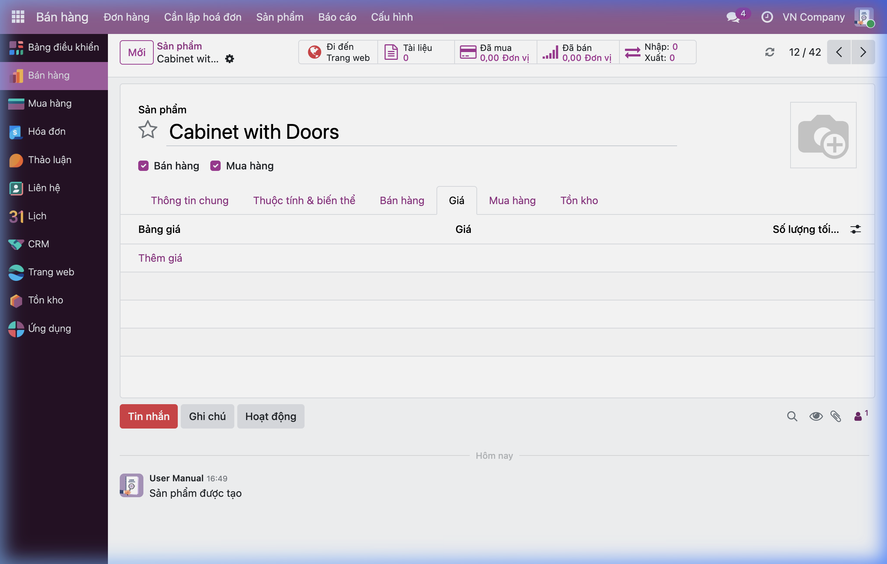
- **Bước 7:** (Tùy chọn) Chuyển sang tab **"Mua hàng"** để thiết lập nhà cung cấp ưu tiên, chính sách lập hóa đơn nhà cung cấp và thuế mua hàng.
   
- **Bước 8:** (Tùy chọn) Chuyển sang tab **"Kho vận"** (Tồn kho) để bật tính năng theo dõi tồn kho (đối với hàng hóa cần quản lý số lượng) và nhập trọng lượng.
   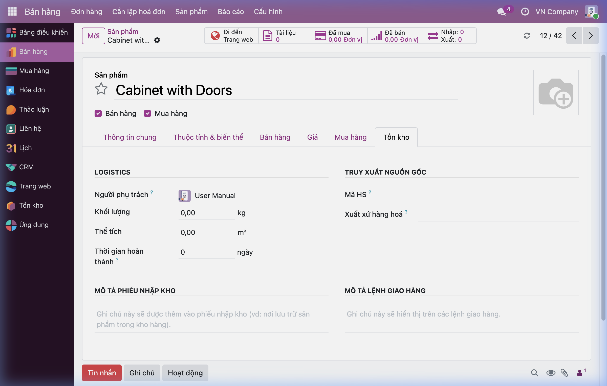
- **Bước 9:** Nhấn nút **"Lưu"** (Save) để hoàn tất khai báo.

---

#### **4.1.2.2 Biến thể sản phẩm (Product Variants)**
##### **Mục đích & Ý nghĩa nghiệp vụ**
Quản lý các thuộc tính khác nhau của cùng một mã sản phẩm (Ví dụ: Tủ Cabinet có các biến thể về Màu sắc: Trắng, Đen, Vân gỗ; hoặc Kích thước).

##### **Giải thích các trường thông tin**
| Trường thông tin 

 | Ý nghĩa & Quy tắc nhập |
| :--- | :--- |
| **Thuộc tính (*)** | Thuộc tính phân loại sản phẩm (Ví dụ: Color, Size). |
| **Giá trị** | Giá trị của thuộc tính (Ví dụ: Black, White, Grey). |

##### **Các bước thực hiện**
- **Bước 1:** Mở biểu mẫu chi tiết của Sản phẩm đã tạo tại Mục 1.2.1.
- **Bước 2:** Di chuyển đến tab **"Thuộc tính & biến thể"** và nhấn **"Add a line"**.
- **Bước 3:** Chọn thuộc tính tại cột **Attribute** và nhập/chọn các giá trị biến thể tại cột **Giá trị**.
- **Bước 4:** Hệ thống sẽ tự động sinh ra danh sách các mã biến thể sản phẩm tương ứng. Nhấn **Save** để áp dụng.

---

#### **4.1.2.3 Bảng giá (Pricelists)**
##### **Mục đích & Ý nghĩa nghiệp vụ**
Thiết lập các chính sách giá đặc thù cho từng nhóm đối tượng khách hàng (VIP, đại lý, bán sỉ) hoặc áp dụng các chiến dịch giảm giá theo khoảng thời gian cụ thể.

##### **Giải thích các trường thông tin**
| Trường thông tin 

 | Ý nghĩa & Quy tắc nhập |
| :--- | :--- |
| **Tên bảng giá (*)** | Tên bảng giá (Ví dụ: Bảng giá đại lý Cấp 1). |
| **Tiền tệ (*)** | Loại tiền tệ áp dụng (VND, USD). |
| **Quy tắc giá (Tab)** | Các quy tắc tính giá: Áp dụng cho toàn bộ sản phẩm, danh mục sản phẩm, hoặc sản phẩm cụ thể. |

##### **Các bước thực hiện**
- **Bước 1:** Chọn phân hệ **"Bán hàng"** -> chọn menu **"Sản phẩm"** -> click **"Bảng giá"**.
- **Bước 2:** Nhấn nút **"Mới"** để mở form thiết lập bảng giá:
   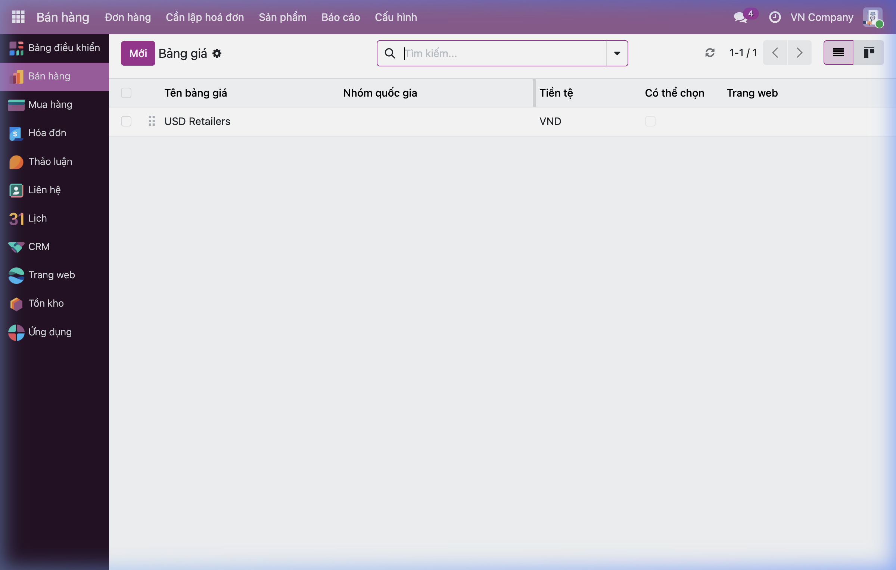
- **Bước 3:** Cấu hình chi tiết các quy tắc tính giá tại tab **Quy tắc giá** (Price Rules):
   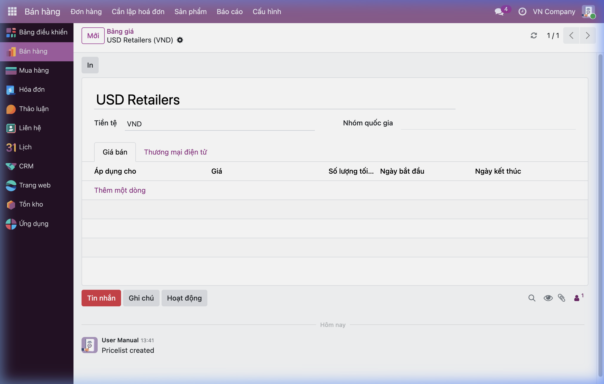
- **Bước 4:** Nhấn **Save** để lưu. Bảng giá này có thể được gán mặc định trong hồ sơ Khách hàng.

---

#### **4.1.2.4 Khuyến mãi & Khách hàng thân thiết (Discount & Loyalty)**
##### **Mục đích & Ý nghĩa nghiệp vụ**
Xây dựng các chiến dịch marketing thúc đẩy doanh số thông qua chương trình khuyến mãi (mua 1 tặng 1, chiết khấu hóa đơn) hoặc tích điểm đổi quà cho khách hàng thân thiết.

##### **Giải thích các trường thông tin**
| Trường thông tin 

 | Ý nghĩa & Quy tắc nhập |
| :--- | :--- |
| **Tên chương trình (*)** | Tên chương trình (Ví dụ: Khuyến mãi Hè 2026). |
| **Loại chương trình (*)** | Phân loại: **Khuyến mãi** (Khuyến mãi), **Thẻ tích điểm** (Tích điểm), **Mã giảm giá** (Mã giảm giá). |
| **Điều kiện áp dụng** | Các điều kiện áp dụng (Ví dụ: Giá trị đơn hàng tối thiểu từ 1,000,000 đ). |
| **Phần thưởng** | Phần thưởng nhận được (Ví dụ: Giảm 50,000 đ, miễn phí vận chuyển). |

##### **Các bước thực hiện**
- **Bước 1:** Chọn phân hệ **"Bán hàng"** -> chọn menu **"Sản phẩm"** -> click **"Khuyến mãi & Khách hàng thân thiết"**.
- **Bước 2:** Nhấn nút **"Mới"** để cấu hình chiến dịch mới:
   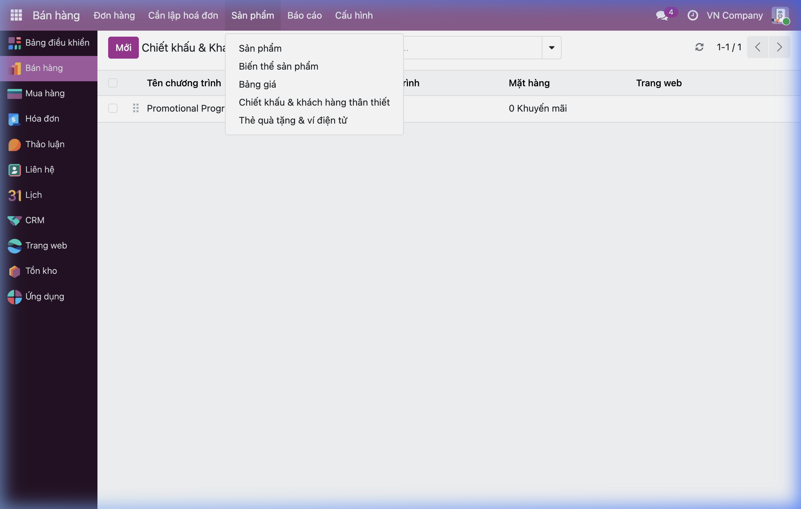
- **Bước 3:** Thiết lập chi tiết điều kiện mua hàng tối thiểu tại tab **Quy tắc** (Rules) và phần thưởng nhận được tại tab **Phần thưởng** (Rewards):
   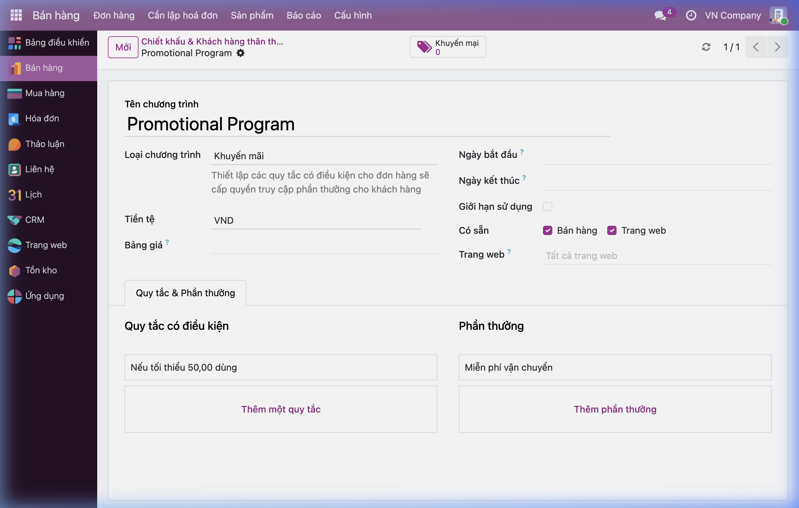
- **Bước 4:** Nhấn **Save** để kích hoạt chương trình trên hệ thống.

---

#### **4.1.2.5 Thẻ quà tặng & Ví điện tử (Gift cards & eWallet)**
##### **Mục đích & Ý nghĩa nghiệp vụ**
Phát hành và quản lý số dư thẻ quà tặng (Gift cards) hoặc ví điện tử (eWallet) của khách hàng để phục vụ thanh toán trừ dần trực tiếp trên đơn hàng.

##### **Các bước thực hiện**
- **Bước 1:** Chọn phân hệ **"Bán hàng"** -> chọn menu **"Sản phẩm"** -> click **"Thẻ quà tặng & Ví điện tử"**.
- **Bước 2:** Nhấn nút **"Mới"** để thiết lập chương trình phát hành thẻ hoặc ví:
   
- **Bước 3:** Cấu hình chi tiết mệnh giá mặc định, mã số serial hoặc liên kết ví điện tử:
   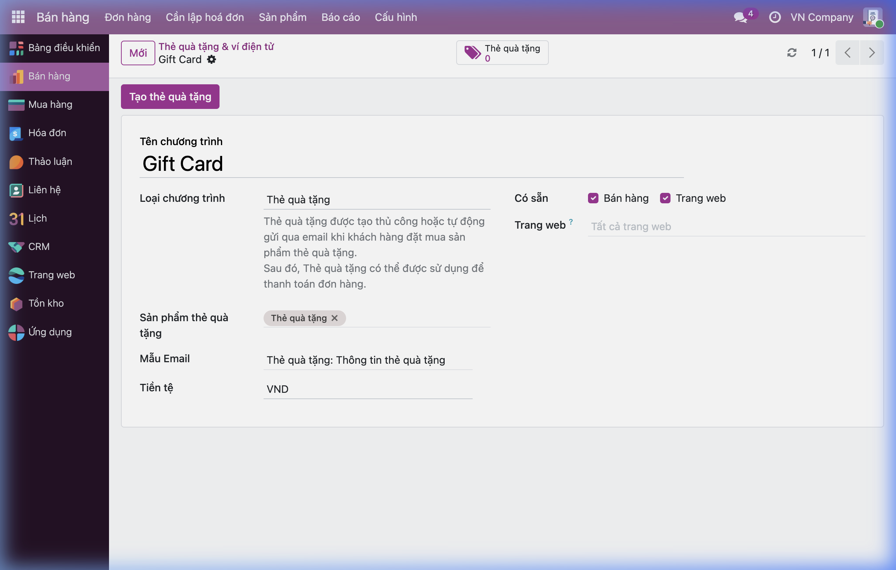
- **Bước 4:** Nhấn **Save** để hoàn tất.

---

### **4.1.3 Đơn hàng (Orders)**

#### **4.1.3.1 Báo giá (Quotations)**
##### **Mục đích & Ý nghĩa nghiệp vụ**
Khởi tạo và gửi báo giá chi tiết cho khách hàng. Đây là bước giao dịch đầu tiên với khách hàng trước khi ký kết đơn hàng.

##### **Giải thích các trường thông tin**
| Trường thông tin 

 | Ý nghĩa & Quy tắc nhập |
| :--- | :--- |
| **Khách hàng (*)** | Khách hàng nhận báo giá. |
| **Ngày hết hạn** | Ngày hết hạn hiệu lực của báo giá. |
| **Điều khoản thanh toán** | Điều khoản thanh toán thỏa thuận (Thanh toán ngay, 15 ngày...). |
| **Sản phẩm (*)** | Sản phẩm, số lượng và đơn giá thỏa thuận bán lẻ. |

##### **Các bước thực hiện**
- **Bước 1:** Chọn phân hệ **"Bán hàng"** -> chọn menu **"Đơn hàng"** -> click **"Báo giá"**.
- **Bước 2:** Nhấn nút **"Mới"** để mở form báo giá mới:
   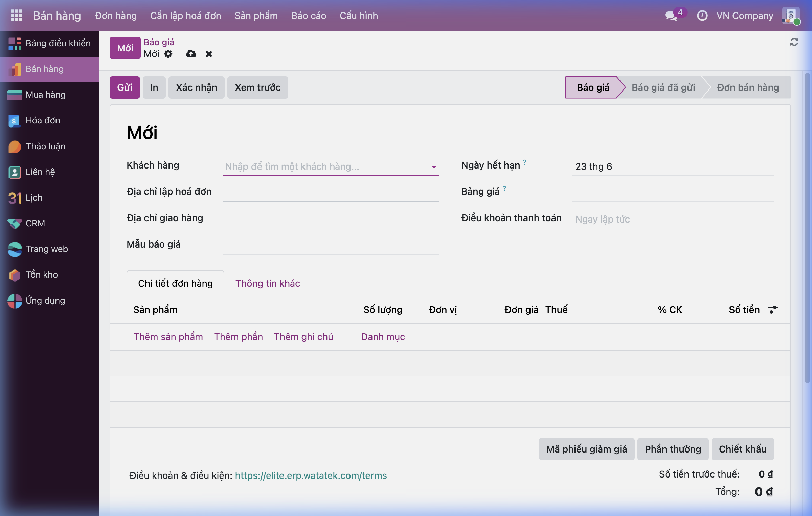
- **Bước 3:** Chọn **Customer**, ngày hết hạn **Ngày hết hạn** và điều khoản **Điều khoản thanh toán** tại **Phần thông tin chung** (Header).
- **Bước 4:** Tại tab **Chi tiết đơn hàng**, nhấn **Thêm sản phẩm** để chọn sản phẩm, điền số lượng và đơn giá bán.
- **Bước 5:** (Tùy chọn) Chuyển sang tab **"Thông tin khác"** để cấu hình điều khoản giao hàng, đội ngũ bán hàng và người chịu trách nhiệm.
   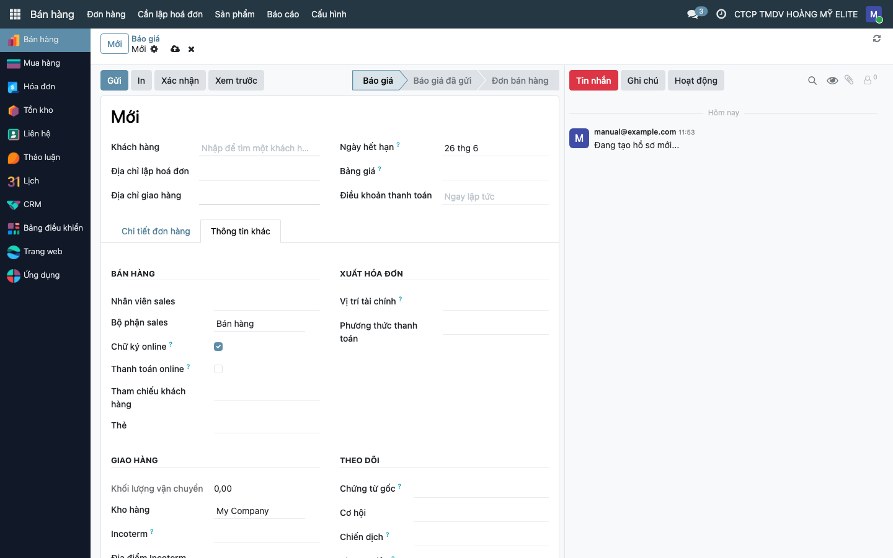
- **Bước 6:** Nhấn **Save** để lưu báo giá ở trạng thái nháp (**Báo giá**). Nhấn **Gửi qua email** để gửi email tự động cho đối tác, hoặc click **Xác nhận** (Confirm) để xác nhận đơn hàng thành Sales Order.

---

#### **4.1.3.2 Đơn bán hàng (Sales Orders)**
##### **Mục đích & Ý nghĩa nghiệp vụ**
Chuyển đổi Báo giá nháp thành Đơn bán hàng chính thức (Sales Order - SO) sau khi khách hàng đồng ý ký kết, ghi nhận doanh thu dự kiến và kích hoạt luồng xuất kho hàng hóa.

##### **Các bước thực hiện**
- **Bước 1:** Mở Báo giá (Quotation) cần xác nhận đang ở trạng thái nháp.
- **Bước 2:** Kiểm tra lại toàn bộ thông tin sản phẩm, số lượng, điều khoản thanh toán.
- **Bước 3:** Nhấp chọn nút **[Xác nhận]** ở góc trên bên trái màn hình.
- **Bước 4:** Hệ thống chuyển trạng thái báo giá sang **Đơn bán hàng** (Đơn bán hàng chính thức):
   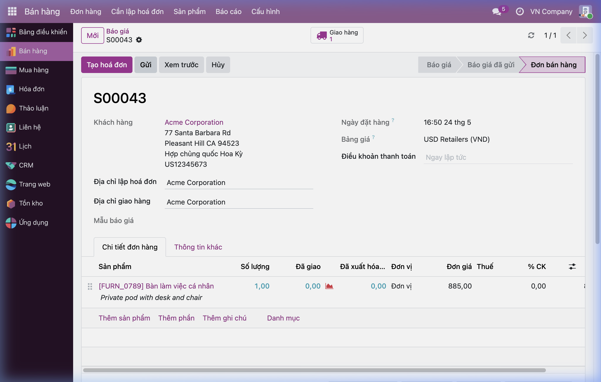
- **Bước 5:** Một phiếu xuất kho nháp (Delivery Order) sẽ được tự động tạo lập bên phân hệ Kho hàng để thủ kho chuẩn bị hàng hóa.

---

#### **4.1.3.3 Khách hàng (Customers)**
##### **Mục đích & Ý nghĩa nghiệp vụ**
Quản lý danh sách và thông tin liên hệ của khách hàng mua sản phẩm trực tiếp từ phân hệ Sales, giúp nhân viên kinh doanh nhanh chóng tra cứu lịch sử mua hàng, công nợ và thông tin liên lạc.

##### **Các bước thực hiện**
- **Bước 1:** Chọn phân hệ **"Bán hàng"** -> chọn menu **"Đơn hàng"** -> click **"Khách hàng"**.
- **Bước 2:** Giao diện hiển thị danh mục các khách hàng hiện tại dưới dạng thẻ hình ảnh.
- **Bước 3:** Nhấp nút **"Mới"** để khai báo khách hàng mới. Bạn có thể cập nhật thông tin liên lạc tại tab **Liên hệ & Địa chỉ** (Contacts & Addresses) và thiết lập điều khoản tại tab **Bán hàng & Mua hàng** (Sales & Purchase). Click trực tiếp vào một thẻ khách hàng để xem chi tiết hồ sơ.

---

#### **4.1.3.4 Nhập Đơn bán hàng từ Excel/CSV (Import Sales Orders)**
##### **Mục đích & Ý nghĩa nghiệp vụ**
Hỗ trợ người dùng nhập liệu hàng loạt Đơn bán hàng (Sales Orders) vào hệ thống từ file Excel hoặc CSV, giúp tiết kiệm thời gian so với việc nhập thủ công từng đơn hàng, đặc biệt hữu ích khi lấy dữ liệu từ các hệ thống kênh bán lẻ khác.

##### **Các bước thực hiện**
- **Bước 1:** Tại phân hệ **"Bán hàng"**, truy cập menu **"Đơn hàng"** -> click **"Báo giá"** hoặc **"Đơn bán hàng"**.
- **Bước 2:** Nhấp vào biểu tượng **Favorites (Yêu thích)** ⚙️ hoặc nút **Actions (Hành động)** ở thanh menu phía trên và chọn **Import records (Nhập tập tin)**.
   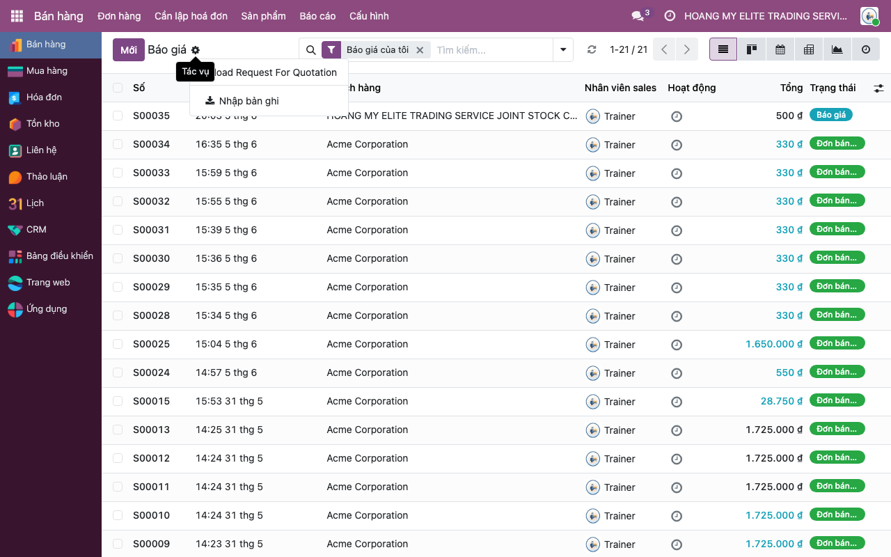
- **Bước 3:** Nhấn nút **Upload File (Tải lên tập tin)** và chọn file Excel/CSV từ máy tính của bạn.
- **Bước 4:** Giao diện **Map File Columns to Odoo Fields** sẽ xuất hiện. Tại đây, hãy kiểm tra và ghép nối (mapping) các cột trong file của bạn sao cho khớp với các trường dữ liệu tương ứng trên hệ thống (ví dụ: `Order Reference`, `Customer`, `Product`, `Quantity`, `Unit Price`).
   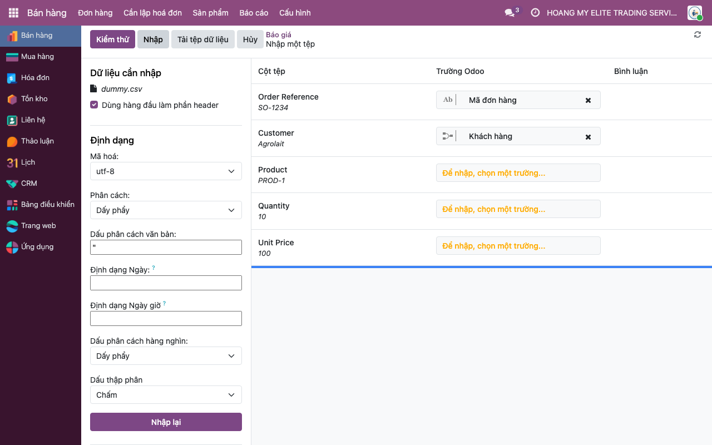
- **Bước 5:** Nhấn nút **Test (Kiểm tra)** để hệ thống rà soát lỗi dữ liệu. Nếu xuất hiện thông báo *Everything seems valid* (Mọi thứ có vẻ hợp lệ), tiếp tục bước sau.
- **Bước 6:** Nhấn nút **Import (Nhập)** để hệ thống tiến hành nạp các đơn bán hàng vào hệ thống.

---

## **4.2 👑 PHÂN HỆ MUA HÀNG (Purchase)**

### **4.2.1 Cấu hình (Configuration)**

#### **4.2.1.1 Bảng giá của nhà cung cấp (Vendor Pricelists)**
##### **Mục đích & Ý nghĩa nghiệp vụ**
Bảng giá của nhà cung cấp (Vendor Pricelist) được sử dụng để quản lý thông tin giá mua của từng sản phẩm từ các nhà cung cấp khác nhau. Hệ thống tự động áp đơn giá mua chính xác vào RFQ khi chọn nhà cung cấp và số lượng tối thiểu tương ứng đã thỏa thuận trước đó.

##### **Giải thích các trường thông tin**
| Trường thông tin 

 | Ý nghĩa & Quy tắc nhập |
| :--- | :--- |
| **Nhà cung cấp (*)** | Nhà cung cấp áp dụng bảng giá. |
| **Tên/Mã NCC** | Tên hoặc mã sản phẩm của nhà cung cấp (tự động in trên PO thay cho tên nội bộ). |
| **Số lượng tối thiểu** | Số lượng mua tối thiểu để được hưởng đơn giá này. |
| **Giá (*)** | Đơn giá mua thỏa thuận chưa thuế. |
| **Thời gian giao hàng** | Số ngày từ lúc xác nhận đơn hàng đến lúc NCC giao hàng về kho. |

##### **Các bước thực hiện**
- **Bước 1:** Chọn phân hệ **"Mua hàng"** -> chọn **"Cấu hình"** -> click **"Bảng giá nhà cung cấp"**.
- **Bước 2:** Nhấp nút **"Mới"** để tạo quy tắc giá mua mới:
   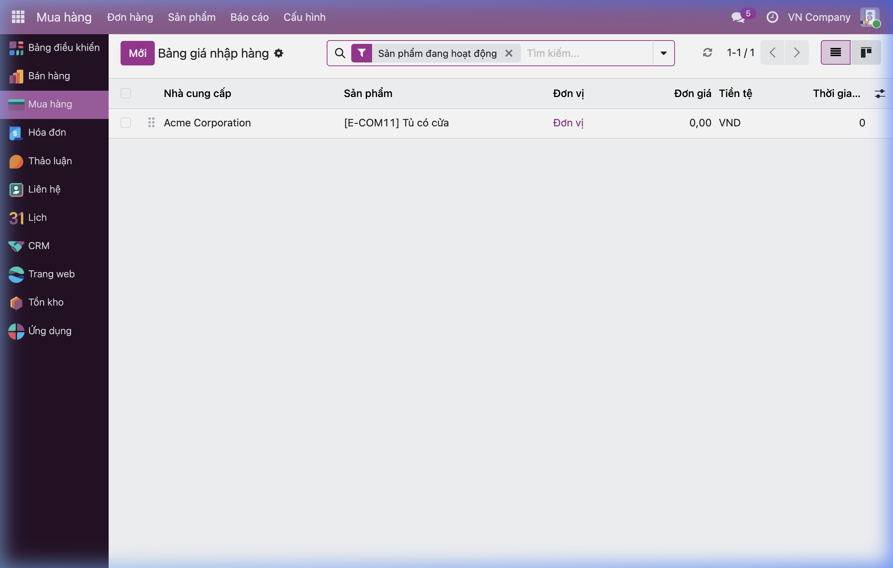
- **Bước 3:** Điền thông tin **Nhà cung cấp**, **Product**, số lượng tối thiểu và đơn giá mua tương ứng:
   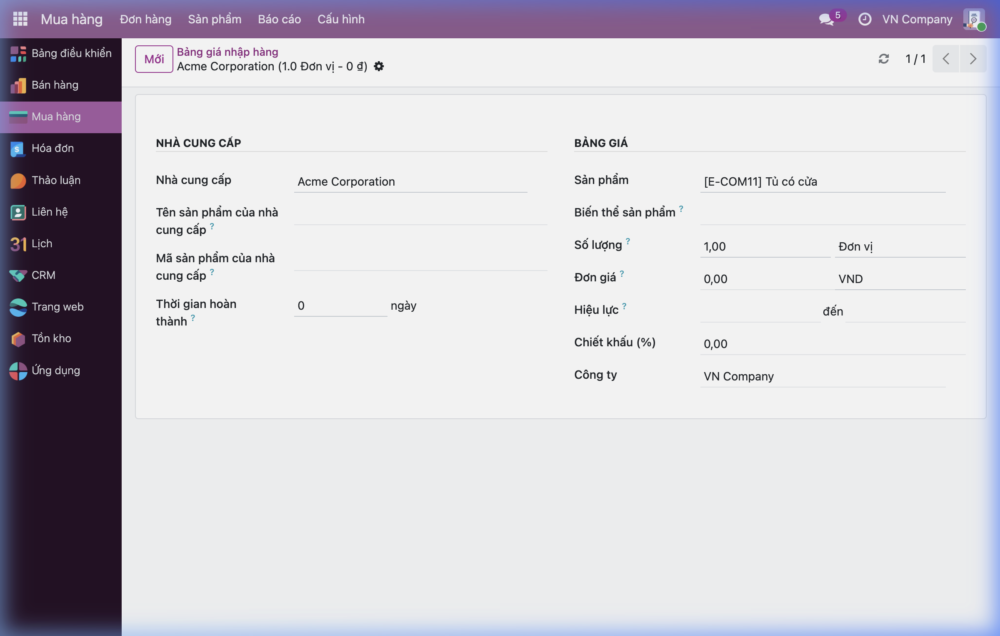
- **Bước 4:** Nhập **Thời gian giao hàng** và nhấn **Save** để lưu.

---

#### **4.2.1.2 Thuộc tính sản phẩm (Attributes)**
##### **Mục đích & Ý nghĩa nghiệp vụ**
Quản lý danh mục các thuộc tính vật lý hoặc tính chất của sản phẩm mua sắm (Màu sắc, kích thước, chất liệu) giúp đồng bộ dữ liệu thuộc tính dùng chung trên toàn hệ thống.

##### **Các bước thực hiện**
- **Bước 1:** Chọn phân hệ **"Mua hàng"** -> chọn **"Cấu hình"** -> click **"Thuộc tính"**.
- **Bước 2:** Nhấn nút **"Mới"** để định nghĩa một thuộc tính mới:
   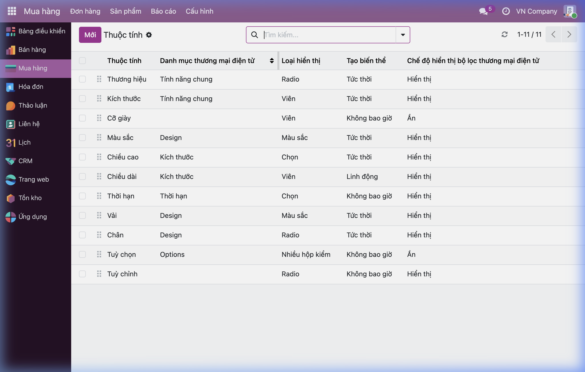
- **Bước 3:** Định nghĩa tên thuộc tính và nhập các giá trị tùy chọn tại phần **Giá trị**:
   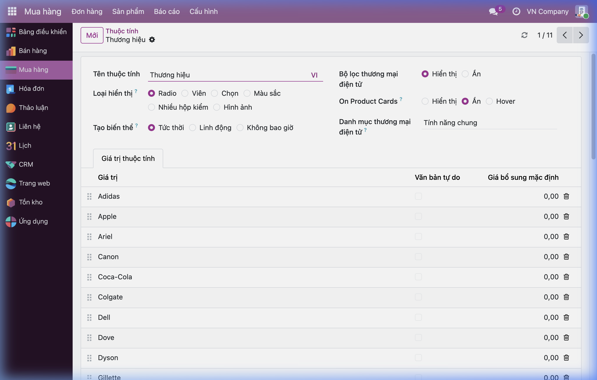
- **Bước 4:** Nhấn **Save** để lưu trữ.

---

#### **4.2.1.3 Nhóm sản phẩm (Categories)**
##### **Mục đích & Ý nghĩa nghiệp vụ**
Phân nhóm danh mục sản phẩm (Product Categories) phục vụ định khoản kế toán tự động (tài khoản kho, tài khoản giá vốn) và thiết lập phương pháp tính giá trị hàng tồn kho.

##### **Giải thích các trường thông tin**
| Trường thông tin 

 | Ý nghĩa & Quy tắc nhập |
| :--- | :--- |
| **Tên nhóm (*)** | Tên nhóm sản phẩm (Ví dụ: Office Furniture). |
| **Phương pháp tính giá** | Phương pháp tính giá vốn hàng tồn kho: **Giá tiêu chuẩn** (Giá tiêu chuẩn), **FIFO** (Nhập trước xuất trước), hoặc **Giá bình quân** (Giá bình quân gia quyền). |
| **Định giá tồn kho** | Định giá kho: **Thủ công** (Báo cáo kho thủ công) hoặc **Tự động** (Kế toán ghi sổ kho tự động sau mỗi lần nhập/xuất). |

##### **Các bước thực hiện**
- **Bước 1:** Chọn phân hệ **"Mua hàng"** -> chọn **"Cấu hình"** -> click **"Product Categories"**.
- **Bước 2:** Nhấn nút **"Mới"** để tạo nhóm sản phẩm mới:
   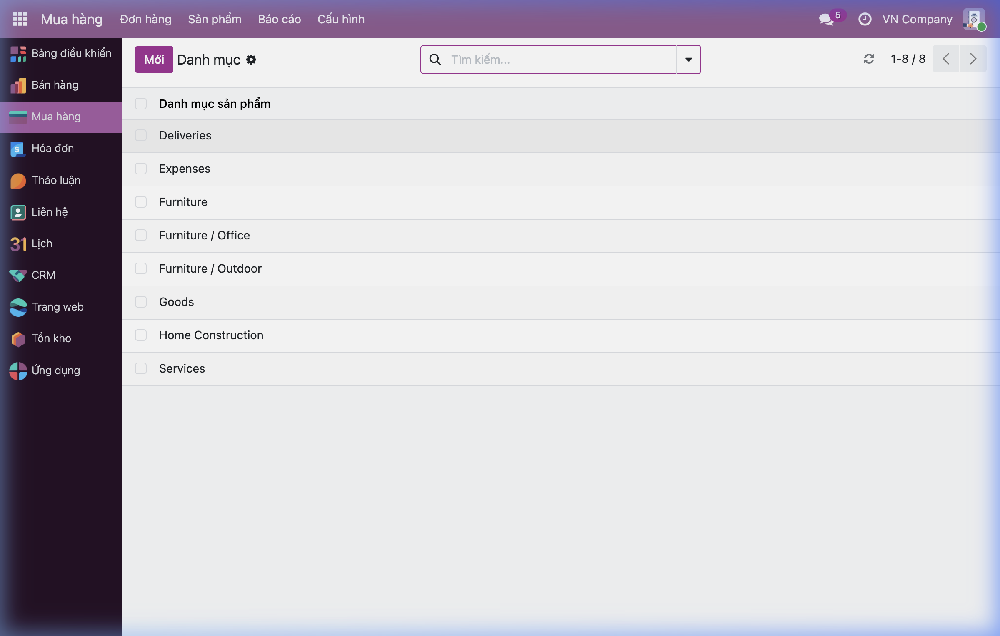
- **Bước 3:** Nhập **Category Name**, cấu hình phương pháp tính giá vốn **Phương pháp tính giá** và định giá kho tự động **Định giá tồn kho** tại tab **Định giá tồn kho** (Inventory Valuation):
   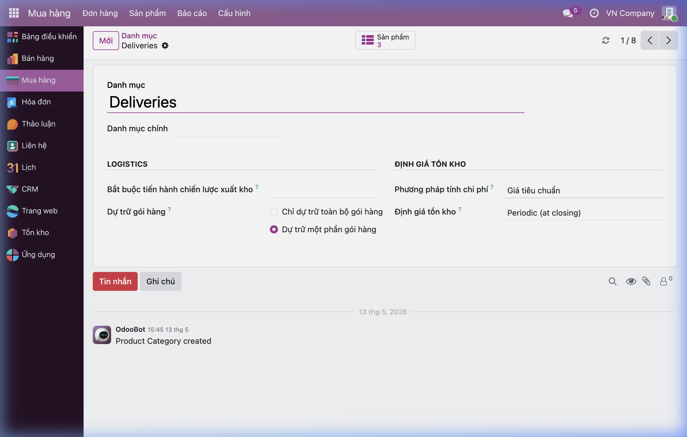
- **Bước 4:** Nhấn **Save** để hoàn tất.

---

#### **4.2.1.4 Đơn vị tính & Quy cách đóng gói (Units & Packagings)**
##### **Mục đích & Ý nghĩa nghiệp vụ**
Quản lý các loại Đơn vị tính (UoM) phục vụ quy đổi đơn vị mua sắm khác với đơn vị bán (Ví dụ: mua theo Thùng nhưng bán lẻ theo Cái) và quy định số lượng sản phẩm trên mỗi gói hàng (Packagings) khi giao nhận.

##### **Các bước thực hiện**
- **Bước 1:** Chọn phân hệ **"Mua hàng"** -> chọn **"Cấu hình"** -> click **"Units of Measure"** để định cấu hình nhóm quy đổi đơn vị tính:
   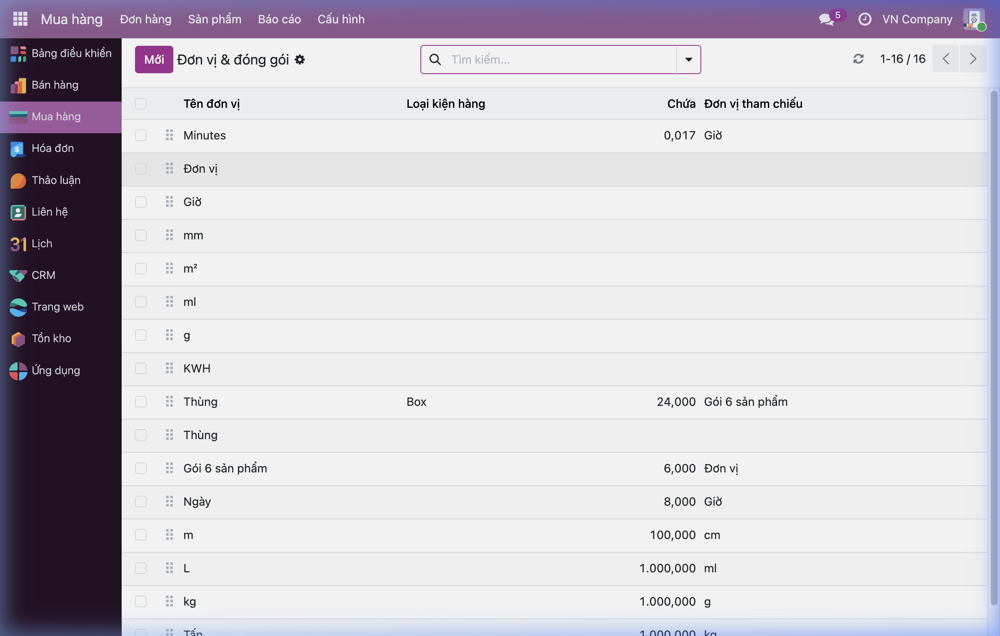
- **Bước 2:** Cấu hình chi tiết tỷ lệ quy đổi trong nhóm đơn vị tính:
   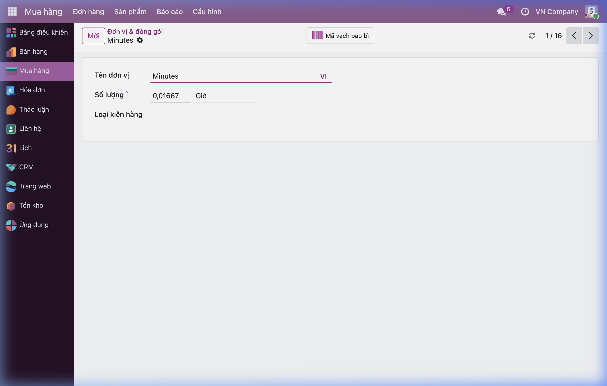
- **Bước 3:** Để thiết lập quy cách đóng gói cho sản phẩm cụ thể: Mở hồ sơ sản phẩm đó -> di chuyển đến tab **Mua hàng** -> điền thông tin đóng gói tại mục **Packaging** (Ví dụ: `Box of 10` chứa 10 sản phẩm). Nhấn **Save** để lưu.

---

### **4.2.2 Sản phẩm (Products)**

#### **4.2.2.1 Sản phẩm (Products)**
##### **Mục đích & Ý nghĩa nghiệp vụ**
Khai báo và quản lý thông tin các mặt hàng, vật tư, nguyên liệu cần mua sắm phục vụ cho nhu cầu hoạt động sản xuất kinh doanh của công ty.

##### **Giải thích các trường thông tin**
| Trường thông tin 

 | Ý nghĩa & Quy tắc nhập |
| :--- | :--- |
| **Chi phí** | Giá vốn hoặc giá mua tham chiếu của sản phẩm. |
| **Thuế mua hàng** | Thuế suất GTGT đầu vào áp dụng mặc định khi mua hàng. |
| **Chính sách kiểm tra** | Chính sách kiểm tra hóa đơn: **Theo số lượng đặt mua** (Theo số lượng đặt mua) hoặc **Theo số lượng đã nhận** (Theo số lượng thực tế nhận vào kho). |

##### **Các bước thực hiện**
- **Bước 1:** Chọn phân hệ **"Mua hàng"** -> chọn **"Sản phẩm"** -> click **"Sản phẩm"**.
- **Bước 2:** Nhấn nút **"Mới"** để khai báo sản phẩm cần mua:
   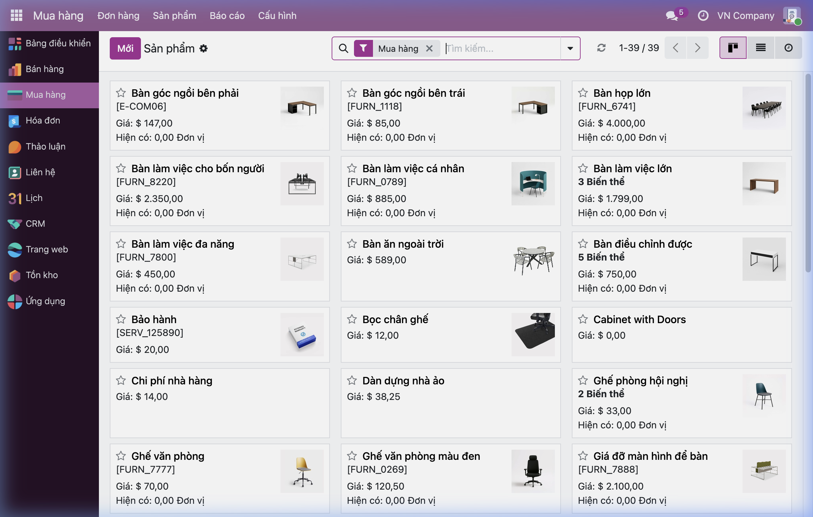
- **Bước 3:** Điền thông tin giá vốn tại ô **Chi phí** trong tab **Thông tin chung**. Chuyển sang tab **Mua hàng** (Purchase) để chọn **Thuế mua hàng** và thiết lập **Chính sách kiểm tra** kiểm soát hóa đơn. Nhấn **Save** để lưu.

---

#### **4.2.2.2 Biến thể sản phẩm (Product Variants)**
##### **Mục đích & Ý nghĩa nghiệp vụ**
Tra cứu nhanh danh sách các biến thể hàng hóa đã tạo để cập nhật riêng giá vốn (Cost) hoặc giá mua thỏa thuận cho từng biến thể cụ thể (Ví dụ: Tủ Cabinet màu trắng có giá mua cao hơn màu đen).

##### **Các bước thực hiện**
- **Bước 1:** Chọn phân hệ **"Mua hàng"** -> chọn **"Sản phẩm"** -> click **"Biến thể sản phẩm"**.
- **Bước 2:** Hệ thống hiển thị danh sách tất cả các biến thể đang có trên hệ thống. Nhấp chọn biến thể cần cấu hình để cập nhật thông tin đặc thù.

---

### **4.2.3 Đơn hàng (Orders)**

#### **4.2.3.1 Yêu cầu báo giá (Requests for Quotation)**
##### **Mục đích & Ý nghĩa nghiệp vụ**
Khởi tạo chứng từ Yêu cầu báo giá gửi đến nhà cung cấp để đối chiếu và lưu thông tin báo giá nháp trên hệ thống.

##### **Các bước thực hiện**
- **Bước 1:** Tại thanh menu bên trái, nhấp chọn phân hệ **"Mua hàng"** để truy cập danh sách các Yêu cầu báo giá.
- **Bước 2:** Nhấn nút **"Mới"** ở góc trên bên trái màn hình.
- **Bước 3:** Click vào ô nhập liệu **"Nhà cung cấp"**, gõ `Acme Corporation` và chọn nhà cung cấp.
- **Bước 4:** Di chuyển xuống tab **Sản phẩm**, nhấn **"Add a product"**, chọn sản phẩm `Cabinet with Doors` (Mã `[E-COM11]`) và điền số lượng mua là `5.00`.
- **Bước 5:** (Tùy chọn) Chuyển sang tab **"Thông tin khác"** để kiểm tra vị trí tài chính, người phụ trách mua hàng hoặc điều khoản thanh toán.
   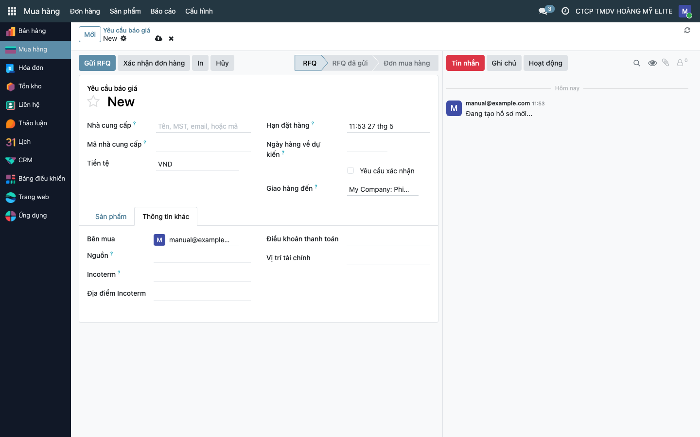
- **Bước 6:** Nhấn biểu tượng đám mây lưu trữ (**Lưu thủ công**) hoặc click **Xác nhận đơn hàng** (Confirm Order) để chuyển thành PO.
   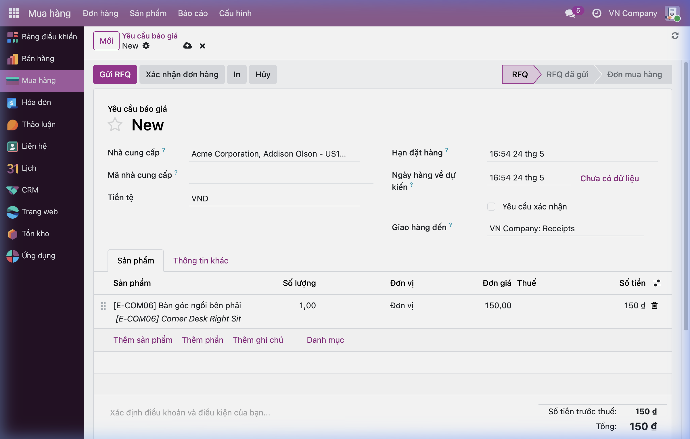

---

#### **4.2.3.2 Đơn mua hàng (Purchase Orders)**
##### **Mục đích & Ý nghĩa nghiệp vụ**
Xác nhận RFQ thành Đơn mua hàng chính thức (PO) gửi sang nhà cung cấp để thực hiện giao hàng, ghi nhận công nợ và tự động sinh phiếu nhập kho tương ứng.

##### **Các bước thực hiện**
- **Bước 1:** Mở Yêu cầu báo giá (RFQ) đã tạo ở Mục 2.3.1.
- **Bước 2:** Nhấp nút **[Confirm Order]** ở góc trái trên của màn hình:
   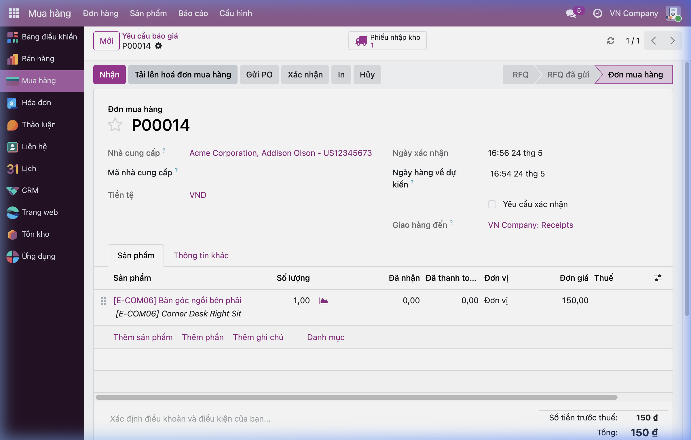
- **Bước 3:** Hệ thống cập nhật trạng thái đơn hàng sang **Đơn mua hàng** và tự động sinh phiếu nhập kho nháp liên kết.

---

#### **4.2.3.3 Nhà cung cấp (Vendors)**
##### **Mục đích & Ý nghĩa nghiệp vụ**
Quản lý hồ sơ, lịch sử giao dịch và tài khoản thanh toán của các nhà cung cấp sản phẩm và dịch vụ đầu vào cho công ty.

##### **Các bước thực hiện**
- **Bước 1:** Chọn phân hệ **"Mua hàng"** -> chọn menu **"Đơn hàng"** -> click **"Nhà cung cấp"**.
- **Bước 2:** Hệ thống hiển thị danh sách các nhà cung cấp:
   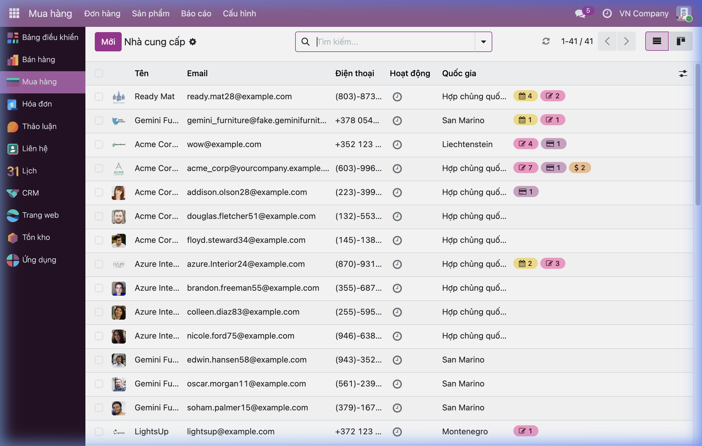
- **Bước 3:** Nhấn **New** để tạo hồ sơ nhà cung cấp mới. Khai báo thông tin liên hệ tại tab **Liên hệ & Địa chỉ** và thông tin đối tác tại tab **Bán hàng & Mua hàng**. Chọn nhà cung cấp hiện có để xem lịch sử giao dịch mua sắm.

---

#### **4.2.3.4 Nhập Đơn mua hàng từ Excel/CSV (Import Purchase Orders)**
##### **Mục đích & Ý nghĩa nghiệp vụ**
Hỗ trợ người dùng nạp hàng loạt Yêu cầu báo giá (RFQ) hoặc Đơn mua hàng (PO) từ file Excel/CSV lên hệ thống một cách nhanh chóng, tránh nhầm lẫn khi phải tạo thủ công quá nhiều dòng sản phẩm.

##### **Các bước thực hiện**
- **Bước 1:** Tại phân hệ **"Mua hàng"**, truy cập menu **"Đơn hàng"** -> click **"Yêu cầu báo giá"** hoặc **"Đơn mua hàng"**.
- **Bước 2:** Nhấp vào biểu tượng **Favorites (Yêu thích)** ⚙️ hoặc nút **Actions (Hành động)** ở thanh menu và chọn **Import records (Nhập tập tin)**.
   
- **Bước 3:** Nhấn nút **Upload File (Tải lên tập tin)** để chọn file dữ liệu mua hàng.
- **Bước 4:** Tiến hành ghép nối (mapping) các cột dữ liệu trên file Excel khớp với các trường dữ liệu trên hệ thống (ví dụ: `Vendor`, `Product`, `Quantity`, `Unit Price`).
   
- **Bước 5:** Nhấn **Test (Kiểm tra)** để kiểm tra tính hợp lệ của dữ liệu.
- **Bước 6:** Nhấn **Import (Nhập)** để hoàn tất việc nhập đơn mua hàng.

---

## **4.3 🛡️ PHÂN HỆ HÓA ĐƠN (Invoicing)**

> [!IMPORTANT]
> **Giới hạn hệ thống (Scope & Limitations):**
> Elite ERP cấu hình tiêu chuẩn hiện sử dụng phân hệ **Hóa đơn (Invoicing)** làm trung tâm xử lý thu chi, giúp bao phủ hoàn hảo luồng Mua - Bán - Thu - Chi và sinh bút toán tự động/thủ công. Tuy nhiên, nó KHÔNG phải là phân hệ **Kế toán chuyên sâu (Full Accounting)**. Do đó, hệ thống sẽ giới hạn 3 tính năng nâng cao sau:
> 1. **Không có tính năng Khóa sổ kế toán (Lock Dates):** Không thể khóa sổ cuối kỳ để chặn sửa đổi lùi ngày. Kế toán trưởng cần quản lý thủ công thông qua việc phân quyền chặt chẽ.
> 2. **Không có Đối soát sao kê tự động (Bank Reconciliation):** Việc ghi nhận thanh toán sẽ thao tác thủ công trên từng chứng từ (Register Payment) thay vì import file sao kê từ ngân hàng để máy tự động gạch nợ hàng loạt.
> 3. **Giới hạn Báo cáo tài chính:** Hệ thống cung cấp công cụ Phân tích Hóa đơn/Dòng tiền xuất sắc nhưng chưa đóng gói sẵn Bảng Cân đối kế toán (Balance Sheet), Kết quả kinh doanh (P&L) hay Bảng cân đối phát sinh. Kế toán cần tự kết xuất sổ nhật ký ra Excel để lên báo cáo khi cần.

### **4.3.1 Cấu hình (Configuration)**

#### **4.3.1.1 Cấu hình thuế (Configuration > Taxes)**
##### **Mục đích & Ý nghĩa nghiệp vụ**
Cấu hình các loại thuế suất giá trị gia tăng (VAT) đầu vào và đầu ra áp dụng cho sản phẩm. Thiết lập này giúp hệ thống định khoản tự động tài khoản thuế phải nộp hoặc thuế được khấu trừ tương ứng khi ghi sổ hóa đơn.

##### **Giải thích các trường thông tin & Cấu hình các Tab**
* **Thông tin chung:**
  * **Tên thuế (*):** Tên hiển thị của loại thuế (Ví dụ: `VAT 10% bán ra`).
  * **Loại thuế (*):** Phân loại phạm vi áp dụng: **Sales** (Thuế đầu ra khi bán hàng) hoặc **Purchase** (Thuế đầu vào khi mua hàng).
  * **Cách tính thuế (*):** Phương pháp tính, thường chọn **Phần trăm của giá** (Percentage of Price).
  * **Giá trị:** Giá trị thuế suất (Ví dụ: `10.00` tương đương 10%).

* **Tab Định nghĩa (Definition):**
  Quy định cách hạch toán tiền hàng trước thuế (Cơ sở) và tiền thuế (Thuế) vào sổ cái khi phát sinh Hóa đơn (Invoices) hoặc đơn Hoàn tiền (Refunds):
  * **Cơ sở (Base):** Tiền hàng trước thuế. Dòng này để trống phần Tài khoản kế toán (hệ thống tự lấy tài khoản doanh thu/chi phí của sản phẩm).
  * **Thuế (Tax):** Tiền thuế suất được tính ra. Dòng này cần nhập `%` là `100.00`, `Dựa trên` chọn `thuế` và chọn **Tài khoản** kế toán phù hợp (Ví dụ: `333100` cho thuế bán ra, `131000`/`1331` cho thuế mua vào).
  * **Lưới thuế (Tax Grid):** Gán chỉ tiêu tương ứng trên Tờ khai thuế GTGT nếu cần kết xuất tờ khai tự động (để trống nếu không dùng).

* **Tab Tùy chọn nâng cao (Advanced Options):**
  * **Nhãn thuế trên hóa đơn:** Ký hiệu ngắn in ra cho khách hàng xem trên hóa đơn (Ví dụ: `VAT 10%`).
  * **Nhóm thuế:** Phân loại nhóm thuế (Ví dụ: nhóm `Nhóm thuế VAT 10%`).
  * **Quốc gia:** Chọn `Việt Nam` để đồng bộ đúng chuẩn tiền tệ và định dạng pháp lý.
  * **Bao gồm trong giá:** Tích chọn nếu đơn giá sản phẩm nhập trên đơn hàng là giá đã gồm thuế (bán lẻ B2C); bỏ tích nếu là giá chưa gồm thuế (bán buôn B2B).
  * **Ảnh hưởng cơ sở tính thuế kế tiếp:** Tích chọn nếu tính thuế chồng thuế (ví dụ: thuế tiêu thụ đặc biệt tính cộng vào giá cơ sở rồi mới tính thuế GTGT).

##### **Các bước thực hiện**
- **Bước 1:** Chọn phân hệ **"Hóa đơn"** -> click **"Cấu hình"** -> chọn **"Thuế"**.
- **Bước 2:** Nhấn nút **"Mới"** để tạo thuế mới:
   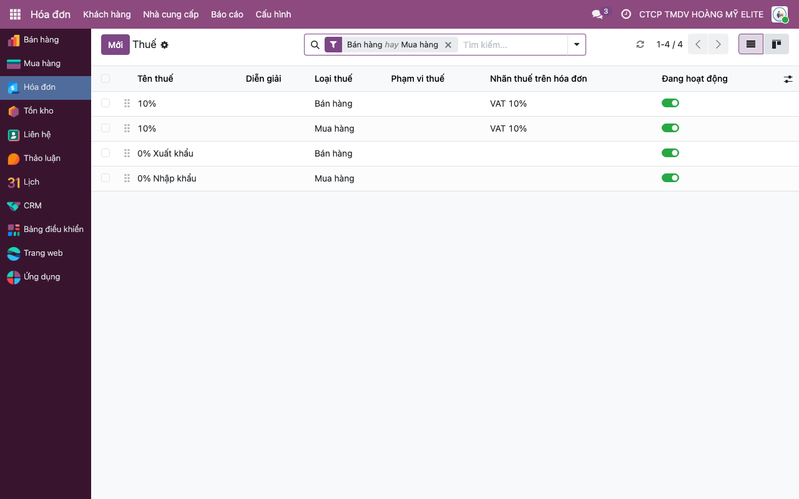
- **Bước 3:** Điền **Tên thuế**, chọn loại **Loại thuế**, nhập **Giá trị** thuế suất, đồng thời cấu hình các thông tin hạch toán và tùy chọn nâng cao tại 2 tab **Định nghĩa** & **Tùy chọn nâng cao** như hướng dẫn trên:
   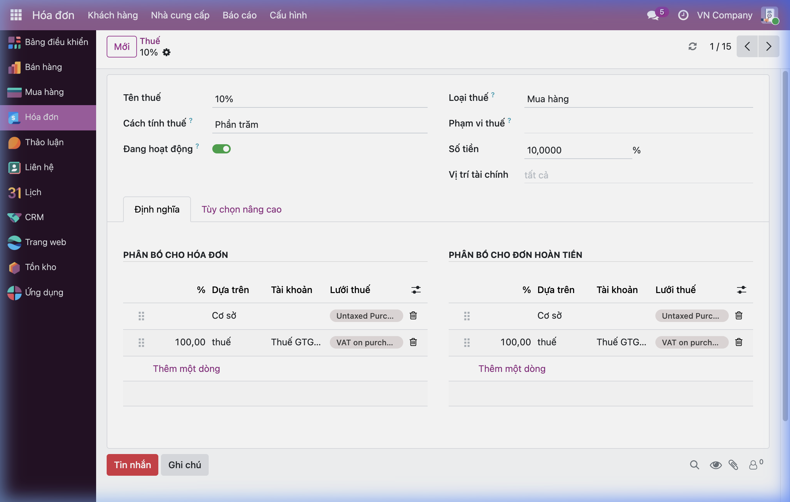
   * *Chi tiết tab Tùy chọn nâng cao:*
   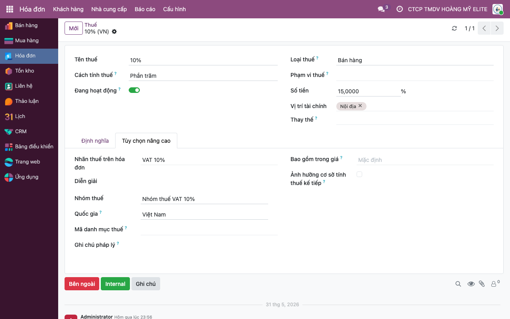
- **Bước 4:** Nhấn **Save** để lưu.

---

#### **4.3.1.2 Sổ nhật ký (Journals)**
##### **Mục đích & Ý nghĩa nghiệp vụ**
Thiết lập các sổ nhật ký kế toán để phân nhóm các nghiệp vụ tài chính phát sinh (Ví dụ: Sổ nhật ký Hóa đơn bán hàng, Sổ nhật ký Mua hàng, Nhật ký tài khoản Ngân hàng, Nhật ký Tiền mặt). Mỗi sổ nhật ký sẽ quản lý một chuỗi số chứng từ riêng biệt và tài khoản định khoản mặc định.

##### **Các bước thực hiện**
- **Bước 1:** Chọn phân hệ **"Hóa đơn"** -> chọn **"Cấu hình"** -> click **"Sổ nhật ký"**.
- **Bước 2:** Nhấn nút **"Mới"**:
   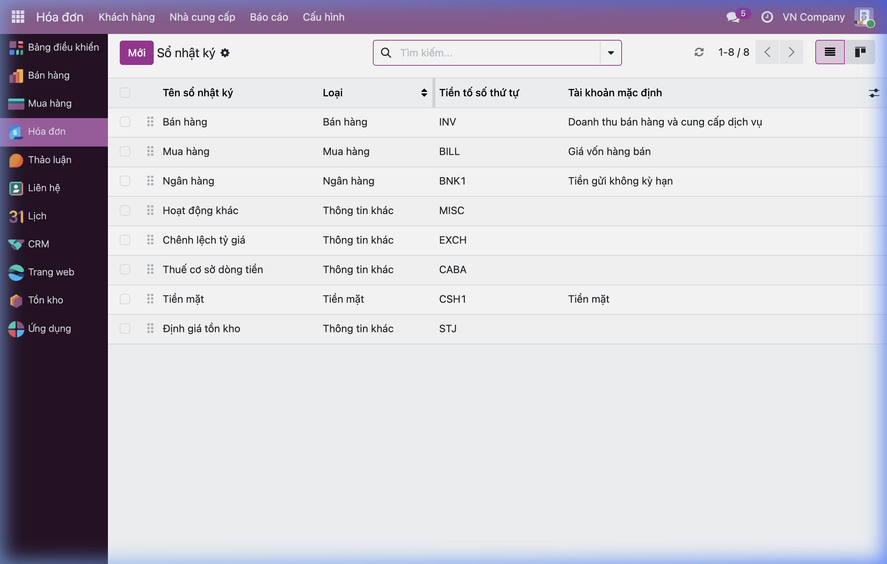
- **Bước 3:** Điền tên **Tên sổ nhật ký**, chọn loại **Loại** và mã chứng từ **Mã ngắn**:
   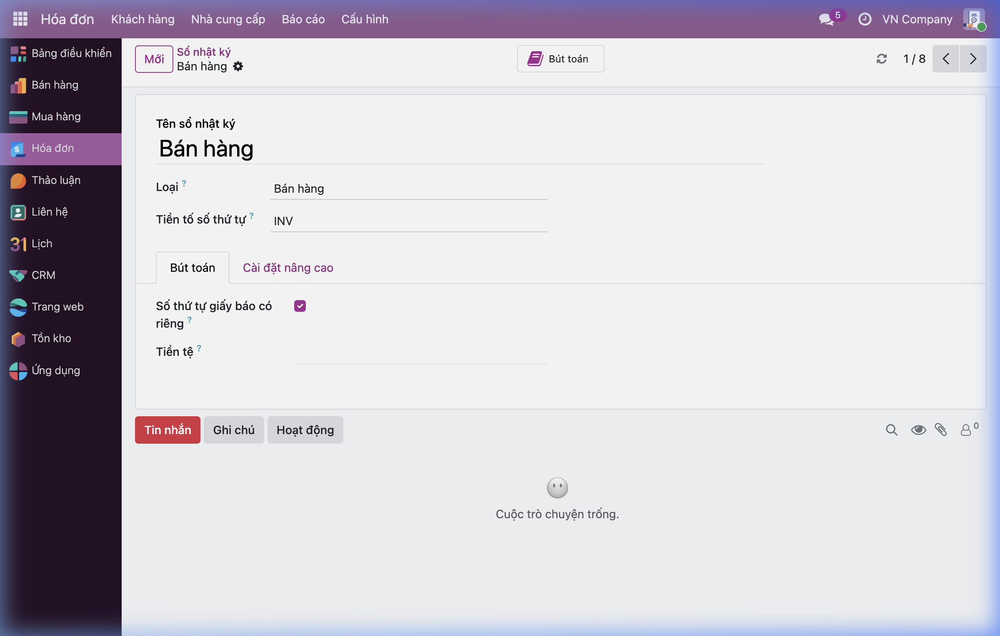
- **Bước 4:** Thiết lập tài khoản tiền mặt/ngân hàng mặc định đối với nhật ký thanh toán tại tab **Mục nhập Sổ nhật ký** (Journal Entries).
- **Bước 5:** Tại tab **Cài đặt nâng cao** (Advanced Settings), cấu hình tài khoản kiểm soát, kiểm soát sản phẩm, hoặc phương thức thanh toán tương ứng:
   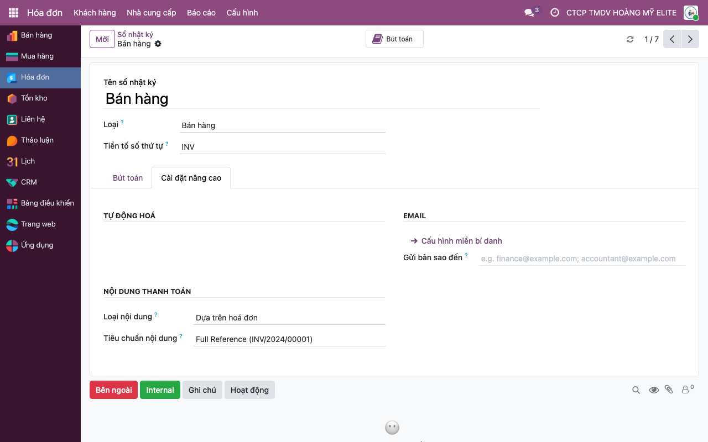
- **Bước 6:** Nhấn **Save** để lưu.

---

#### **4.3.1.3 Điều khoản thanh toán (Payment Terms)**
##### **Mục đích & Ý nghĩa nghiệp vụ**
Định nghĩa các chính sách tín dụng và thời hạn thanh toán áp dụng cho khách hàng hoặc nhà cung cấp (Ví dụ: Thanh toán ngay, Thanh toán 30% đặt cọc, 70% sau 30 ngày giao hàng).

##### **Các bước thực hiện**
- **Bước 1:** Chọn phân hệ **"Hóa đơn"** -> chọn **"Cấu hình"** -> click **"Điều khoản thanh toán"**.
- **Bước 2:** Nhấn nút **"Mới"**:
   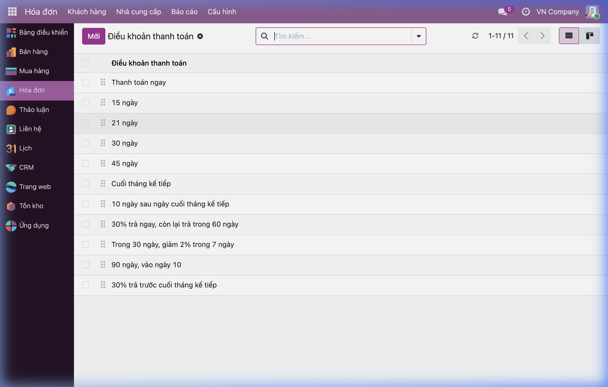
- **Bước 3:** Nhập tên điều khoản thanh toán và cấu hình các dòng quy tắc thanh toán chi tiết:
   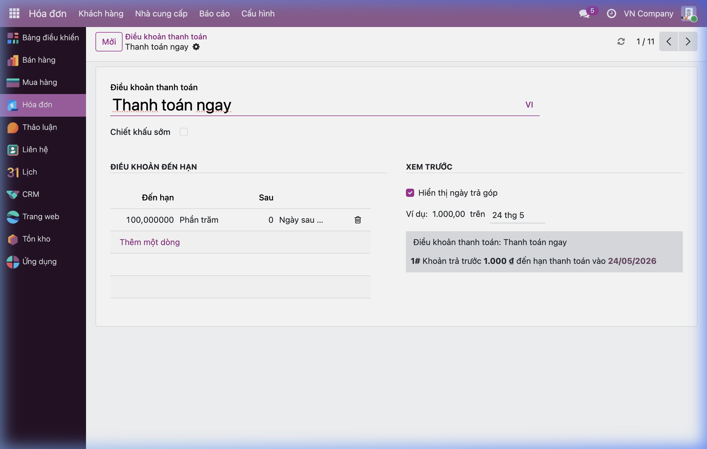
- **Bước 4:** Nhấn **Save** để lưu.

---

#### **4.3.1.4 Quản lý Hệ thống Tài khoản Kế toán (Chart of Accounts)**
##### **Mục đích & Ý nghĩa nghiệp vụ**
Hệ thống tài khoản kế toán (Chart of Accounts - COA) là nền tảng cốt lõi để phân loại và định khoản toàn bộ các nghiệp vụ kinh tế phát sinh của doanh nghiệp (theo chuẩn mực Thông tư 200/2014/TT-BTC như: TK 111 - Tiền mặt, TK 112 - Tiền gửi Ngân hàng, TK 131 - Phải thu khách hàng, TK 331 - Phải trả người bán, TK 642 - Chi phí quản lý kinh doanh, TK 811 - Chi phí khác). Ngay cả khi chỉ sử dụng phân hệ Hóa đơn (Invoicing) mà không cài module Kế toán chuyên sâu, bạn vẫn cần quản lý và định danh chính xác danh mục tài khoản này để phục vụ hạch toán bút toán và chi phí.

##### **Giải thích các trường thông tin trên Tài khoản**
* **Mã tài khoản (Code - *):** Số hiệu tài khoản theo chuẩn Thông tư 200 (Ví dụ: `1111`, `131`, `331`, `6422`, `811`).
* **Tên tài khoản (Account Name - *):** Tên định danh của tài khoản (Ví dụ: `Tiền Việt Nam`, `Phải thu của khách hàng`, `Chi phí dịch vụ mua ngoài`).
* **Loại tài khoản (Type - *):** Quyết định tính chất số dư và cách lên báo cáo của tài khoản. Các nhóm chính trong hệ thống gồm:
  * *Tài sản / Phải thu / Ngân hàng và Tiền mặt* (nhóm TK 1, 2).
  * *Nợ phải trả / Phải trả / Vốn chủ sở hữu* (nhóm TK 3, 4).
  * *Thu nhập / Thu nhập khác* (nhóm TK 5, 7).
  * *Chi phí / Khấu hao / Chi phí trực tiếp / Chi phí khác* (nhóm TK 6, 8).
* **Cho phép đối soát (Reconcile):** Đánh dấu cờ này nếu tài khoản cần theo dõi chi tiết công nợ hoặc đối soát từng chứng từ (Bắt buộc bật đối với TK `131`, `331` và tài khoản Ngân hàng/Tiền mặt).
* **Thuế mặc định (Default Taxes):** Gán mức thuế VAT mặc định tự động áp dụng khi chọn tài khoản này trên hóa đơn.

##### **Các bước thực hiện**
- **Bước 1:** Tại phân hệ **"Hóa đơn"** -> click menu **"Cấu hình"** -> chọn **"Danh mục tài khoản"** (Chart of Accounts).
- **Bước 2 (Tạo mới - Create):** Nhấn nút **[Mới]** (New), nhập **Mã tài khoản**, **Tên tài khoản** và chọn chính xác **Loại tài khoản**:
   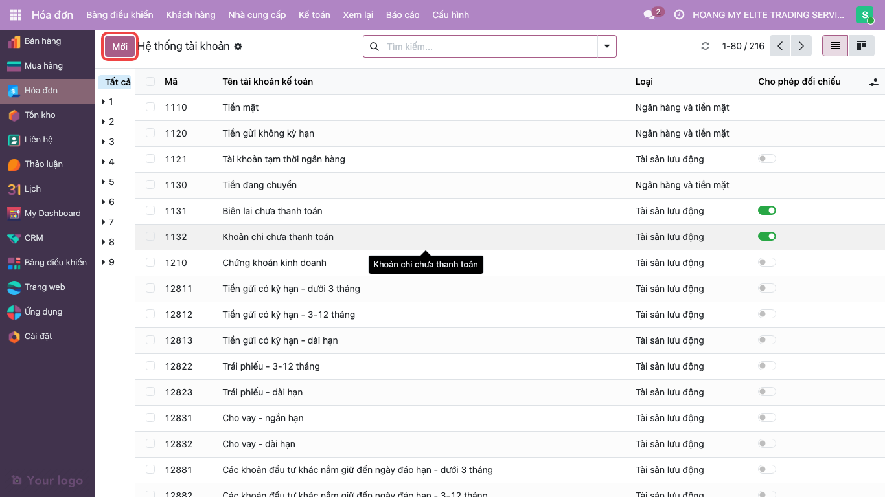
- **Bước 3 (Tra cứu - Read):** Sử dụng thanh tìm kiếm trên cùng để lọc theo Mã tài khoản (Ví dụ gõ `642` hoặc `811`) hoặc lọc theo Nhóm tài khoản (Tài sản, Nợ phải trả, Chi phí).
- **Bước 4 (Sửa đổi - Update):** Nhấp trực tiếp vào dòng tài khoản cần điều chỉnh tên hoặc thiết lập cờ **Cho phép đối soát** -> nhấn **[Lưu]** (Save).

> [!IMPORTANT]
> **Lưu ý nghiệp vụ cấu hình tài khoản:** Tuyệt đối không thay đổi **Loại tài khoản** (Type) đối với các tài khoản đang có số dư hoặc đã phát sinh bút toán hạch toán, vì điều này có thể làm sai lệch cấu trúc cân đối kế toán của toàn hệ thống.

---

### **4.3.2 Nhà cung cấp (Vendor)**

#### **4.3.2.1 Hóa đơn nhà cung cấp (Bills)**
##### **Mục đích & Ý nghĩa nghiệp vụ**
Ghi nhận hóa đơn mua hàng do nhà cung cấp phát hành gửi đến doanh nghiệp để hạch toán chi phí đầu vào và ghi nhận công nợ phải trả (Accounts Payable).

##### **Các bước thực hiện**
- **Bước 1:** Chọn phân hệ **"Hóa đơn"** -> di chuyển đến menu **"Nhà cung cấp"** -> click **"Hóa đơn nhà cung cấp"**.
- **Bước 2:** Nhấn nút **"Mới"** để tạo hóa đơn NCC mới:
   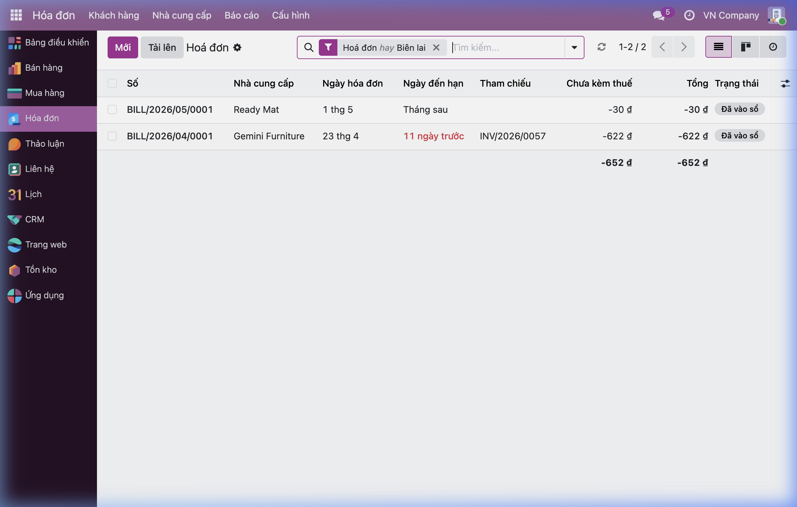
- **Bước 3:** Nhập tên nhà cung cấp tại **Nhà cung cấp**, ngày hóa đơn tại **Ngày hóa đơn** và các dòng sản phẩm tại tab **Chi tiết hóa đơn** (Bút toán).
- **Bước 4:** (Tùy chọn) Chuyển sang tab **"Thông tin khác"** để nhập thông tin thanh toán như tài khoản ngân hàng thụ hưởng, điều khoản thanh toán và ngày đến hạn.
   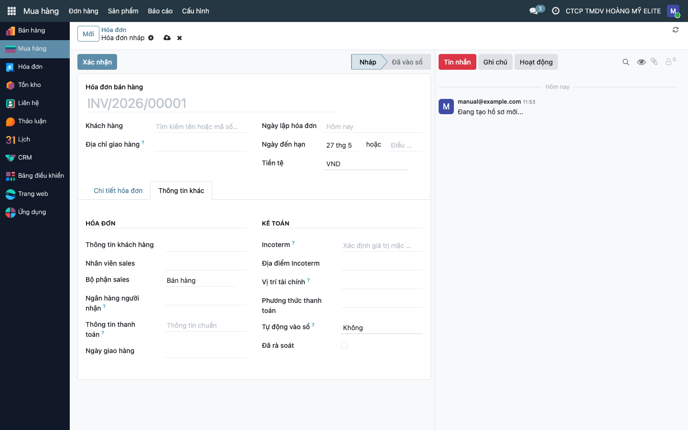
- **Bước 5:** Nhấn **Save** để lưu nháp và nhấn **Confirm** để chính thức ghi sổ công nợ phải trả.

---

#### **4.3.2.2 Hóa đơn trả lại / Hoàn tiền (Refunds)**
##### **Mục đích & Ý nghĩa nghiệp vụ**
Tạo chứng từ giảm trừ công nợ hoặc hoàn tiền từ nhà cung cấp (Vendor Credit Note) trong trường hợp doanh nghiệp trả lại hàng lỗi, hỏng hoặc được giảm giá mua hàng.

##### **Các bước thực hiện**
- **Bước 1:** Chọn phân hệ **"Hóa đơn"** -> di chuyển đến menu **"Nhà cung cấp"** -> click **"Hoàn tiền"** (hoở mở trực tiếp hóa đơn Bill gốc và chọn **Thêm ghi chú tín dụng**):
   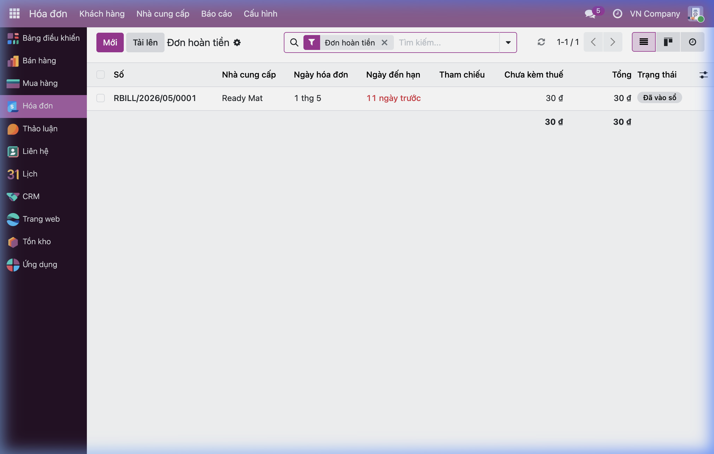
- **Bước 2:** Điền số tiền được hoàn trả hoặc cấn trừ, lý do hoàn tiền. Nhấn **Save** và **Confirm** để giảm trừ công nợ phải trả nhà cung cấp.

---

#### **4.3.2.3 Thanh toán cho nhà cung cấp (Vendor Payments)**
##### **Mục đích & Ý nghĩa nghiệp vụ**
Ghi nhận bút toán chuyển khoản ngân hàng hoặc chi tiền mặt thực tế để thanh toán công nợ cho nhà cung cấp.

##### **Các bước thực hiện**
- **Bước 1:** Chọn phân hệ **"Hóa đơn"** -> di chuyển đến menu **"Nhà cung cấp"** -> click **"Payments"**.
- **Bước 2:** Nhấn nút **"Mới"** (hoặc mở hóa đơn Bill gốc đang nợ và nhấn **Ghi nhận thanh toán**):
   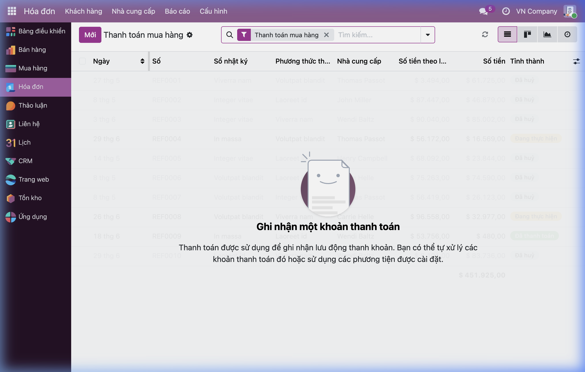
- **Bước 3:** Chọn sổ nhật ký thanh toán (Tiền mặt/Ngân hàng), điền số tiền trả và chọn nhà cung cấp đối ứng. Nhấn **Confirm** để khấu trừ nợ phải trả.

---

#### **4.3.2.4 Sản phẩm (Products)**
##### **Mục đích & Ý nghĩa nghiệp vụ**
Tra cứu nhanh danh sách các mặt hàng mua vào để phục vụ làm Bills hoặc cấu hình tài khoản kế toán chi phí đầu vào tương ứng cho sản phẩm.

##### **Các bước thực hiện**
- **Bước 1:** Chọn phân hệ **"Hóa đơn"** -> di chuyển đến menu **"Nhà cung cấp"** -> click **"Sản phẩm"**.
- **Bước 2:** Click chọn sản phẩm cần cấu hình để điều chỉnh các tài khoản kế toán chi phí tại tab **Income/Expense Accounts**.

---

#### **4.3.2.5 Nhà cung cấp (Vendors)**
##### **Mục đích & Ý nghĩa nghiệp vụ**
Xem và cấu hình thông tin danh bạ đối tác là nhà cung cấp, cấu hình tài khoản công nợ phải trả mặc định (Account Payable) phục vụ hạch toán mua hàng.

##### **Các bước thực hiện**
- **Bước 1:** Chọn phân hệ **"Hóa đơn"** -> di chuyển đến menu **"Nhà cung cấp"** -> click **"Nhà cung cấp"**.
- **Bước 2:** Chọn nhà cung cấp cần thiết lập, tại tab **Kế toán**, gán tài khoản kế toán công nợ và nhấn **Save**.

---

#### **4.3.2.6 Ghi nhận hóa đơn Chi phí & Chi phí khác (Other Expenses - TK 642, 811)**
##### **Mục đích & Ý nghĩa nghiệp vụ**
Trong hoạt động doanh nghiệp, ngoài các hóa đơn nhập mua hàng hóa nhập kho (được sinh tự động từ Đơn mua hàng PO), kế toán thường xuyên phải xử lý và hạch toán các hóa đơn chi phí dịch vụ mua ngoài, chi phí thuê văn phòng, tiền điện nước (TK 642) hoặc các khoản chi phí khác, chi phí bất thường (TK 811). Với phân hệ Hóa đơn (Invoicing), bạn hoàn toàn có thể ghi nhận trực tiếp các hóa đơn chi phí này vào sổ nhật ký mua hàng mà không cần cài module Kế toán phức tạp.

##### **Giải thích các trường thông tin trên Hóa đơn chi phí**
* **Nhà cung cấp (Vendor - *):** Đơn vị cung cấp dịch vụ hoặc hóa đơn (Ví dụ: Công ty Điện lực, Chủ cho thuê văn phòng).
* **Ngày hóa đơn (Bill Date - *):** Ngày ghi trên hóa đơn VAT hoặc ngày phát sinh chi phí.
* **Số hóa đơn (Vendor Reference / Bill Reference):** Số ký hiệu và số hóa đơn thực tế để phục vụ kê khai thuế và tra cứu.
* **Tab Chi tiết hóa đơn (Invoice Lines):**
  * **Sản phẩm / Diễn giải:** Nhập trực tiếp nội dung chi tiêu (Ví dụ: `Chi phí thuê văn phòng tháng 07/2026`, `Chi phí tiếp khách`). Bạn không bắt buộc phải chọn mã sản phẩm trong danh mục nếu đây là khoản chi một lần.
  * **Tài khoản (Account - *):** Chọn tài khoản chi phí TT200 phù hợp (Ví dụ: `6427 - Chi phí dịch vụ mua ngoài`, `6422 - Chi phí vật liệu quản lý`, hoặc `811 - Chi phí khác`).
  * **Số lượng & Giá (Quantity & Price):** Nhập số lượng và đơn giá chưa thuế.
  * **Thuế (Taxes):** Chọn mức thuế GTGT đầu vào (Ví dụ `VAT 10%`, `VAT 8%` hoặc `Không chịu thuế`) để hệ thống tự động tách thuế vào tài khoản `1331 - Thuế GTGT được khấu trừ`.

##### **Các bước thực hiện**
- **Bước 1 (Create):** Vào phân hệ **"Hóa đơn"** -> chọn menu **"Nhà cung cấp"** -> click **"Hóa đơn nhà cung cấp"** (Bills) -> bấm nút **[Mới]** (New).
- **Bước 2:** Chọn **Nhà cung cấp**, nhập **Ngày hóa đơn** và **Số hóa đơn**.
- **Bước 3:** Tại tab **Chi tiết hóa đơn**, thêm dòng chi phí mới, ghi diễn giải nội dung chi tiêu và gán đúng **Tài khoản chi phí** (TK 642 hoặc 811):
   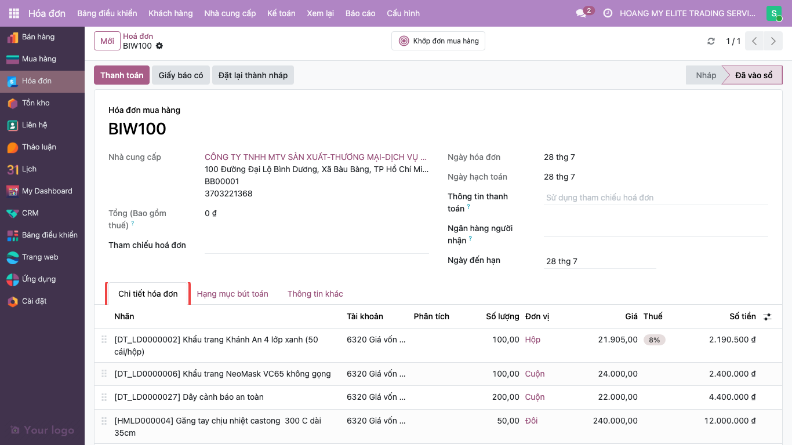
- **Bước 4 (Post/Confirm):** Kiểm tra tổng tiền chưa thuế, tiền thuế VAT đầu vào và tổng thanh toán -> Bấm **[Xác nhận]** (Confirm). Hóa đơn chuyển sang trạng thái **Đã ghi sổ** và hệ thống tự động sinh bút toán hạch toán Nợ TK Chi phí (642/811), Nợ TK Thuế (1331) / Có TK Phải trả người bán (331).
- **Bước 5 (Read & Update):** Khi hóa đơn ở trạng thái Nháp, bạn có thể tự do chỉnh sửa tài khoản chi phí và số tiền. Khi đã ghi sổ, bấm nút **[Thanh toán]** (Register Payment) khi chi tiền mặt hoặc chuyển khoản để tất toán công nợ chi phí này.

---

### **4.3.3 Khách hàng (Customers)**

#### **4.3.3.1 Hóa đơn khách hàng (Invoices)**
##### **Mục đích & Ý nghĩa nghiệp vụ**
Ghi nhận doanh thu bán hàng và công nợ phải thu từ khách hàng (Accounts Receivable). Hóa đơn sau khi được ghi sổ sẽ cấp số hiệu chính thức và ghi nhận công nợ.

##### **Các bước thực hiện**
- **Bước 1:** Chọn phân hệ **"Hóa đơn"** bên menu trái để xem danh sách hóa đơn hiện có:
   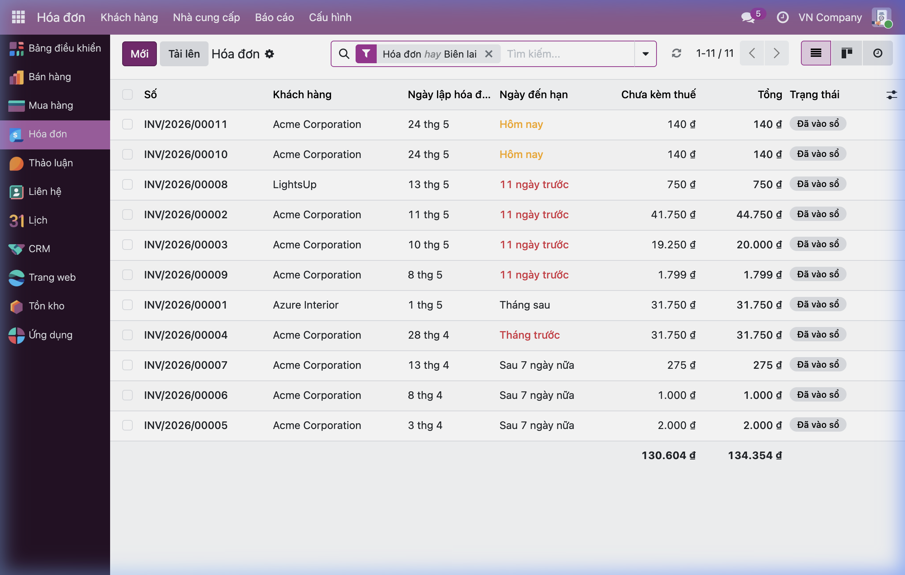
- **Bước 2:** Nhấp nút **"Mới"** ở góc trên cùng bên trái.
- **Bước 3:** Chọn khách hàng tại ô **Customer** (Ví dụ: `Acme Corporation`) và nhập sản phẩm tại tab **Chi tiết hóa đơn** (Invoice Lines).
- **Bước 4:** Nhập số lượng bán là `1.00`, hệ thống tự lấy giá bán mặc định `140.00`.
- **Bước 5:** (Tùy chọn) Chuyển sang tab **"Thông tin khác"** để cài đặt tài khoản ngân hàng nhận tiền, điều khoản thanh toán hoặc người bán phụ trách.
   
- **Bước 6:** Lưu hóa đơn ở trạng thái nháp:
   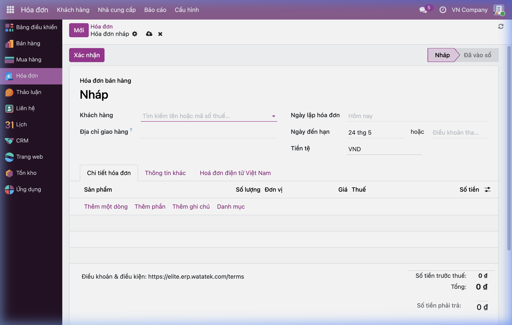
- **Bước 7:** Nhấp chọn nút **[Xác nhận]** ở góc trái trên để chính thức ghi sổ hóa đơn.
- **Bước 8:** Trạng thái chuyển sang **Đã ghi sổ**, hệ thống sinh số hóa đơn dạng `INV/2026/00010` và hiển thị khoản nợ cần thu ở trường **Amount Due**:
   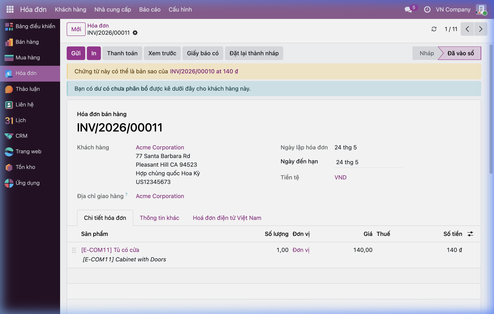

---

#### **4.3.3.2 Ghi chú tín dụng / Giảm trừ nợ (Credit Notes)**
##### **Mục đích & Ý nghĩa nghiệp vụ**
Tạo hóa đơn giảm trừ công nợ (Credit Note) cho khách hàng trong trường hợp trả lại hàng hóa đã mua hoặc được chiết khấu, giảm giá sau khi hóa đơn chính thức đã xuất.

##### **Các bước thực hiện**
- **Bước 1:** Mở Hóa đơn khách hàng (Invoice) cần giảm trừ đã ghi sổ.
- **Bước 2:** Nhấp nút **[Ghi chú tín dụng]** ở thanh công cụ phía trên.
- **Bước 3:** Nhập lý do giảm trừ nợ, chọn phương thức hoàn tiền và nhấn **Confirm** để tạo và ghi sổ hóa đơn giảm trừ công nợ:
   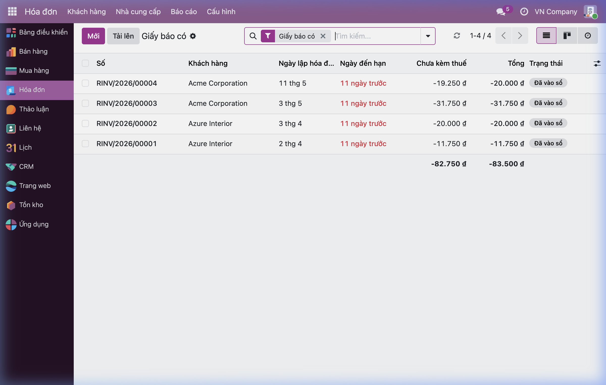

---

#### **4.3.3.3 Ghi nhận thanh toán của khách hàng (Customer Payments)**
##### **Mục đích & Ý nghĩa nghiệp vụ**
Ghi nhận số tiền thu về từ khách hàng (chuyển khoản ngân hàng hoặc tiền mặt) để cấn trừ các hóa đơn còn nợ của họ trên hệ thống.

##### **Các bước thực hiện**
- **Bước 1:** Mở hóa đơn bán hàng cần ghi nhận thanh toán đang có trạng thái **Đã ghi sổ**.
- **Bước 2:** Nhấn nút **[Thanh toán]** (hoặc **Ghi nhận thanh toán**) ở góc trên bên trái:
   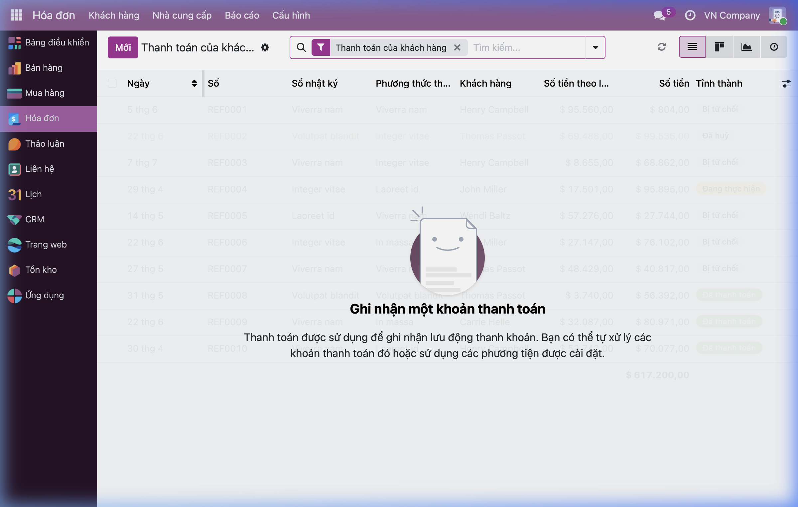
- **Bước 3:** Chọn Sổ nhật ký nhận tiền (Cash/Bank), số tiền nhận thực tế và nhấn **Create Payment**.
- **Bước 4:** Hoặc đối với khách hàng có sẵn tiền đặt cọc trước đó: Cuộn xuống chân trang tại phần **Outstanding credits** và nhấn nút **[Add]** bên cạnh khoản tiền cọc để cấn trừ trực tiếp công nợ.

---

#### **4.3.3.4 Sản phẩm (Products)**
##### **Mục đích & Ý nghĩa nghiệp vụ**
Tra cứu nhanh danh sách các mặt hàng bán ra để kiểm tra thông tin tài khoản doanh thu (Income Account) phục vụ xuất hóa đơn khách hàng.

##### **Các bước thực hiện**
- **Bước 1:** Chọn phân hệ **"Hóa đơn"** -> di chuyển đến menu **"Khách hàng"** -> click **"Sản phẩm"**.
- **Bước 2:** Cấu hình tài khoản kế toán ghi nhận doanh thu mặc định cho sản phẩm tại tab **Kế toán**.

---

#### **4.3.3.5 Khách hàng (Customers)**
##### **Mục đích & Ý nghĩa nghiệp vụ**
Quản lý danh sách khách hàng và thiết lập các thông tin tài khoản ngân hàng, tài khoản công nợ phải thu (Account Receivable) của khách hàng phục vụ cho phân hệ Kế toán.

##### **Các bước thực hiện**
- **Bước 1:** Chọn phân hệ **"Hóa đơn"** -> di chuyển đến menu **"Khách hàng"** -> click **"Khách hàng"**.
- **Bước 2:** Chọn khách hàng cần thiết lập, tại tab **Kế toán**, gán tài khoản kế toán công nợ phải thu và nhấn **Save** để cập nhật.

---

### **4.3.4 Kế toán tổng hợp & Bút toán (Accounting Operations & Journal Entries)**

#### **4.3.4.1 Quản lý Bút toán Nhật ký (Manage Journal Entries)**
##### **Mục đích & Ý nghĩa nghiệp vụ**
Bên cạnh việc phát sinh tự động từ hóa đơn bán hàng và hóa đơn mua hàng, bộ phận kế toán cần thực hiện lập thủ công các chứng từ kết chuyển, bút toán điều chỉnh, hạch toán chi phí tiền lương, khấu hao tài sản hoặc trích trước chi phí theo đúng Thông tư 200/2014/TT-BTC. Trình đơn Bút toán nhật ký (Journal Entries) trong phân hệ Hóa đơn cung cấp đầy đủ công cụ để lập (Create), tra cứu (Read), điều chỉnh (Update) và ghi sổ chứng từ tổng hợp.

##### **Giải thích các trường thông tin trên Bút toán**
* **Sổ nhật ký (Journal - *):** Chọn sổ nhật ký phù hợp với nghiệp vụ phát sinh (Ví dụ: `Sổ các thao tác khác / Miscellaneous Operations`, `Sổ Tiền mặt`, `Sổ Ngân hàng`).
* **Ngày kế toán (Accounting Date - *):** Ngày ghi nhận chứng từ vào sổ cái (thường là ngày phát sinh nghiệp vụ hoặc ngày cuối kỳ hạch toán).
* **Tham chiếu (Reference):** Số chứng từ gốc hoặc diễn giải tóm tắt nghiệp vụ (Ví dụ: `Hạch toán tiền lương T07/2026`).
* **Tab Chi tiết bút toán (Journal Items):**
  * **Tài khoản (Account - *):** Chọn tài khoản theo Hệ thống tài khoản TT200 (Ví dụ: `6422 - Chi phí vật liệu quản lý`, `3341 - Must trả người lao động`).
  * **Đối tác (Partner):** Chọn Khách hàng, Nhà cung cấp hoặc Nhân viên liên quan (bắt buộc đối với các tài khoản công nợ `131`, `331`, `141`, `334`...).
  * **Nhãn (Label):** Diễn giải chi tiết nghiệp vụ cho dòng hạch toán tương ứng.
  * **Nợ (Debit) / Có (Credit):** Nhập số tiền phát sinh bên Nợ hoặc bên Có. Tổng Nợ và Tổng Có của bút toán bắt buộc phải cân bằng nhau.

##### **Các bước thực hiện**
- **Bước 1 (Create - Tạo mới):** Tại phân hệ **"Hóa đơn"** -> chọn menu **"Kế toán"** (hoặc Các thao tác khác) -> click **"Bút toán nhật ký"** (Journal Entries) -> nhấn nút **[Mới]** (New).
- **Bước 2:** Chọn **Sổ nhật ký**, nhập **Ngày kế toán** và **Tham chiếu**.
- **Bước 3:** Tại tab **Chi tiết bút toán**, nhấn **[Thêm một dòng]**, chọn Tài khoản Nợ TT200, chọn Đối tác (nếu có) và nhập số tiền Nợ:
   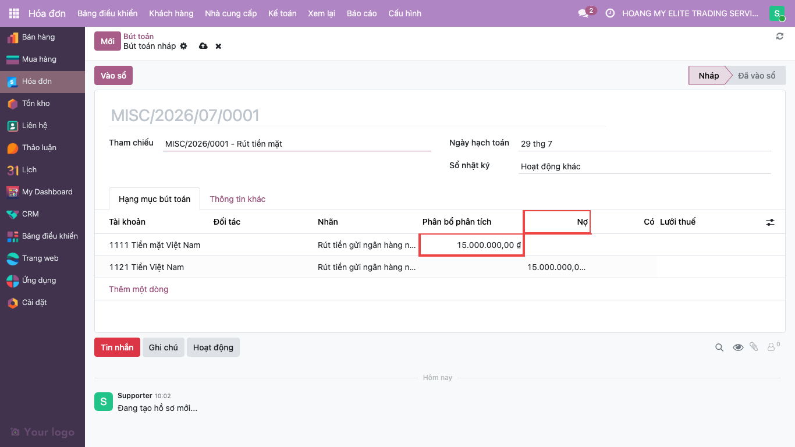
- **Bước 4:** Nhấn **[Thêm một dòng]** tiếp theo, chọn Tài khoản Có TT200 tương ứng để cân bằng chứng từ:
   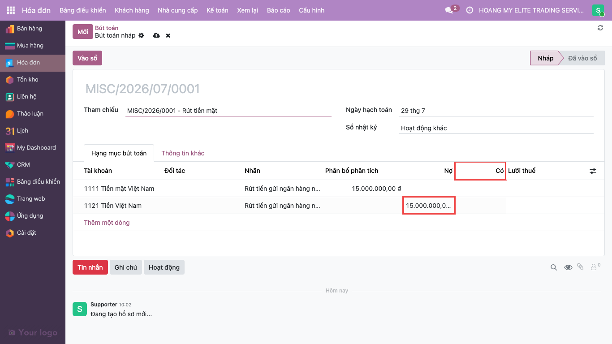
- **Bước 5 (Post - Ghi sổ):** Kiểm tra Tổng số tiền Nợ = Tổng số tiền Có. Nhấn nút **[Vào sổ]** (Post) để chính thức ghi nhận nghiệp vụ vào sổ cái kế toán:
   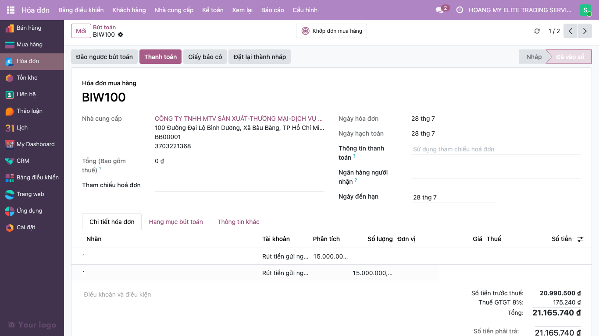
- **Bước 6 (Read - Tra cứu):** Tại màn hình danh sách Bút toán nhật ký, sử dụng bộ lọc tìm kiếm theo số chứng từ, theo tài khoản, hoặc lọc theo trạng thái **Đã vào sổ** (Posted) / **Nháp** (Draft).
- **Bước 7 (Update & Reverse - Sửa đổi & Đảo bút toán):**
  * *Khi chứng từ đang ở trạng thái Nháp:* Bạn tự do chỉnh sửa tài khoản, số tiền hoặc bấm biểu tượng bánh răng chọn **"Xóa"** (Delete).
  * *Khi chứng từ Đã vào sổ:* Để đảm bảo tính toàn vẹn và dấu vết kiểm toán theo chuẩn TT200, hệ thống khóa không cho sửa xóa trực tiếp. Bạn bấm nút **[Đảo ngược bút toán]** (Reverse Entry) ở góc trên, hệ thống sẽ sinh bút toán đảo chiều Nợ/Có để triệt tiêu số dư sai một cách hợp lệ:
   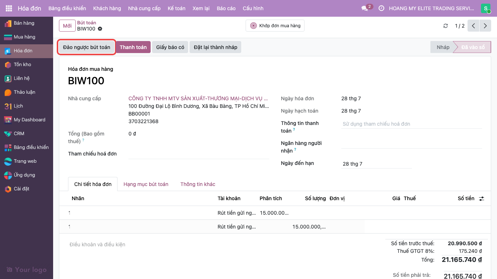

---

#### **4.3.4.2 Cách hệ thống sinh bút toán tự động (Automated Journal Entries)**
##### **Cơ chế hoạt động**
Trong Odoo, bạn không cần phải tạo thủ công 100% các bút toán. Hầu hết các nghiệp vụ cốt lõi như Bán hàng, Mua hàng và Thanh toán đều được hệ thống **tự động hạch toán** (sinh bút toán) dựa trên cấu hình tài khoản (Chart of Accounts) mặc định của Sản phẩm, Khách hàng, Nhà cung cấp và Thuế.

##### **Cách xem chi tiết một bút toán tự động**
Để hiểu rõ hệ thống đang hạch toán dòng tiền như thế nào, bạn có thể kiểm tra trực tiếp ngay trên bất kỳ Hóa đơn hoặc Chứng từ thanh toán nào:

- **Bước 1:** Mở một Hóa đơn khách hàng (hoặc Hóa đơn nhà cung cấp) đã được **[Xác nhận]** (Đã vào sổ).
- **Bước 2:** Chuyển sang tab **"Chi tiết bút toán" (Journal Items)** nằm ngay bên cạnh tab Chi tiết hóa đơn.
- **Bước 3:** Tại đây, hệ thống sẽ hiển thị minh bạch các cặp định khoản Nợ/Có. Ví dụ, với một Hóa đơn bán hàng thông thường, hệ thống tự động sinh các dòng hạch toán như sau:
  - **Nợ TK 131 (Phải thu khách hàng):** Tổng số tiền khách hàng phải thanh toán (Ghi nhận vào công nợ).
  - **Có TK 511 (Doanh thu bán hàng):** Giá trị tiền hàng trước thuế.
  - **Có TK 3331 (Thuế GTGT đầu ra):** Số tiền thuế VAT phát sinh (nếu có).
   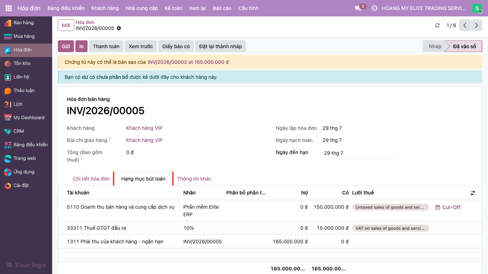

> [!TIP]
> **Mẹo:** Việc thường xuyên xem tab "Chi tiết bút toán" giúp kế toán viên kiểm soát chéo sự chính xác của các tài khoản doanh thu/chi phí được cấu hình ẩn dưới sản phẩm, đảm bảo báo cáo tài chính luôn chuẩn xác theo Thông tư 200.

---

### **4.3.5 Báo cáo & Phân tích (Reporting & Analysis)**
##### **Mục đích & Ý nghĩa nghiệp vụ**
Hỗ trợ Ban giám đốc và Kế toán quản trị truy xuất nhanh các chỉ số tài chính cốt lõi (Doanh thu, Chi phí, Dòng tiền) theo thời gian thực (Real-time) ngay trên hệ thống mà không cần chờ đến kỳ báo cáo thuế, phục vụ việc ra quyết định kinh doanh kịp thời.

##### **Các bước thực hiện xem báo cáo**

**1. Xem Báo cáo Doanh thu & Chi phí (Invoices Analysis):**
- **Bước 1:** Tại module **Hóa đơn (Invoicing)**, chọn menu **Báo cáo (Reporting)** -> **Phân tích hóa đơn (Invoices Analysis)**.
- **Bước 2:** Nhìn lên thanh tìm kiếm, hệ thống đang mặc định lọc `[Khách hàng]`.
  - Để xem **Doanh thu (Thu)**: Giữ nguyên bộ lọc. Ở nút **Chỉ số (Measures)**, chọn **Số tiền trước thuế (Untaxed Amount)**. Bạn có thể nhóm theo *Khách hàng* hoặc *Tháng* để xem biểu đồ tăng trưởng.

  - Để xem **Chi phí (Chi)**: Bấm dấu **X** để tắt bộ lọc `[Khách hàng]`. Bấm vào thanh tìm kiếm, chọn **Bộ lọc (Filters)** -> **Hóa đơn nhà cung cấp (Vendor Bills)**. Biểu đồ sẽ lập tức hiển thị tổng tiền đã chi.
  - Để xem **Lãi Gộp (Gross Profit)**: Lọc theo `[Khách hàng]`, ở nút **Chỉ số (Measures)**, chọn **Biên lợi nhuận (Margin)**.

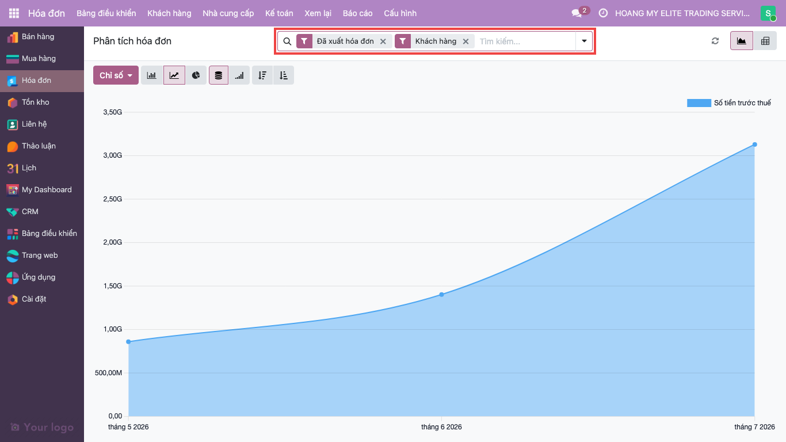

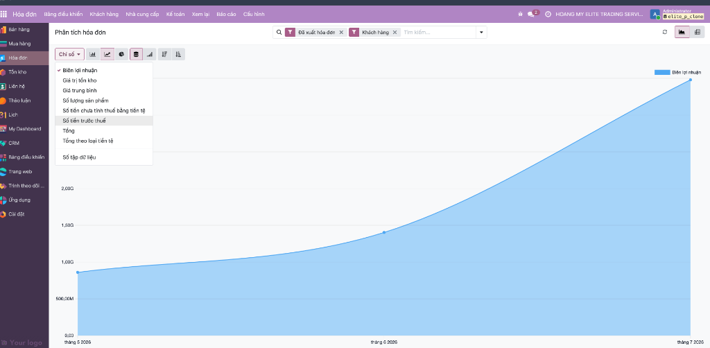

> [!NOTE]
> **Giải nghĩa số tiền trên biểu đồ (K, M, G):**
> Khi số tiền quá lớn, trục dọc của biểu đồ sẽ được viết tắt theo chuẩn quốc tế để chống rối mắt:
> - **K (Kilo):** Ngàn (Ví dụ: 500K = 500.000 VNĐ)
> - **M (Mega):** Triệu (Ví dụ: 500M = 500.000.000 VNĐ - 500 triệu)
> - **G (Giga):** Tỷ (Ví dụ: 2,00G = 2.000.000.000 VNĐ - 2 tỷ đồng)

> [!TIP]
> **Mẹo xem con số chính xác không cần rê chuột:**
> Theo mặc định, biểu đồ làm ẩn các con số để tránh rối mắt. Nếu muốn xem bảng số liệu chi tiết chính xác đến từng đồng (giống Excel), hãy nhấp vào biểu tượng **Bảng lưới (Pivot)** nằm ở góc trên cùng bên phải (ngay cạnh biểu tượng biểu đồ). Bạn có thể bấm nút **Tải xuống xlsx** (Biểu tượng mũi tên tải xuống) để xuất báo cáo này ra Excel.
> 
> 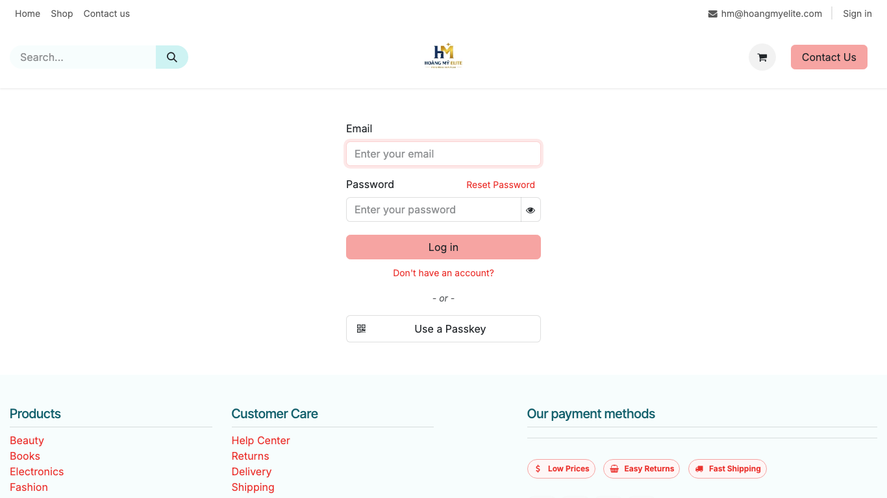

- **Bước 3:** (Tùy chọn) Lưu cấu hình bộ lọc này vào mục **Yêu thích (Favorites) -> Lưu tìm kiếm hiện tại** để truy cập nhanh cho lần sau.

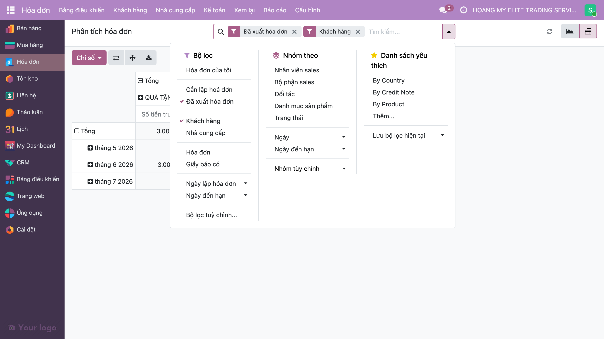

**2. Xem Báo cáo Kế toán phân tích - Lãi/Lỗ ròng (Analytic Reporting):**
- **Bước 1:** Chọn menu **Báo cáo (Reporting)** -> **Báo cáo Kế toán phân tích (Analytic Reporting)**.
- **Bước 2:** Báo cáo này giúp xem **Lãi / Lỗ ròng (Net Profit)** của từng Dự án hoặc Phòng ban cụ thể (vì nó đã cộng trừ chéo cả hóa đơn bán và hóa đơn mua cùng gắn 1 thẻ phân tích).
- **Bước 3:** Sử dụng **Nhóm theo (Group By)** -> Chọn **Dự án / Hợp đồng lớn** (Hoặc Thêm nhóm tùy chỉnh nếu bị ẩn) để bung giao diện báo cáo Lãi/Lỗ theo từng dự án (Ví dụ: Dự án SunGroup Lỗ 30tr, Dự án Masterise Lãi 50tr).

**3. Xem Dòng tiền thực tế (Cash & Bank Dashboard):**
- **Bước 1:** Truy cập module **Hóa đơn (Invoicing)** -> Chọn menu **Bảng thông tin (Dashboard)**.
- **Bước 2:** Trên màn hình Kanban, quan sát hai thẻ sổ nhật ký quan trọng nhất: **Tiền mặt (Cash)** và **Ngân hàng (Bank)**.
- **Bước 3:** Tại mỗi thẻ, bạn sẽ thấy ngay con số **Số dư hiện tại (Current Balance)** phản ánh lượng tiền thực tế đang có.
- **Bước 4:** Để xem chi tiết các dòng tiền vào/ra (thu tiền khách, trả tiền nhà cung cấp), hãy nhấp vào chữ **Giao dịch (Transactions)** hoặc **Sổ cái (General Ledger)** ngay trên thẻ sổ đó.
   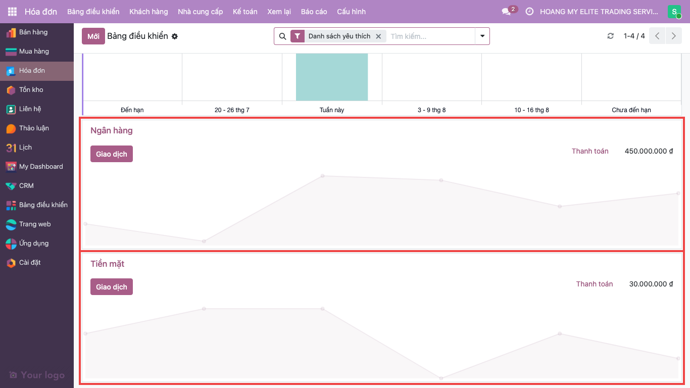

---

## **4.4 📦 PHÂN HỆ KHO (Inventory)**

### **4.4.1 Cấu hình (Configuration)**

#### **4.4.1.1 Kho hàng (Warehouses)**
##### **Mục đích & Ý nghĩa nghiệp vụ**
Quản lý các địa điểm vật lý hoặc kho hàng của doanh nghiệp (Ví dụ: Kho chính, Kho trung chuyển, Kho chi nhánh). Việc thiết lập kho hàng giúp hệ thống theo dõi chính xác lượng tồn kho và cấu hình các tuyến đường vận chuyển tự động.

##### **Các bước thực hiện**
- **Bước 1:** Chọn phân hệ **"Tồn kho"** -> chọn **"Cấu hình"** -> click **"Kho hàng"**.
- **Bước 2:** Hệ thống hiển thị danh sách các kho hàng:
   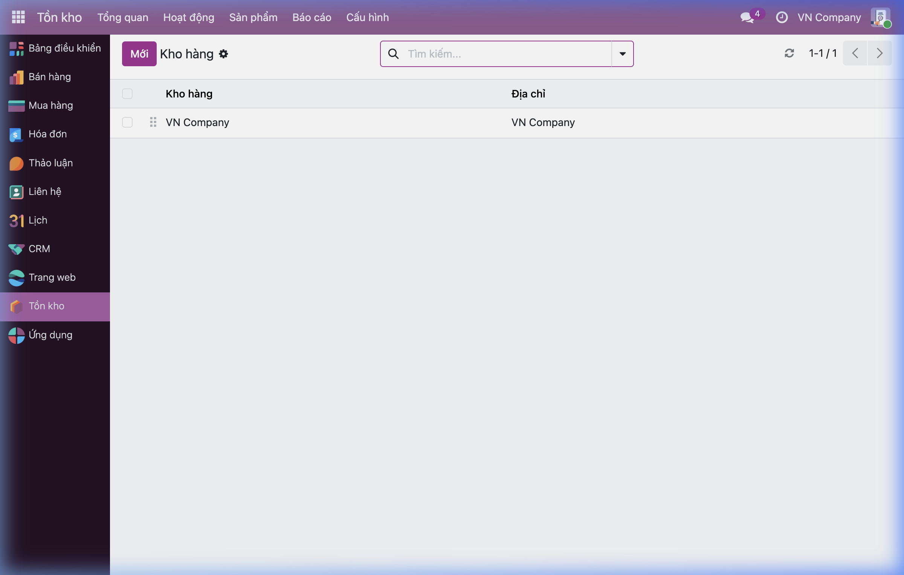
- **Bước 3:** Nhấp chọn một kho hàng (hoặc nhấn **"Mới"** để tạo mới) để xem thông tin chi tiết:
   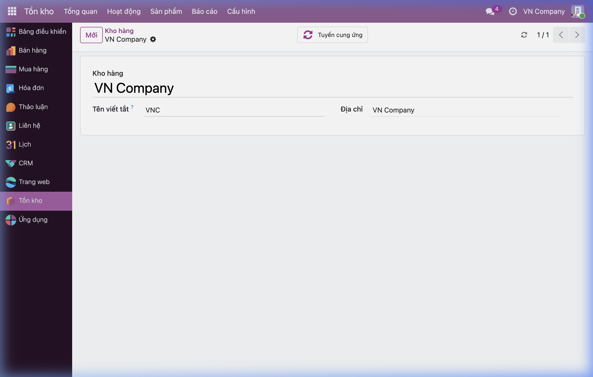
- **Bước 4:** Nhập tên kho hàng (**Kho hàng**), mã viết tắt (**Tên viết tắt**), và địa chỉ kho. Nhấn **Save** để lưu.

---

#### **4.4.1.2 Loại hoạt động (Operations Types)**
##### **Mục đích & Ý nghĩa nghiệp vụ**
Định nghĩa các loại giao dịch kho khác nhau (Ví dụ: Nhận hàng - Receipts, Giao hàng - Delivery Orders, Chuyển kho nội bộ - Internal Transfers). Mỗi loại hoạt động sẽ có quy trình xử lý, địa điểm kho nguồn/đích mặc định và chuỗi số phiếu riêng biệt.

##### **Các bước thực hiện**
- **Bước 1:** Chọn phân hệ **"Tồn kho"** -> chọn **"Cấu hình"** -> click **"Loại hoạt động"**.
- **Bước 2:** Hệ thống hiển thị danh sách các loại hoạt động:
   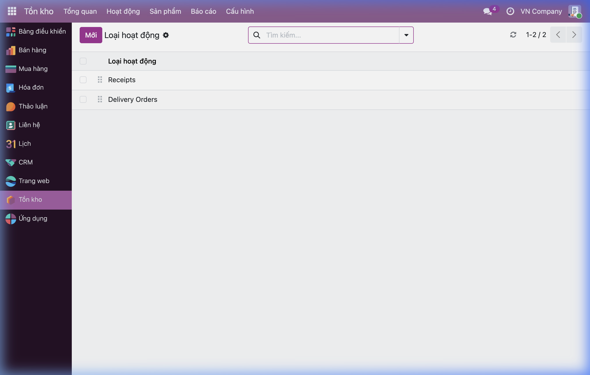
- **Bước 3:** Nhấp chọn một loại hoạt động để xem chi tiết cấu hình:
   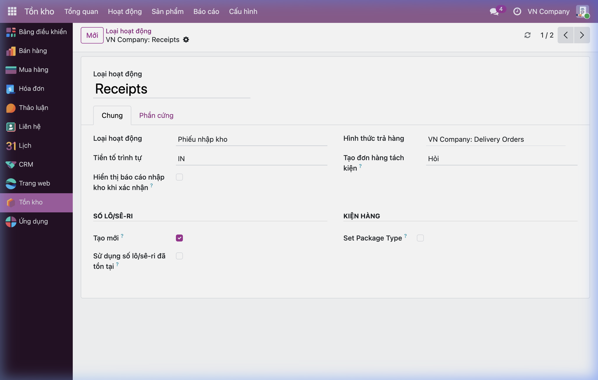
- **Bước 4:** Định nghĩa tên loại hoạt động, chọn kho hàng áp dụng, địa điểm nguồn/đích mặc định tại tab **Thông tin chung** (General) và nhấn **Save**.

---

### **4.4.2 Hoạt động kho (Operations)**

#### **4.4.2.1 Nhận hàng (Receipts)**
##### **Mục đích & Ý nghĩa nghiệp vụ**
Thực hiện nhận hàng hóa từ nhà cung cấp vào kho dựa trên Đơn mua hàng (PO). Phiếu nhận hàng ghi nhận số lượng thực nhập, in phiếu nhập kho và cập nhật số lượng tồn kho tức thời.

##### **Các bước thực hiện**
- **Bước 1:** Chọn phân hệ **"Tồn kho"** -> chọn menu **"Hoạt động"** -> click **"Nhận hàng"** (hoặc nhấn vào nút **"Nhận hàng"** trên bảng điều khiển Inventory Overview).
   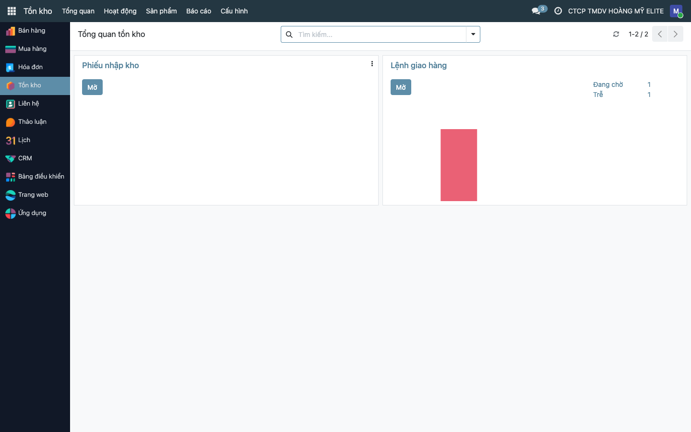
- **Bước 2:** Chọn phiếu nhận hàng có trạng thái **"Ready"** liên kết với PO tương ứng.
   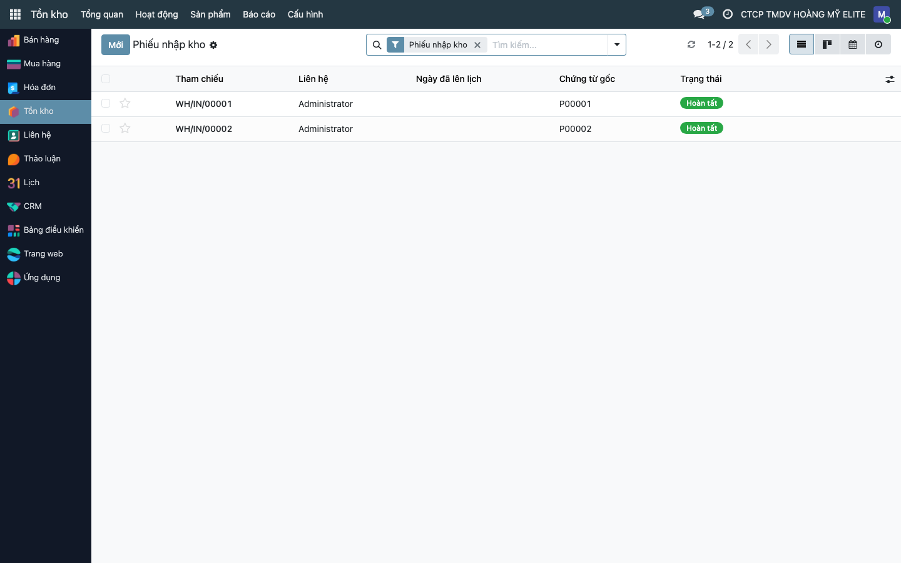
- **Bước 3:** Kiểm tra số lượng thực tế nhận được tại cột **"Số lượng"** (Quantity) của tab **Hoạt động**.
   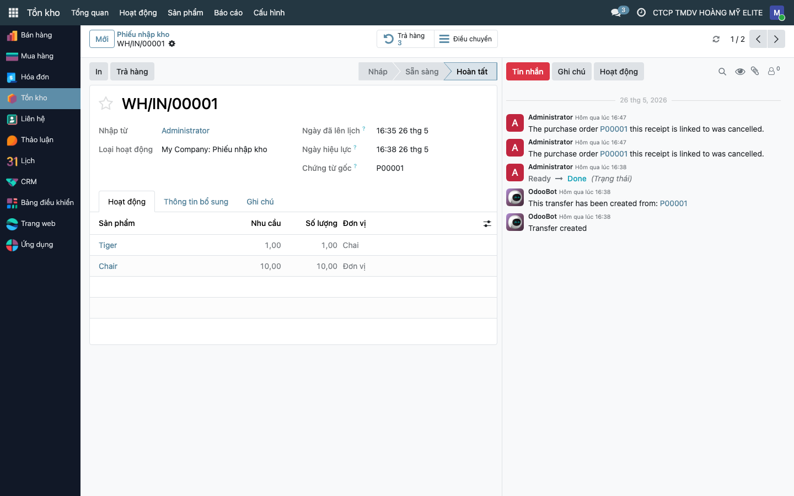
- **Bước 4:** (Tùy chọn) Chuyển sang tab **"Thông tin bổ sung"** để điền thông tin đơn vị vận chuyển hoặc kiểm tra chứng từ gốc liên quan.
   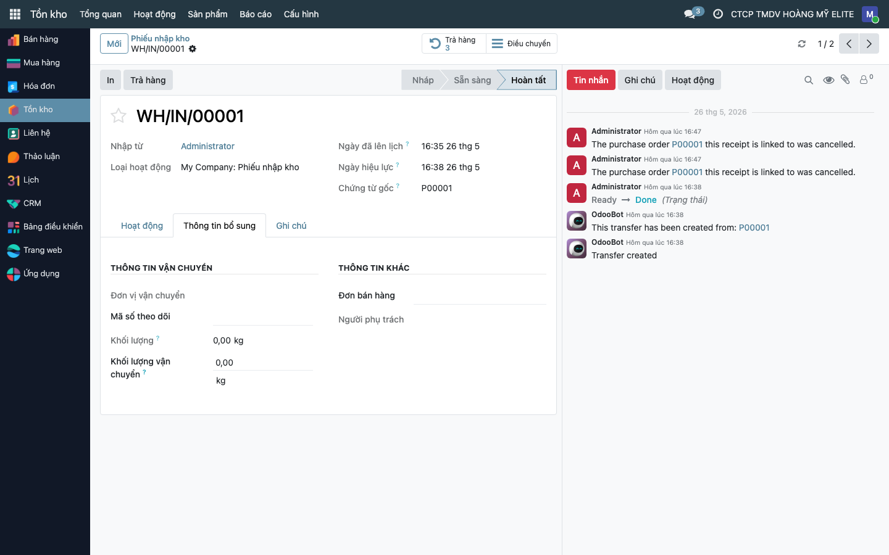
- **Bước 5:** (Tùy chọn) Chuyển sang tab **"Ghi chú"** để nhập ghi chú nhận hàng hoặc thông tin nội bộ.
   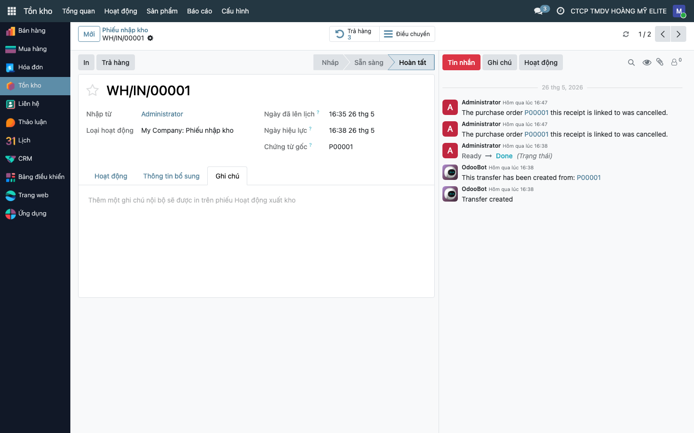
- **Bước 6:** Nhấn nút **"Xác nhận"** (Validate) để hoàn tất nhập kho:
   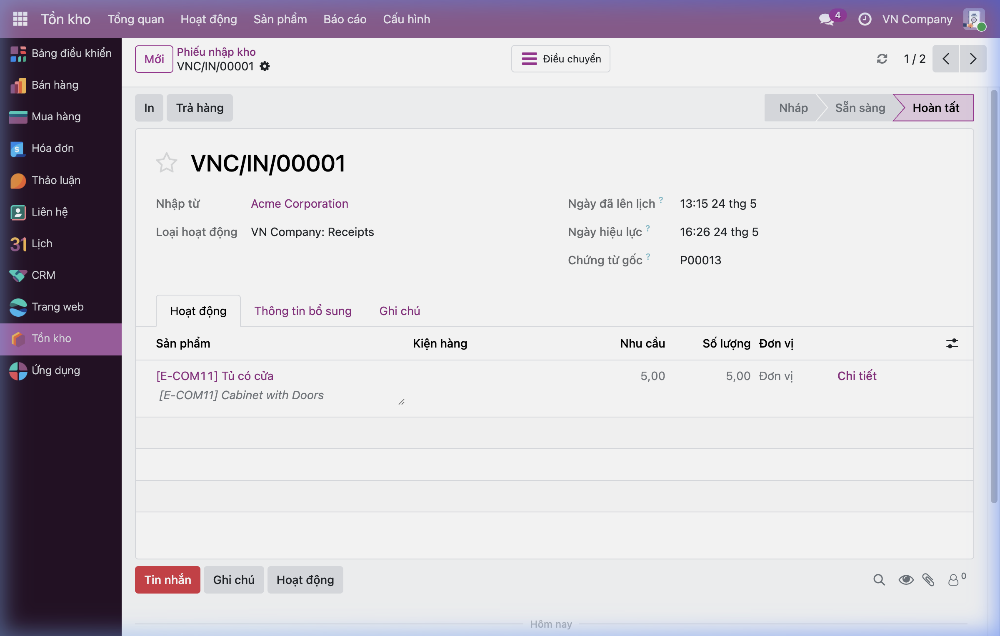

---

#### **4.4.2.2 Giao hàng (Deliveries)**
##### **Mục đích & Ý nghĩa nghiệp vụ**
Xuất kho hàng hóa để giao cho khách hàng dựa trên Đơn bán hàng (SO). Phiếu giao hàng giúp kiểm tra tình trạng hàng trong kho, chuẩn bị hàng và xác nhận xuất kho chính thức.

##### **Các bước thực hiện**
- **Bước 1:** Chọn phân hệ **"Tồn kho"** -> chọn menu **"Hoạt động"** -> click **"Giao hàng"** (hoặc nhấn vào nút **"Delivery Orders"** trên bảng điều khiển Inventory Overview).
- **Bước 2:** Chọn phiếu giao hàng tương ứng của Đơn bán hàng cần xuất.
- **Bước 3:** Xác nhận số lượng xuất kho thực tế tại cột **"Số lượng"** (Quantity) của tab **Hoạt động**.
- **Bước 4:** (Tùy chọn) Chuyển sang tab **"Thông tin bổ sung"** để điền thông tin đơn vị vận chuyển hoặc kiểm tra chứng từ gốc liên quan.
   
- **Bước 5:** (Tùy chọn) Chuyển sang tab **"Ghi chú"** để nhập ghi chú giao hàng.
   
- **Bước 6:** Nhấn **"Xác nhận"** (Validate) để chính thức xuất kho hàng hóa:
   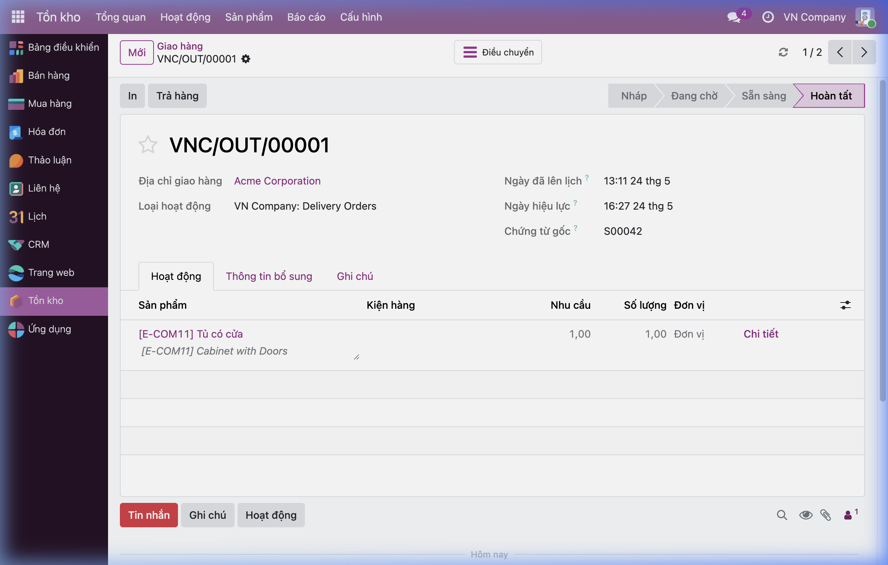

#### **4.4.2.3 Chuyển kho nội bộ (Internal Transfers)**
##### **Mục đích & Ý nghĩa nghiệp vụ**
Điều chuyển hàng hóa giữa các kho vật lý hoặc các khu vực khác nhau trong cùng một kho (Ví dụ: Chuyển hàng từ Kho chính sang Kho cửa hàng bán lẻ, hoặc chuyển hàng vào khu vực hàng lỗi). Việc điều chuyển này giúp luân chuyển hàng hóa và tối ưu hóa lượng hàng sẵn sàng bán.

> [!IMPORTANT]
> Nếu bạn không nhìn thấy trường **Địa điểm nguồn** (Source Location) và **Địa điểm đích** (Destination Location), nguyên nhân có thể do hệ thống chưa kích hoạt tính năng **Nhiều địa điểm kho** (Storage Locations). Hãy liên hệ Quản trị viên truy cập **Tồn kho** -> **Cấu hình** -> **Thiết lập** -> Tích chọn **Địa điểm lưu kho** (Storage Locations) và lưu lại.

##### **Các bước thực hiện**
- **Bước 1:** Chọn phân hệ **"Tồn kho"** -> chọn menu **"Hoạt động"** -> click **"Lệnh chuyển hàng"** (hoặc nhấn vào nút **"Mới"** trên thẻ **Chuyển kho nội bộ** tại bảng điều khiển Inventory Overview).
   
- **Bước 2:** Nhấn nút **"Mới"** (New).
- **Bước 3:** Khai báo **Địa điểm nguồn** (Source Location), **Địa điểm đích** (Destination Location). Tại tab **Hoạt động**, bấm **Thêm một dòng**, chọn sản phẩm và nhập **Số lượng nhu cầu**:
   
- **Bước 4:** Nhấn **Lưu**, sau đó nhấn **Đánh dấu cần làm** (Mark as Todo) và **Kiểm tra khả dụng** (Check Availability) để giữ hàng trong kho.
- **Bước 5:** Khi hoàn tất điều chuyển thực tế, nhập số lượng vào cột **Hoàn thành** (hoặc **Số lượng**) (Done) và nhấn **Xác nhận** (Validate) để hoàn tất.

> [!IMPORTANT]
> **Lưu ý quan trọng khi chuyển kho:**
> - **Tồn kho nguồn:** Kho nguồn bắt buộc phải có sẵn sản phẩm thì mới có thể **Xác nhận** (Validate) phiếu chuyển kho. Nếu thiếu hàng, phiếu sẽ ở trạng thái *Chờ* và không cho phép hoàn tất.
> - **Giữ hàng (Reservation):** Khi bấm **Kiểm tra khả dụng** (Check Availability), hệ thống sẽ tự động khóa số lượng hàng tương ứng tại kho nguồn vào cột **Dành trước** (Reserved) để tránh việc lượng hàng này bị lấy đi bởi các đơn hàng khác.
> - **Quản lý Lô/Serial:** Đối với sản phẩm quản lý theo Lô hoặc Số Sê-ri, bạn bắt buộc phải chọn chính xác mã Lô/Serial cụ thể được điều chuyển tại tab hoạt động chi tiết, không thể chỉ nhập số lượng tổng hợp.
> - **Đơn vị tính (UoM):** Hãy đảm bảo sử dụng đúng đơn vị tính của sản phẩm để tránh trường hợp quy đổi sai lệch số lượng tồn thực tế.

---

#### **4.4.2.4 Kiểm kho định kỳ (Physical Inventory)**
##### **Mục đích & Ý nghĩa nghiệp vụ**
Kiểm kê số lượng tồn kho thực tế tại kho và điều chỉnh số lượng tồn kho trên hệ thống nếu có chênh lệch, đảm bảo tính chính xác của số liệu kế toán kho.

##### **Các bước thực hiện**
- **Bước 1:** Chọn phân hệ **"Tồn kho"** -> chọn menu **"Hoạt động"** -> click **"Kiểm kê kho"**.
- **Bước 2:** Nhấn nút **"Mới"** để bắt đầu đợt kiểm kê, hoặc chọn các dòng sản phẩm hiển thị để điều chỉnh trực tiếp số lượng thực tế tại cột **"Counted Quantity"**:
   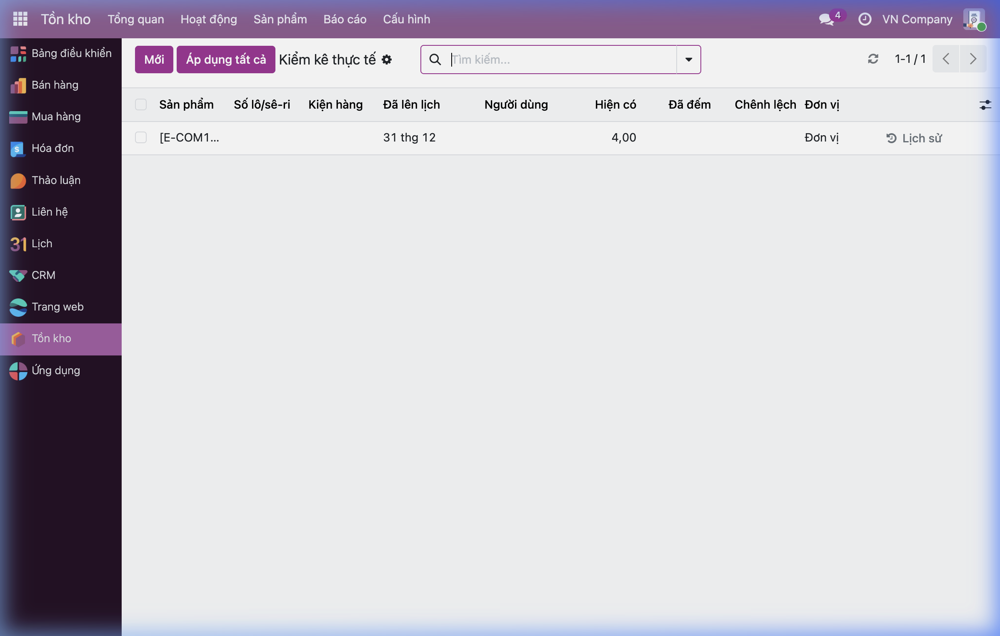
- **Bước 3:** Sau khi nhập số lượng thực tế kiểm đếm, nhấn **"Áp dụng"** để hệ thống tự động sinh bút toán điều chỉnh kho.

---

#### **4.4.2.5 Phiếu loại bỏ / Hủy hàng (Scrap Orders)**
##### **Mục đích & Ý nghĩa nghiệp vụ**
Loại bỏ hàng hóa bị hư hỏng, lỗi, hết hạn sử dụng ra khỏi kho và ghi nhận chi phí hao hụt kho tương ứng.

##### **Các bước thực hiện**
- **Bước 1:** Chọn phân hệ **"Tồn kho"** -> chọn menu **"Hoạt động"** -> click **"Phiếu hủy hàng"**.
- **Bước 2:** Nhấn nút **"Mới"** để tạo phiếu hủy hàng:
   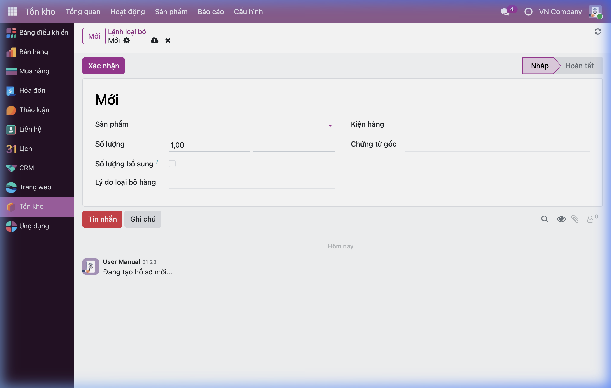
- **Bước 3:** Chọn sản phẩm cần hủy, nhập số lượng hủy tại cột **"Quantity"**, và chọn kho chứa hàng lỗi. Nhấn **Save** và **Validate** để hoàn tất hủy hàng.

---

#### **4.4.2.6 Quy trình Trả hàng (Product Returns)**
##### **Mục đích & Ý nghĩa nghiệp vụ**
Xử lý việc nhận lại hàng hóa bị trả từ khách hàng (Customer Return) hoặc xuất trả lại hàng hóa cho nhà cung cấp (Vendor Return) khi phát hiện hàng lỗi, hỏng hoặc không đạt yêu cầu. Quy trình này giúp cập nhật chính xác tồn kho thực tế và làm cơ sở cho kế toán xử lý cấn trừ công nợ hoặc hoàn tiền.

##### **1. Khách hàng trả lại hàng (Customer Returns)**
- **Bước 1:** Truy cập vào phân hệ **Tồn kho** -> chọn menu **Hoạt động** -> click **Giao hàng** (hoặc **Lệnh chuyển hàng**). Tìm và mở phiếu Xuất kho (giao hàng) có mã **OUT** tương ứng của đơn hàng ban đầu cần trả.
- **Bước 2:** Tại giao diện chi tiết phiếu xuất kho (trạng thái Hoàn tất), nhấn nút **[Trả hàng] (Return)** ở thanh trạng thái phía trên:
   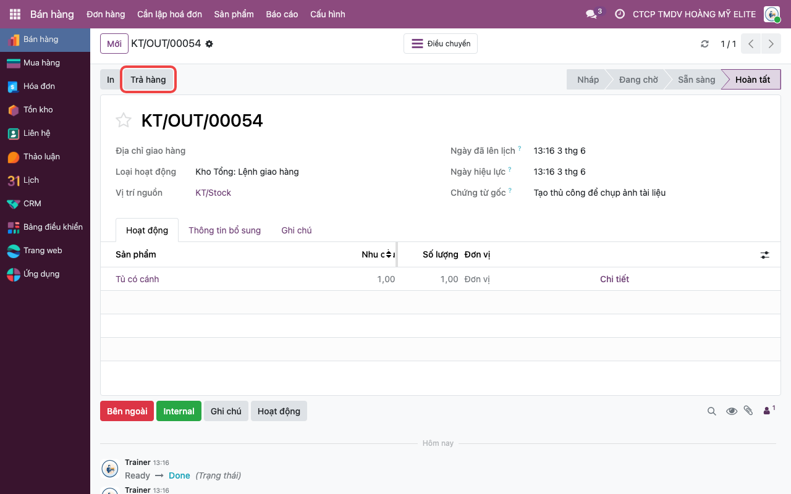
- **Bước 3:** Hệ thống hiển thị hộp thoại pop-up (Hỗ trợ trả hàng). Bạn hãy kiểm tra danh sách sản phẩm và nhập số lượng khách trả thực tế tại cột **Số lượng**:
   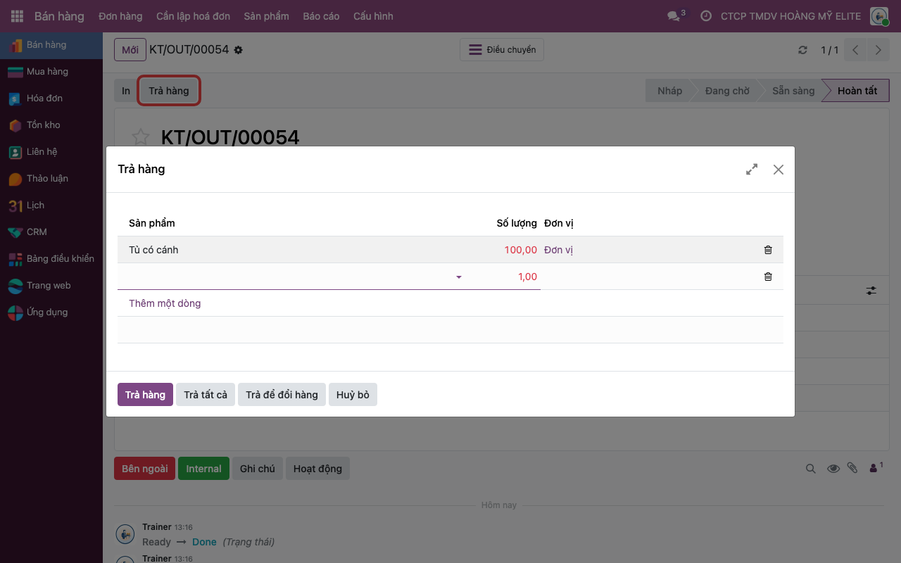
- **Bước 4:** Nhấn nút **[Trả hàng] (Return)** màu xanh. Hệ thống sẽ tự động tạo một phiếu Nhập kho mới ở trạng thái **Sẵn sàng (Ready)** với mã nguồn gốc được ghi nhận là *"Đơn trả hàng của [Mã phiếu OUT ban đầu]"*:
   
- **Bước 5:** Thủ kho tiến hành kiểm đếm hàng nhận lại thực tế, điền số lượng vào cột **Số lượng** (hoặc **Hoàn thành**) (Done) và nhấn **[Xác nhận]** (Validate) để hoàn tất đưa hàng trở lại kho:
   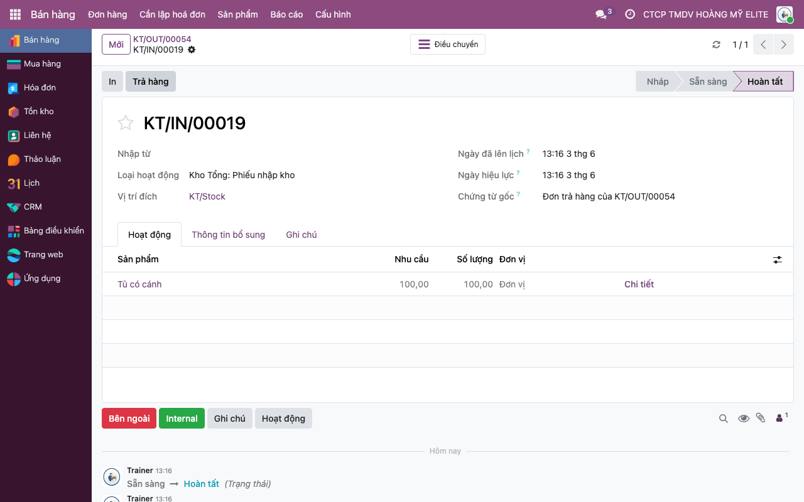

##### **2. Trả hàng cho Nhà cung cấp (Vendor Returns)**
- **Bước 1:** Truy cập vào phân hệ **Tồn kho** -> chọn menu **Hoạt động** -> click **Phiếu nhập kho** (hoặc **Lệnh chuyển hàng**). Tìm và mở phiếu Nhập kho (nhận hàng) có mã **IN** tương ứng của đơn mua hàng ban đầu cần trả.
- **Bước 2:** Nhấn nút **[Trả hàng] (Return)** ở thanh trạng thái phía trên:
   
- **Bước 3:** Tại hộp thoại pop-up, điền số lượng sản phẩm thực tế cần xuất trả cho Nhà cung cấp:
   
- **Bước 4:** Nhấn nút **[Trả hàng] (Return)**. Hệ thống sẽ tự động tạo một phiếu Xuất kho mới (giao hàng trả) ở trạng thái **Sẵn sàng (Ready)** với nguồn gốc là *"Đơn trả hàng của [Mã phiếu IN ban đầu]"*:
   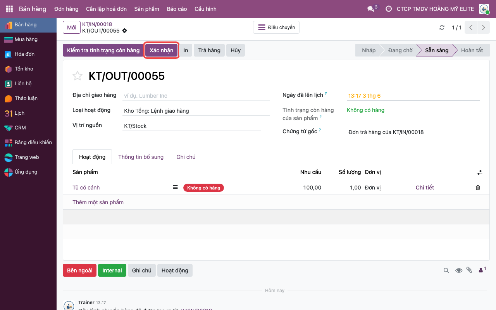
- **Bước 5:** Nhấn **[Xác nhận]** (Validate) để hoàn tất xuất trả hàng đi:
   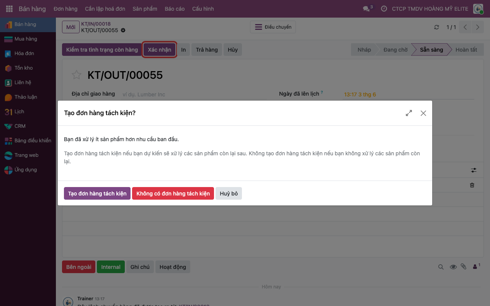

---

#### **4.4.2.7 Tổng quan kho (Inventory Overview)**
##### **Mục đích & Ý nghĩa nghiệp vụ**
Bảng điều khiển trung tâm hiển thị trạng thái hoạt động của tất cả các loại hoạt động kho (Nhập kho, Xuất kho, Chuyển kho nội bộ) giúp thủ kho nắm bắt nhanh số lượng phiếu đang chờ xử lý (To Process), phiếu trễ hạn (Late), hoặc phiếu sẵn sàng thực hiện (Ready).

##### **Các bước thực hiện**
- **Bước 1:** Chọn phân hệ **"Tồn kho"** -> chọn menu **"Hoạt động"** -> click **"Tổng quan tồn kho"** (hoặc click trực tiếp vào tab Inventory khi vào phân hệ).
- **Bước 2:** Màn hình Kanban hiển thị các thẻ đại diện cho từng loại hoạt động kho:
   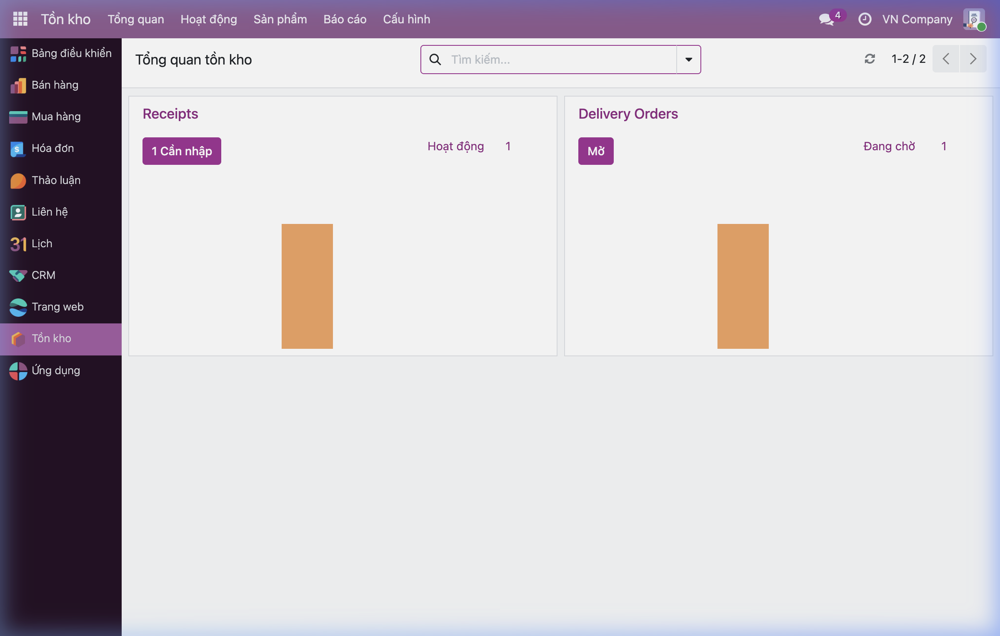
- **Bước 3:** Nhấp vào các phím chức năng trên thẻ để đi đến danh sách các phiếu kho tương ứng theo trạng thái cần xử lý.

---

#### **4.4.2.8 Quy trình Cung ứng theo đơn hàng (Make to Order - MTO)**
##### **Mục đích & Ý nghĩa nghiệp vụ**
Quy trình MTO áp dụng cho mô hình "Mua hàng rồi giao hàng" (Back-to-Back). Khi khách hàng đặt mua một sản phẩm nhưng sản phẩm đó không có sẵn hoặc bạn không muốn lưu trữ tồn kho cố định, hệ thống sẽ tự động tạo một Yêu cầu báo giá mua hàng (PO nháp) gửi cho nhà cung cấp tương ứng ngay khi Đơn bán hàng (SO) được xác nhận. Điều này giúp tối ưu hóa vốn lưu động và tự động liên kết dòng chảy chứng từ.

##### **Các bước thực hiện cấu hình và vận hành**

###### **1. Cấu hình sản phẩm**
- **Bước 1:** Vào phân hệ **Sản phẩm** -> mở sản phẩm cần thiết lập. Đảm bảo tích chọn cả **Sales (Bán hàng)** và **Purchase (Mua hàng)** ở đầu trang:
   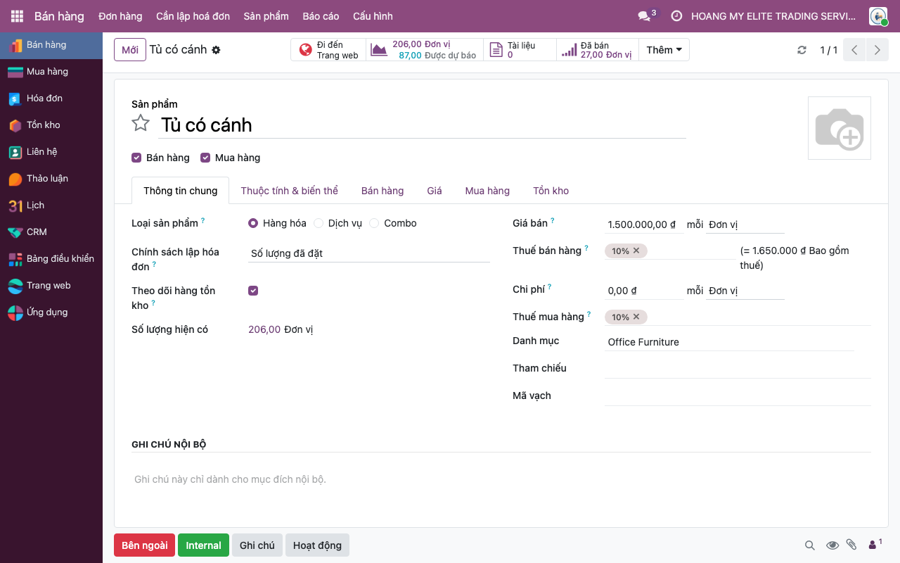
- **Bước 2:** Chọn tab **Mua hàng (Purchase)** -> bấm **[Thêm một dòng]** để gán Nhà cung cấp mặc định và giá mua tương ứng:
   

###### **2. Vận hành luồng tự động**
- **Bước 3:** Tạo một Đơn bán hàng (SO) mới, chọn sản phẩm đã cấu hình MTO ở trên, nhập số lượng bán và bấm **[Xác nhận]**.
- **Bước 4:** Trên giao diện đơn bán hàng SO sau khi xác nhận, bạn sẽ thấy xuất hiện một nút thông minh **Đơn mua hàng (Purchase Orders)** hiển thị số lượng đơn mua tự động sinh ra:
   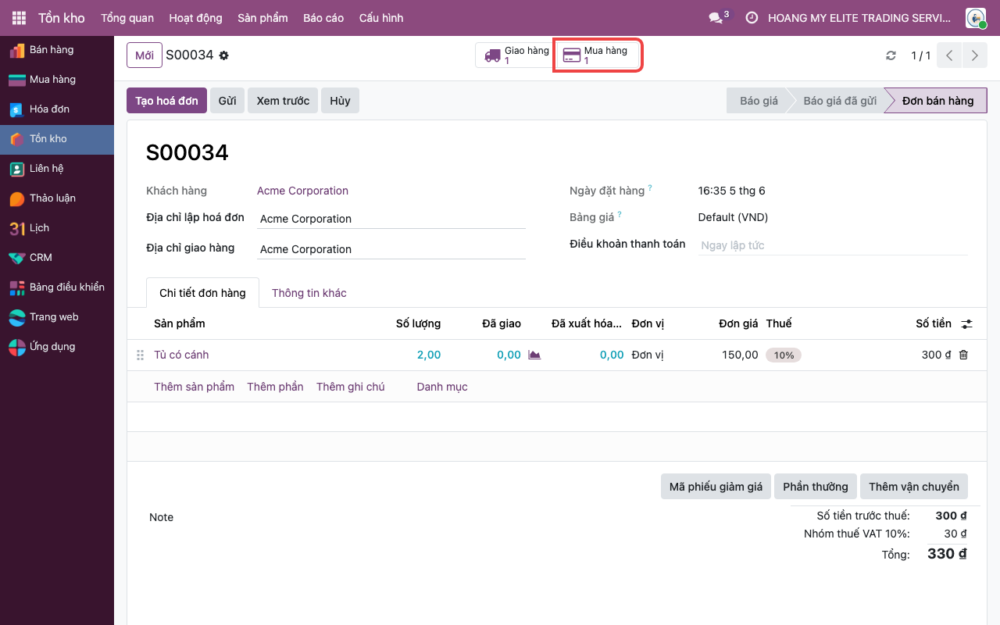
- **Bước 5:** Vào phân hệ **Mua hàng** -> mở đơn Yêu cầu báo giá (PO nháp) vừa được tự động sinh ra. Bạn sẽ thấy trường **Tài liệu nguồn (Source Document)** hiển thị mã đơn bán hàng SO tương ứng để truy vết chéo:
   

###### **3. Thao tác đối với bộ phận Kho vận (Warehouse)**
- **Bước 6:** Trên đơn bán hàng (SO), nhấp vào nút thông minh **Giao hàng (Delivery)**. Bạn sẽ thấy Phiếu xuất kho (OUT) đang ở trạng thái **Chờ hoạt động khác (Waiting Another Operation)** do chưa có hàng nhập về:
   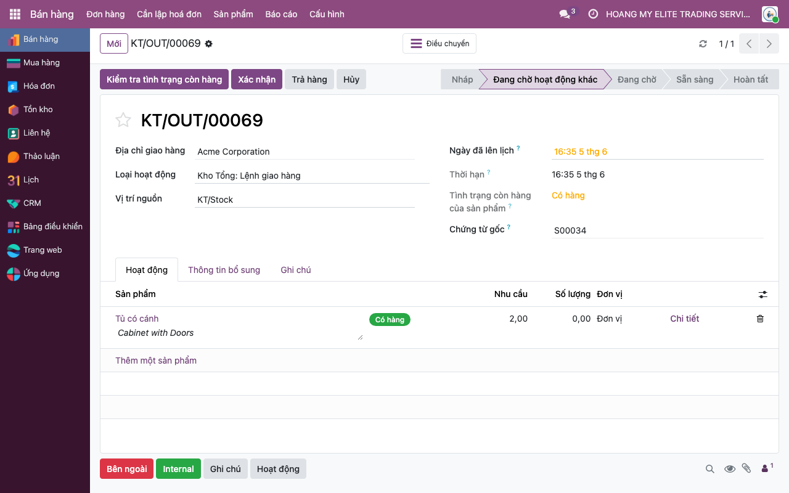
- **Bước 7:** Sau khi bộ phận mua hàng xác nhận đơn mua (PO) thành công, một phiếu nhập kho (IN) từ nhà cung cấp được sinh ra. Truy cập phân hệ Kho -> mở phiếu nhập kho này (đang ở trạng thái **Sẵn sàng**):
   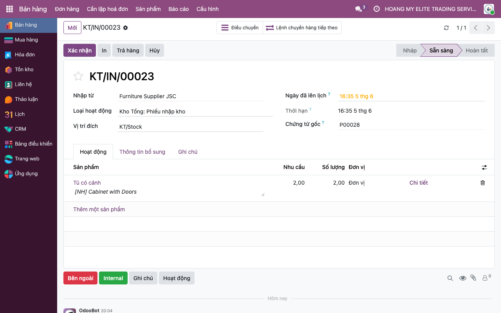
- **Bước 8:** Thủ kho tiến hành nhận hàng và bấm **[Xác nhận]** phiếu nhập kho (IN). Ngay lập tức, hệ thống tự động giữ hàng (Auto-reservation) cho đơn bán (SO), trạng thái phiếu xuất kho (OUT) sẽ tự động chuyển sang **Sẵn sàng (Ready)**:
   
- **Bước 9:** Thủ kho mở lại phiếu xuất kho (OUT) và bấm **[Xác nhận]** để hoàn tất việc xuất giao hàng cho khách.

##### **Các lưu ý quan trọng (Ngoại lệ & Kế toán)**
> [!IMPORTANT]
> **1. Hủy đơn hàng (Cancellation):** Nếu SO bị hủy sau khi PO đã được sinh ra, liên kết tự động sẽ bị đứt. Đơn mua PO sẽ không tự động hủy, bộ phận mua hàng phải chủ động xử lý PO thủ công.
>
> **2. Lưu ý đối với bộ phận Kế toán & Hóa đơn (Invoicing):**
> * **Chính sách hóa đơn mua:** Khuyên dùng **Theo số lượng đã nhận (Received Quantities)** để chỉ thanh toán cho NCC đúng lượng hàng thực tế đã nhập kho.
> * **Chính sách hóa đơn bán:** Khuyên dùng **Theo số lượng đã giao (Delivered Quantities)** để tránh xuất hóa đơn bán trước khi hàng thực tế được xuất kho giao cho khách.
> * **Kiểm soát biên lợi nhuận:** Kế toán cần đối chiếu giá mua trên PO tự động sinh với giá bán trên SO để kiểm soát biên lợi nhuận trước khi nhân viên mua hàng chốt đơn mua.

---

# **5. Xử lý sự cố & Luồng ngoại lệ (FAQ & Exceptions)**

Trong quá trình vận hành ERP, bạn có thể gặp các luồng ngoại lệ hoặc cần hủy chứng từ. Dưới đây là hướng dẫn xử lý:

## **5.1 Luồng Hủy & Xử lý ngoại lệ (Cancellation Workflows)**

##### **1. Cách hủy Đơn bán hàng / Mua hàng khi khách đổi ý?**
- **Trường hợp 1 (Chưa giao/nhận hàng, chưa xuất hóa đơn):** Truy cập vào đơn hàng và bấm nút **[Hủy] (Cancel)**. Đơn hàng sẽ chuyển sang trạng thái Đã hủy.
- **Trường hợp 2 (Đã giao/nhận hàng hoặc Đã lên hóa đơn):** Bạn không thể hủy trực tiếp. Bạn phải:
  - Hủy/Trả lại (Return) phiếu kho.
  - Tạo Ghi chú tín dụng (Credit Note) để hủy hóa đơn.
  - Sau đó mới có thể hủy Đơn hàng gốc.

##### **2. Hủy/Hoàn trả phiếu Nhập/Xuất/Chuyển kho nội bộ đã "Hoàn thành"?**
- Phiếu kho đã hoàn thành (Done) **không thể xóa hoặc hủy** trực tiếp.
- **Xử lý:** Mở phiếu kho đó, bấm nút **[Trả hàng] (Return)**. Hệ thống sẽ tự động tạo một phiếu kho đảo ngược (Reverse Transfer) để đưa tồn kho về đúng địa điểm cũ (đối với chuyển kho nội bộ, hàng sẽ được chuyển ngược về địa điểm nguồn).

##### **3. Xử lý Hóa đơn hoặc Bút toán kế toán đã "Vào sổ" (Posted) bị sai?**
- Theo chuẩn mực kế toán (TT200), **không được phép xóa** các chứng từ đã vào sổ để bảo toàn dấu vết kiểm toán.
- **Đối với Hóa đơn (Invoices/Bills):** Bấm **[Thêm Ghi chú tín dụng] (Add Credit Note)** để đảo ngược toàn bộ giá trị của hóa đơn cũ, sau đó tạo một hóa đơn mới hoàn toàn.
- **Đối với Bút toán tay (Manual Journals):** Bấm nút **[Đảo ngược bút toán] (Reverse Entry)** để hệ thống tự động sinh một bút toán đảo chiều (Nợ thành Có, Có thành Nợ) nhằm triệt tiêu số dư sai hợp lệ.

## **5.2 Câu hỏi thường gặp khác (General FAQ)**

##### **1. Không thể "Xác nhận" (Validate) phiếu xuất kho hoặc phiếu chuyển kho nội bộ?**
- **Nguyên nhân:** Có thể do sản phẩm trong kho nguồn không đủ (Cột "Dành trước / Reserved" hiển thị màu đỏ).
- **Xử lý:** Kiểm tra lại số lượng tồn kho thực tế tại địa điểm nguồn, hoặc kiểm tra xem có phiếu xuất/chuyển kho nào khác đang "giữ chỗ" (Reserved) sản phẩm này không.

##### **2. Tạo phiếu chuyển kho nội bộ nhưng không thấy trường "Địa điểm nguồn" và "Địa điểm đích"?**
- **Nguyên nhân:** Tính năng **Nhiều địa điểm kho** (Storage Locations) chưa được kích hoạt trong thiết lập hệ thống.
- **Xử lý:** Liên hệ Quản trị viên hệ thống (Admin) truy cập **Tồn kho** -> **Cấu hình** -> **Thiết lập** -> Tích chọn **Địa điểm lưu kho** (Storage Locations) và lưu lại.

##### **3. Không thấy menu chức năng?**
- **Nguyên nhân:** Tài khoản của bạn chưa được phân quyền truy cập.
- **Xử lý:** Liên hệ Quản trị viên hệ thống (Admin) để được cấp quyền bổ sung.

## **5.3 Câu hỏi nghiệp vụ Kế toán (Accounting FAQ)**

##### **1. Tại sao tôi không thấy nút "Đảo ngược bút toán" (Reverse Entry) trên chứng từ?**
- **Nguyên nhân 1:** Bút toán của bạn đang ở trạng thái **Nháp (Draft)**. Lúc này chứng từ chưa phát sinh hiệu lực tài chính, bạn có thể sửa số liệu trực tiếp hoặc bấm biểu tượng bánh răng để "Xóa" nên hệ thống không hiển thị nút Đảo ngược. Nút Đảo ngược chỉ hiện ra khi chứng từ đã **Vào sổ (Posted)**.
- **Nguyên nhân 2:** Nếu bạn đang xem Hóa đơn bán hàng/mua hàng, nút đảo ngược sẽ được gọi dưới tên thương mại là **"Thêm Giấy báo Có" (Add Credit Note)** thay vì "Đảo ngược bút toán".

##### **2. Khi nào bắt buộc phải sinh "Bút toán tay" (Manual Journal Entries)?**
Hệ thống đã tự động hóa luồng Mua, Bán và Kho. Bạn chỉ phải tự sinh bút toán tay cho các nghiệp vụ nội bộ hoặc điều chỉnh cuối kỳ như:
- Khấu hao tài sản / Phân bổ chi phí trả trước.
- Kết chuyển doanh thu, chi phí cuối kỳ để xác định kết quả kinh doanh.
- Hạch toán tiền lương và các khoản trích theo lương.
- Trích lập các khoản dự phòng hoặc điều chỉnh sai sót số dư.

##### **3. Hạch toán chi phí lương và tiền điện theo TT200 khác nhau thế nào trên hệ thống?**
- **Tiền lương:** Không dùng "Hóa đơn nhà cung cấp" vì nhân viên không phải là nhà cung cấp. Bạn phải tạo **Bút toán tay (Manual Journal)**, phân bổ chi phí về đúng đầu bộ phận (Ví dụ: Nợ 622, 641, 642 / Có 334).
- **Tiền điện/nước/mặt bằng:** Là dịch vụ mua từ bên ngoài, bắt buộc dùng **Hóa đơn nhà cung cấp (Vendor Bills)**. Nếu cần chia cho nhiều bộ phận (Xưởng, Showroom, Văn phòng), bạn chỉ việc thêm nhiều dòng (Invoice Lines) trên cùng một hóa đơn và gán trực tiếp tài khoản chi phí (6277, 6417, 6427) cho từng dòng.

---

# **6. Giải nghĩa thuật ngữ (Glossary)**

Bảng dưới đây tổng hợp các thuật ngữ thường xuyên xuất hiện trên giao diện Elite ERP nhằm giúp người dùng mới dễ dàng nắm bắt:

| Thuật ngữ / Viết tắt 

 | Giải nghĩa chi tiết |
| :--- | :--- |
| **ERP** (Enterprise Resource Planning) | Hệ thống Hoạch định Nguồn lực Doanh nghiệp, nền tảng cốt lõi của Elite ERP. |
| **SO** (Sales Order) | **Đơn bán hàng:** Chứng từ xác nhận việc khách hàng đã đồng ý mua sản phẩm/dịch vụ. |
| **PO** (Purchase Order) | **Đơn mua hàng:** Chứng từ chính thức gửi cho nhà cung cấp để đặt mua hàng hóa. |
| **RFQ** (Request for Quotation) | **Yêu cầu báo giá:** Bản nháp của đơn mua hàng, dùng để hỏi giá nhà cung cấp trước khi chốt mua. |
| **Credit Note** | **Ghi chú tín dụng / Hóa đơn điều chỉnh giảm:** Dùng để đảo ngược giá trị của một hóa đơn đã vào sổ (ví dụ khi khách trả hàng hoặc hóa đơn bị sai). |
| **Validate** | **Xác nhận / Xác thực / Chốt:** Hành động bấm xác nhận để hệ thống thực thi một giao dịch (VD: Xác nhận phiếu kho). Sau khi xác nhận, chứng từ thường không thể xóa. |
| **Posted** | **Đã vào sổ:** Trạng thái của hóa đơn khi đã được hệ thống ghi nhận doanh thu/chi phí vào sổ kế toán chính thức. |
| **Kanban** | Chế độ xem dữ liệu dạng **Thẻ**, cho phép kéo thả chứng từ qua lại giữa các giai đoạn (Draft -> Sent -> Confirmed). |
| **Scrap** | **Loại bỏ / Phế liệu:** Đưa sản phẩm hư hỏng ra khỏi kho để không làm ảnh hưởng đến tồn kho thực tế bán được. |
| **Variant** | **Biến thể sản phẩm:** Các phiên bản khác nhau của cùng một sản phẩm (VD: Áo thun có biến thể là Màu Đỏ, Size L). |
| **COA** (Chart of Accounts) | **Hệ thống Tài khoản Kế toán:** Danh mục phân loại tài sản, nợ, nguồn vốn, doanh thu, chi phí. |
| **Journal** | **Sổ nhật ký:** Nơi ghi chép các nghiệp vụ kinh tế phát sinh theo nhóm (VD: Sổ Tiền mặt, Sổ Mua hàng). |
| **Journal Entry** | **Bút toán nhật ký:** Bản ghi giao dịch tài chính vào hệ thống, đảm bảo nguyên tắc Tổng Nợ = Tổng Có. |
| **Journal Item** | **Chi tiết bút toán:** Một dòng ghi Nợ hoặc Có đơn lẻ cấu thành nên một Bút toán nhật ký. |
| **Manual Journal** | **Bút toán tay:** Bút toán do kế toán tự tạo thủ công thay vì được sinh tự động từ các phân hệ khác (VD: lương, khấu hao). |
| **Reverse Entry** | **Đảo ngược bút toán:** Bút toán đảo chiều (Nợ thành Có, Có thành Nợ) sinh ra để triệt tiêu số dư của chứng từ sai sót. |

---

# **7. Lịch sử thay đổi (Changelog)**

| Phiên bản | Ngày cập nhật | Nội dung thay đổi | Người cập nhật |
| :--- | :--- | :--- | :--- |
| **v1.0** | 2026-06-01 | Khởi tạo tài liệu Hướng dẫn sử dụng gốc, bao gồm các phân hệ Bán hàng, Mua hàng, Hóa đơn cơ bản và Kho hàng. | HT |
| **v2.0** | 2026-07-31 | - Bổ sung mục **4.3.4 Kế toán tổng hợp & Bút toán** (bao gồm Bút toán tự động, Bút toán tay). - Bổ sung mục **4.3.5 Báo cáo & Phân tích** (Invoices Analysis & Cash/Bank Dashboard). - Thêm Giới hạn hệ thống (Scope & Limitations) cho phân hệ Hóa đơn ở mục **4.3**. - Bổ sung mục **5.3 Câu hỏi nghiệp vụ Kế toán (Accounting FAQ)**. - Cập nhật thêm thuật ngữ (COA, Journal, Reverse Entry...) vào **6. Giải nghĩa thuật ngữ**. - Bổ sung mục **7. Lịch sử thay đổi (Changelog)**. | Hoàng Thúy |
